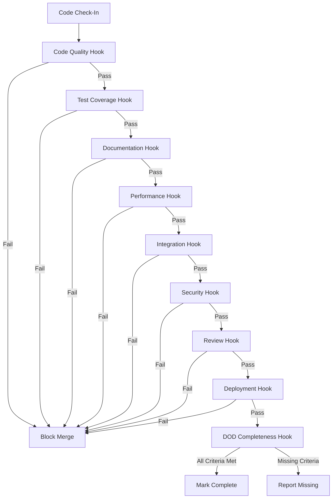

# Autonomic Implementation: KNHK v1.0 Integration Using Knowledge Hooks

**Version**: v1.0  
**Status**: Autonomic Implementation Guide  
**Last Updated**: December 2024  
**Approach**: Policy-driven automation using KNHK/unrdf knowledge hooks

---

## Overview

This document defines how to implement the **Lean Six Sigma Project Charter** and **Definition of Done** criteria **autonomically** using KNHK/unrdf knowledge hooks, SHACL validation, and policy packs. Instead of manual checklists, the system autonomically validates, enforces, and tracks implementation completion.

**Core Principle**: "Knowledge hooks validate, not humans" - All Definition of Done criteria are enforced through autonomic knowledge hooks that react to graph changes.

---

## Architecture: Autonomic Definition of Done

```
┌─────────────────────────────────────────────────┐
│     Definition of Done Knowledge Graph          │
│  (RDF representation of implementation state) │
└──────────────┬──────────────────────────────────┘
               │
    ┌──────────┴──────────┐
    │                     │
┌───▼────────┐    ┌───────▼────────┐
│  KNHK      │    │  unrdf          │
│  Hot Path  │    │  Knowledge      │
│  Hooks     │    │  Hooks          │
│  (Micro)   │    │  (Policy)       │
└────────────┘    └─────────────────┘
    │                     │
    │                     │
┌───▼─────────────────────▼──────────┐
│  Autonomic Validation Engine        │
│  - SHACL Shape Validation           │
│  - Policy Pack Enforcement          │
│  - Guard Constraint Checking        │
│  - OTEL Metrics Validation          │
└─────────────────────────────────────┘
```

---

## 1. Knowledge Graph Representation

### 1.1 Implementation State Model

**RDF Ontology for Implementation Tracking**:

```turtle
@prefix knhk: <https://knhk.org/ontology#> .
@prefix dod: <https://knhk.org/dod#> .
@prefix sh: <http://www.w3.org/ns/shacl#> .

# Implementation Entity
dod:Implementation a knhk:Implementation ;
    knhk:hasTicket "KNHK-001" ;
    knhk:hasStatus knhk:InProgress ;
    knhk:hasFeature dod:SHACLValidationWrapper ;
    knhk:hasComponent knhk:integration ;
    knhk:hasSprint "Sprint-1" .

# Definition of Done Criteria
dod:CodeQualityCheck a knhk:DoDCriterion ;
    knhk:criterionType knhk:CodeQuality ;
    knhk:requires [
        knhk:hasCheck dod:NoPlaceholders ;
        knhk:hasCheck dod:NoUnwrap ;
        knhk:hasCheck dod:ProperErrorHandling ;
    ] .

dod:TestingCheck a knhk:DoDCriterion ;
    knhk:criterionType knhk:Testing ;
    knhk:requires [
        knhk:hasCoverage ">=90" ;
        knhk:hasTestTypes ( dod:UnitTest dod:IntegrationTest dod:PerformanceTest ) ;
    ] .

dod:DocumentationCheck a knhk:DoDCriterion ;
    knhk:criterionType knhk:Documentation ;
    knhk:requires [
        knhk:hasAPIDocs true ;
        knhk:hasUsageExamples true ;
        knhk:hasChangelog true ;
    ] .

# Implementation Status
dod:Implementation-001 knhk:meetsCriterion dod:CodeQualityCheck ;
    knhk:meetsCriterion dod:TestingCheck ;
    knhk:missingCriterion dod:DocumentationCheck ;
    knhk:hasCompletionPercentage "66.7" .
```

---

## 2. Knowledge Hooks for Definition of Done

### 2.1 Hook 1: Code Quality Validator

**Purpose**: Autonomically validate code quality standards

**Hook Definition**:

```json
{
  "meta": {
    "name": "code-quality-validator",
    "description": "Validates code meets Definition of Done quality standards",
    "version": "1.0.0"
  },
  "when": {
    "kind": "shacl",
    "shapes": "file://hooks/shapes/code-quality-shape.ttl"
  },
  "before": async (event) => {
    // Pre-validation: Check if implementation exists
    return { continue: true };
  },
  "run": async (event) => {
    if (!event.result.conforms) {
      throw new Error(`Code quality validation failed: ${event.result.results.map(r => r.message).join(', ')}`);
    }
    return { 
      status: "passed",
      timestamp: new Date(),
      validator: "code-quality-validator"
    };
  },
  "after": async (event) => {
    // Update implementation status in knowledge graph
    await updateImplementationStatus(event.implementationId, "code-quality", "passed");
  }
}
```

**SHACL Shape** (`code-quality-shape.ttl`):

```turtle
@prefix knhk: <https://knhk.org/ontology#> .
@prefix dod: <https://knhk.org/dod#> .
@prefix sh: <http://www.w3.org/ns/shacl#> .

dod:CodeQualityShape a sh:NodeShape ;
    sh:targetClass knhk:Implementation ;
    sh:property [
        sh:path knhk:hasCodeQuality ;
        sh:minCount 1 ;
        sh:hasValue dod:NoPlaceholders ;
        sh:message "Code must have no placeholders" ;
    ] ;
    sh:property [
        sh:path knhk:hasCodeQuality ;
        sh:minCount 1 ;
        sh:hasValue dod:NoUnwrap ;
        sh:message "Code must have no unwrap() calls" ;
    ] ;
    sh:property [
        sh:path knhk:hasCodeQuality ;
        sh:minCount 1 ;
        sh:hasValue dod:ProperErrorHandling ;
        sh:message "Code must have proper error handling" ;
    ] .
```

### 2.2 Hook 2: Test Coverage Validator

**Purpose**: Autonomically validate test coverage requirements

**Hook Definition**:

```json
{
  "meta": {
    "name": "test-coverage-validator",
    "description": "Validates test coverage meets Definition of Done requirements",
    "version": "1.0.0"
  },
  "when": {
    "kind": "threshold",
    "query": "SELECT ?coverage WHERE { ?impl knhk:hasTestCoverage ?coverage }",
    "threshold": {
      "variable": "coverage",
      "operator": ">=",
      "value": 90
    }
  },
  "run": async (event) => {
    if (!event.result) {
      throw new Error(`Test coverage ${event.coverage}% is below required 90%`);
    }
    return { 
      status: "passed",
      coverage: event.coverage,
      timestamp: new Date()
    };
  },
  "after": async (event) => {
    await updateImplementationStatus(event.implementationId, "testing", "passed");
  }
}
```

### 2.3 Hook 3: Performance Validator

**Purpose**: Autonomically validate performance requirements

**Hook Definition**:

```json
{
  "meta": {
    "name": "performance-validator",
    "description": "Validates performance meets Definition of Done requirements",
    "version": "1.0.0"
  },
  "when": {
    "kind": "sparql-ask",
    "query": `
      ASK {
        ?impl knhk:hasPathType ?pathType .
        ?impl knhk:hasLatency ?latency .
        FILTER (
          (?pathType = knhk:HotPath && ?latency <= 8) ||
          (?pathType = knhk:WarmPath && ?latency <= 500000) ||
          (?pathType = knhk:ColdPath && ?latency <= 500000)
        )
      }
    `
  },
  "run": async (event) => {
    if (!event.result) {
      throw new Error("Performance requirements not met");
    }
    return { 
      status: "passed",
      timestamp: new Date()
    };
  },
  "after": async (event) => {
    await updateImplementationStatus(event.implementationId, "performance", "passed");
  }
}
```

### 2.4 Hook 4: Documentation Completeness Validator

**Purpose**: Autonomically validate documentation completeness

**Hook Definition**:

```json
{
  "meta": {
    "name": "documentation-validator",
    "description": "Validates documentation meets Definition of Done requirements",
    "version": "1.0.0"
  },
  "when": {
    "kind": "shacl",
    "shapes": "file://hooks/shapes/documentation-shape.ttl"
  },
  "run": async (event) => {
    if (!event.result.conforms) {
      const missing = event.result.results.map(r => r.message);
      throw new Error(`Documentation incomplete: ${missing.join(', ')}`);
    }
    return { 
      status: "passed",
      timestamp: new Date()
    };
  },
  "after": async (event) => {
    await updateImplementationStatus(event.implementationId, "documentation", "passed");
  }
}
```

### 2.5 Hook 5: Integration Validator

**Purpose**: Autonomically validate integration requirements

**Hook Definition**:

```json
{
  "meta": {
    "name": "integration-validator",
    "description": "Validates integration requirements met",
    "version": "1.0.0"
  },
  "when": {
    "kind": "delta",
    "change": "any",
    "query": "SELECT ?impl WHERE { ?impl knhk:hasIntegrationStatus ?status }"
  },
  "run": async (event) => {
    // Check if integration tests pass
    const integrationTests = await checkIntegrationTests(event.implementationId);
    if (!integrationTests.passed) {
      throw new Error(`Integration tests failed: ${integrationTests.errors.join(', ')}`);
    }
    return { 
      status: "passed",
      integrationTests: integrationTests,
      timestamp: new Date()
    };
  },
  "after": async (event) => {
    await updateImplementationStatus(event.implementationId, "integration", "passed");
  }
}
```

### 2.6 Hook 6: Definition of Done Completeness Checker

**Purpose**: Autonomically check if all Definition of Done criteria are met

**Hook Definition**:

```json
{
  "meta": {
    "name": "dod-completeness-checker",
    "description": "Checks if all Definition of Done criteria are met",
    "version": "1.0.0"
  },
  "when": {
    "kind": "sparql-ask",
    "query": `
      ASK {
        ?impl knhk:meetsCriterion dod:CodeQualityCheck .
        ?impl knhk:meetsCriterion dod:TestingCheck .
        ?impl knhk:meetsCriterion dod:DocumentationCheck .
        ?impl knhk:meetsCriterion dod:PerformanceCheck .
        ?impl knhk:meetsCriterion dod:IntegrationCheck .
        ?impl knhk:meetsCriterion dod:SecurityCheck .
        ?impl knhk:meetsCriterion dod:ReviewCheck .
        ?impl knhk:meetsCriterion dod:DeploymentCheck .
        FILTER NOT EXISTS {
          ?impl knhk:missingCriterion ?missing .
        }
      }
    `
  },
  "run": async (event) => {
    if (event.result) {
      // All criteria met - mark as complete
      await markImplementationComplete(event.implementationId);
      return { 
        status: "complete",
        timestamp: new Date(),
        message: "All Definition of Done criteria met"
      };
    } else {
      // Missing criteria - identify what's missing
      const missing = await getMissingCriteria(event.implementationId);
      return { 
        status: "incomplete",
        missingCriteria: missing,
        timestamp: new Date(),
        message: `Missing criteria: ${missing.join(', ')}`
      };
    }
  },
  "after": async (event) => {
    // Update implementation status and notify team
    await updateImplementationStatus(event.implementationId, "dod-check", event.status);
    if (event.status === "complete") {
      await notifyTeam(event.implementationId, "Implementation complete - ready for review");
    }
  }
}
```

---

## 3. Policy Pack: Definition of Done Enforcement

### 3.1 Policy Pack Definition

**Policy Pack**: `definition-of-done-policy-pack`

**Manifest** (`policy-packs/dod/manifest.json`):

```json
{
  "name": "definition-of-done-policy-pack",
  "version": "1.0.0",
  "description": "Autonomic enforcement of Definition of Done criteria",
  "hooks": [
    "code-quality-validator",
    "test-coverage-validator",
    "performance-validator",
    "documentation-validator",
    "integration-validator",
    "dod-completeness-checker"
  ],
  "shapes": [
    "code-quality-shape.ttl",
    "documentation-shape.ttl",
    "performance-shape.ttl"
  ],
  "dependencies": [],
  "enforcement": "strict"
}
```

### 3.2 Policy Pack Registration

**Register Policy Pack**:

```javascript
import { PolicyPackManager } from 'unrdf';
import { registerHook } from 'unrdf';

const policyPackManager = new PolicyPackManager('./policy-packs');

// Register Definition of Done policy pack
await policyPackManager.loadPolicyPack('definition-of-done-policy-pack');

// Register all hooks
const hooks = [
  codeQualityValidatorHook,
  testCoverageValidatorHook,
  performanceValidatorHook,
  documentationValidatorHook,
  integrationValidatorHook,
  dodCompletenessCheckerHook
];

for (const hook of hooks) {
  await registerHook(hook);
}
```

---

## 4. Autonomic Workflow

### 4.1 Implementation Lifecycle

**State Machine** (RDF representation):

```turtle
dod:ImplementationStateMachine a knhk:StateMachine ;
    knhk:hasStates (
        dod:NotStarted
        dod:InProgress
        dod:CodeQualityValidated
        dod:TestingValidated
        dod:DocumentationValidated
        dod:PerformanceValidated
        dod:IntegrationValidated
        dod:SecurityValidated
        dod:ReviewCompleted
        dod:DeploymentReady
        dod:Complete
    ) ;
    knhk:hasTransitions [
        knhk:from dod:NotStarted ;
        knhk:to dod:InProgress ;
        knhk:triggeredBy dod:CodeCheckIn
    ] , [
        knhk:from dod:InProgress ;
        knhk:to dod:CodeQualityValidated ;
        knhk:triggeredBy dod:CodeQualityHook
    ] , [
        knhk:from dod:CodeQualityValidated ;
        knhk:to dod:TestingValidated ;
        knhk:triggeredBy dod:TestCoverageHook
    ] , [
        knhk:from dod:TestingValidated ;
        knhk:to dod:DocumentationValidated ;
        knhk:triggeredBy dod:DocumentationHook
    ] , [
        knhk:from dod:DocumentationValidated ;
        knhk:to dod:PerformanceValidated ;
        knhk:triggeredBy dod:PerformanceHook
    ] , [
        knhk:from dod:PerformanceValidated ;
        knhk:to dod:IntegrationValidated ;
        knhk:triggeredBy dod:IntegrationHook
    ] , [
        knhk:from dod:IntegrationValidated ;
        knhk:to dod:SecurityValidated ;
        knhk:triggeredBy dod:SecurityHook
    ] , [
        knhk:from dod:SecurityValidated ;
        knhk:to dod:ReviewCompleted ;
        knhk:triggeredBy dod:ReviewHook
    ] , [
        knhk:from dod:ReviewCompleted ;
        knhk:to dod:DeploymentReady ;
        knhk:triggeredBy dod:DeploymentHook
    ] , [
        knhk:from dod:DeploymentReady ;
        knhk:to dod:Complete ;
        knhk:triggeredBy dod:DODCompletenessHook
    ] .
```

### 4.2 Autonomic Validation Flow

**Workflow**:



---

## 5. Implementation Tracking

### 5.1 RDF Representation of Implementation Status

**Implementation Tracking Graph**:

```turtle
@prefix knhk: <https://knhk.org/ontology#> .
@prefix dod: <https://knhk.org/dod#> .
@prefix ex: <http://example.org/> .

# Implementation Entity
ex:Implementation-KNHK-001 a knhk:Implementation ;
    knhk:hasTicket "KNHK-001" ;
    knhk:hasTitle "SHACL Validation Wrapper" ;
    knhk:hasStatus dod:InProgress ;
    knhk:hasComponent knhk:integration ;
    knhk:hasSprint "Sprint-1" ;
    knhk:hasAssignee "developer@example.org" ;
    knhk:hasStoryPoints "13" ;
    knhk:hasPriority knhk:Highest ;
    
    # Definition of Done Criteria Status
    knhk:meetsCriterion dod:CodeQualityCheck ;
    knhk:meetsCriterion dod:TestingCheck ;
    knhk:missingCriterion dod:DocumentationCheck ;
    knhk:hasCompletionPercentage "66.7" ;
    
    # Validation Results
    knhk:hasValidationResult [
        knhk:validator dod:CodeQualityValidator ;
        knhk:status knhk:Passed ;
        knhk:timestamp "2024-12-15T10:00:00Z" ;
        knhk:details "All code quality checks passed"
    ] , [
        knhk:validator dod:TestCoverageValidator ;
        knhk:status knhk:Passed ;
        knhk:timestamp "2024-12-15T10:05:00Z" ;
        knhk:coverage "92.5" ;
        knhk:details "Test coverage 92.5% meets requirement"
    ] , [
        knhk:validator dod:DocumentationValidator ;
        knhk:status knhk:Failed ;
        knhk:timestamp "2024-12-15T10:10:00Z" ;
        knhk:details "Missing API documentation for knhk_unrdf_validate_shacl"
    ] ;
    
    # OTEL Span
    knhk:hasOTELSpan "span-abc123" ;
    knhk:hasReceipt "receipt-xyz789" .
```

### 5.2 Autonomic Status Updates

**Hook-Driven Status Updates**:

```javascript
// Hook automatically updates implementation status
async function updateImplementationStatus(implId, criterion, status) {
  const system = await createDarkMatterCore();
  
  const additions = [
    quad(
      namedNode(`http://example.org/${implId}`),
      namedNode('https://knhk.org/ontology#meetsCriterion'),
      namedNode(`https://knhk.org/dod#${criterion}`)
    ),
    quad(
      namedNode(`http://example.org/${implId}`),
      namedNode('https://knhk.org/ontology#hasValidationResult'),
      blankNode(`validation-${Date.now()}`)
    )
  ];
  
  await system.executeTransaction({
    additions,
    removals: [],
    actor: 'autonomic-validator'
  });
}
```

---

## 6. SHACL Shapes for Definition of Done

### 6.1 Complete Definition of Done Shape

**SHACL Shape** (`dod-complete-shape.ttl`):

```turtle
@prefix knhk: <https://knhk.org/ontology#> .
@prefix dod: <https://knhk.org/dod#> .
@prefix sh: <http://www.w3.org/ns/shacl#> .

dod:DefinitionOfDoneShape a sh:NodeShape ;
    sh:targetClass knhk:Implementation ;
    
    # Code Quality Requirements
    sh:property [
        sh:path knhk:meetsCriterion ;
        sh:hasValue dod:CodeQualityCheck ;
        sh:minCount 1 ;
        sh:message "Code quality criteria must be met" ;
    ] ;
    
    # Testing Requirements
    sh:property [
        sh:path knhk:meetsCriterion ;
        sh:hasValue dod:TestingCheck ;
        sh:minCount 1 ;
        sh:message "Testing criteria must be met" ;
    ] ;
    
    # Documentation Requirements
    sh:property [
        sh:path knhk:meetsCriterion ;
        sh:hasValue dod:DocumentationCheck ;
        sh:minCount 1 ;
        sh:message "Documentation criteria must be met" ;
    ] ;
    
    # Performance Requirements
    sh:property [
        sh:path knhk:meetsCriterion ;
        sh:hasValue dod:PerformanceCheck ;
        sh:minCount 1 ;
        sh:message "Performance criteria must be met" ;
    ] ;
    
    # Integration Requirements
    sh:property [
        sh:path knhk:meetsCriterion ;
        sh:hasValue dod:IntegrationCheck ;
        sh:minCount 1 ;
        sh:message "Integration criteria must be met" ;
    ] ;
    
    # Security Requirements
    sh:property [
        sh:path knhk:meetsCriterion ;
        sh:hasValue dod:SecurityCheck ;
        sh:minCount 1 ;
        sh:message "Security criteria must be met" ;
    ] ;
    
    # Review Requirements
    sh:property [
        sh:path knhk:meetsCriterion ;
        sh:hasValue dod:ReviewCheck ;
        sh:minCount 1 ;
        sh:message "Review criteria must be met" ;
    ] ;
    
    # Deployment Requirements
    sh:property [
        sh:path knhk:meetsCriterion ;
        sh:hasValue dod:DeploymentCheck ;
        sh:minCount 1 ;
        sh:message "Deployment criteria must be met" ;
    ] ;
    
    # No Missing Criteria
    sh:property [
        sh:path knhk:missingCriterion ;
        sh:maxCount 0 ;
        sh:message "No Definition of Done criteria may be missing" ;
    ] ;
    
    # Completion Percentage
    sh:property [
        sh:path knhk:hasCompletionPercentage ;
        sh:datatype xsd:decimal ;
        sh:minInclusive 100 ;
        sh:message "Completion percentage must be 100%" ;
    ] .
```

---

## 7. Autonomic Integration with CI/CD

### 7.1 CI/CD Integration Hook

**Purpose**: Autonomically validate on CI/CD events

**Hook Definition**:

```json
{
  "meta": {
    "name": "cicd-validation-hook",
    "description": "Validates Definition of Done on CI/CD events",
    "version": "1.0.0"
  },
  "when": {
    "kind": "delta",
    "change": "any",
    "query": "SELECT ?impl WHERE { ?impl knhk:hasCICDEvent ?event }"
  },
  "run": async (event) => {
    // Trigger all Definition of Done hooks
    const results = await Promise.all([
      evaluateHook(codeQualityValidatorHook),
      evaluateHook(testCoverageValidatorHook),
      evaluateHook(performanceValidatorHook),
      evaluateHook(documentationValidatorHook),
      evaluateHook(integrationValidatorHook),
      evaluateHook(dodCompletenessCheckerHook)
    ]);
    
    const allPassed = results.every(r => r.fired && r.status === "passed");
    
    if (!allPassed) {
      // Block merge if criteria not met
      throw new Error("Definition of Done criteria not met - merge blocked");
    }
    
    return { 
      status: "passed",
      allCriteriaMet: true,
      timestamp: new Date()
    };
  },
  "after": async (event) => {
    // Update implementation status
    await updateImplementationStatus(event.implementationId, "cicd-validation", "passed");
  }
}
```

### 7.2 GitHub Actions Integration

**GitHub Actions Workflow** (`.github/workflows/dod-validation.yml`):

```yaml
name: Definition of Done Validation

on:
  pull_request:
    types: [opened, synchronize, reopened]
  push:
    branches: [main]

jobs:
  dod-validation:
    runs-on: ubuntu-latest
    steps:
      - uses: actions/checkout@v3
      
      - name: Setup Node.js
        uses: actions/setup-node@v3
        with:
          node-version: '18'
      
      - name: Install dependencies
        run: |
          cd vendors/unrdf
          pnpm install
      
      - name: Run Definition of Done Validation
        run: |
          node scripts/validate-dod.mjs --ticket ${{ github.event.pull_request.title }}
      
      - name: Check Validation Results
        run: |
          if [ $? -ne 0 ]; then
            echo "Definition of Done validation failed"
            exit 1
          fi
```

**Validation Script** (`scripts/validate-dod.mjs`):

```javascript
import { createDarkMatterCore, evaluateHook } from '../vendors/unrdf/src/knowledge-engine/index.mjs';
import { loadPolicyPack } from '../vendors/unrdf/src/knowledge-engine/policy-pack.mjs';

async function validateDefinitionOfDone(ticketId) {
  const system = await createDarkMatterCore();
  
  // Load Definition of Done policy pack
  await loadPolicyPack('definition-of-done-policy-pack');
  
  // Create implementation entity
  const implementationId = `Implementation-${ticketId}`;
  
  // Evaluate all Definition of Done hooks
  const hooks = [
    'code-quality-validator',
    'test-coverage-validator',
    'performance-validator',
    'documentation-validator',
    'integration-validator',
    'dod-completeness-checker'
  ];
  
  const results = [];
  for (const hookName of hooks) {
    const hook = await getHook(hookName);
    const result = await evaluateHook(hook, { implementationId });
    results.push({ hook: hookName, result });
  }
  
  // Check if all passed
  const allPassed = results.every(r => r.result.fired && r.result.status === "passed");
  
  if (!allPassed) {
    console.error("Definition of Done validation failed:");
    results.forEach(r => {
      if (!r.result.fired || r.result.status !== "passed") {
        console.error(`  - ${r.hook}: ${r.result.message || 'Failed'}`);
      }
    });
    process.exit(1);
  }
  
  console.log("✅ All Definition of Done criteria met");
  process.exit(0);
}

const ticketId = process.argv[2];
validateDefinitionOfDone(ticketId).catch(err => {
  console.error("Validation error:", err);
  process.exit(1);
});
```

---

## 8. Autonomic Reporting

### 8.1 Implementation Status Dashboard

**SPARQL Query for Dashboard**:

```sparql
PREFIX knhk: <https://knhk.org/ontology#>
PREFIX dod: <https://knhk.org/dod#>

SELECT ?ticket ?title ?status ?completion ?missingCriteria
WHERE {
  ?impl knhk:hasTicket ?ticket ;
        knhk:hasTitle ?title ;
        knhk:hasStatus ?status ;
        knhk:hasCompletionPercentage ?completion .
  
  OPTIONAL {
    ?impl knhk:missingCriterion ?missingCriteria .
  }
}
ORDER BY ?completion DESC
```

### 8.2 Autonomic Metrics Collection

**OTEL Metrics Integration**:

```javascript
import { Observability } from 'unrdf';

const obs = new Observability();

// Record Definition of Done metrics
obs.recordMetric({
  name: 'knhk.dod.criteria.met',
  value: {
    codeQuality: true,
    testing: true,
    documentation: false,
    performance: true,
    integration: true,
    security: true,
    review: false,
    deployment: false
  },
  timestamp: new Date()
});

// Record completion percentage
obs.recordMetric({
  name: 'knhk.dod.completion.percentage',
  value: 75.0,
  timestamp: new Date()
});
```

---

## 9. Implementation Examples

### 9.1 Example: Autonomic Code Quality Validation

**Implementation**:

```javascript
import { createDarkMatterCore, defineHook, registerHook } from 'unrdf';
import { validateShacl } from 'unrdf';

const system = await createDarkMatterCore();

// Define code quality validation hook
const codeQualityHook = defineHook({
  meta: {
    name: 'code-quality-validator',
    description: 'Validates code quality standards'
  },
  when: {
    kind: 'shacl',
    query: `
      ASK {
        ?impl knhk:hasCodeQuality dod:NoPlaceholders .
        ?impl knhk:hasCodeQuality dod:NoUnwrap .
        ?impl knhk:hasCodeQuality dod:ProperErrorHandling .
      }
    `
  },
  run: async (event) => {
    // Validate code quality using SHACL
    const validation = await validateShacl({
      dataGraph: system.store,
      shapesGraph: await loadShapes('code-quality-shape.ttl')
    });
    
    if (!validation.conforms) {
      throw new Error(`Code quality validation failed: ${validation.results.map(r => r.message).join(', ')}`);
    }
    
    return { 
      status: "passed",
      timestamp: new Date()
    };
  }
});

await registerHook(codeQualityHook);
```

### 9.2 Example: Autonomic Test Coverage Validation

**Implementation**:

```javascript
import { createDarkMatterCore, defineHook, registerHook } from 'unrdf';

const system = await createDarkMatterCore();

// Define test coverage validation hook
const testCoverageHook = defineHook({
  meta: {
    name: 'test-coverage-validator',
    description: 'Validates test coverage meets requirements'
  },
  when: {
    kind: 'threshold',
    query: `
      SELECT ?coverage WHERE {
        ?impl knhk:hasTestCoverage ?coverage .
      }
    `,
    threshold: {
      variable: 'coverage',
      operator: '>=',
      value: 90
    }
  },
  run: async (event) => {
    if (!event.result) {
      throw new Error(`Test coverage ${event.coverage}% is below required 90%`);
    }
    
    return { 
      status: "passed",
      coverage: event.coverage,
      timestamp: new Date()
    };
  }
});

await registerHook(testCoverageHook);
```

---

## 10. Autonomic Workflow Execution

### 10.1 Complete Autonomic Validation Flow

**Execution Script**:

```javascript
import { createDarkMatterCore } from 'unrdf';
import { loadPolicyPack } from 'unrdf';

async function autonomicallyValidateImplementation(ticketId) {
  const system = await createDarkMatterCore({
    enableKnowledgeHookManager: true,
    enableLockchainWriter: true
  });
  
  // Load Definition of Done policy pack
  await loadPolicyPack('definition-of-done-policy-pack');
  
  // Create implementation entity in knowledge graph
  const implementationId = `Implementation-${ticketId}`;
  
  await system.executeTransaction({
    additions: [
      quad(
        namedNode(`http://example.org/${implementationId}`),
        namedNode('https://knhk.org/ontology#hasTicket'),
        literal(ticketId)
      ),
      quad(
        namedNode(`http://example.org/${implementationId}`),
        namedNode('https://www.w3.org/1999/02/22-rdf-syntax-ns#type'),
        namedNode('https://knhk.org/ontology#Implementation')
      )
    ],
    removals: [],
    actor: 'autonomic-validator'
  });
  
  // All hooks will fire automatically based on their conditions
  // Results will be stored in the knowledge graph
  
  // Query implementation status
  const status = await system.query({
    query: `
      SELECT ?status ?completion ?missingCriteria
      WHERE {
        ?impl knhk:hasTicket "${ticketId}" .
        ?impl knhk:hasStatus ?status .
        ?impl knhk:hasCompletionPercentage ?completion .
        OPTIONAL {
          ?impl knhk:missingCriterion ?missingCriteria .
        }
      }
    `,
    type: 'sparql-select'
  });
  
  return status;
}

// Usage
const result = await autonomicallyValidateImplementation('KNHK-001');
console.log('Implementation Status:', result);
```

---

## 11. Benefits of Autonomic Implementation

### 11.1 Advantages

**1. Automated Validation**:
- ✅ No manual checklists required
- ✅ Consistent validation across all implementations
- ✅ Real-time feedback on Definition of Done status

**2. Policy-Driven**:
- ✅ Definition of Done encoded as knowledge (RDF/SHACL)
- ✅ Policy packs enable version control of standards
- ✅ Easy to update criteria without code changes

**3. Provenance Tracking**:
- ✅ All validations recorded in lockchain
- ✅ Audit trail of Definition of Done compliance
- ✅ Cryptographic verification of validation results

**4. Integration**:
- ✅ CI/CD integration for automatic blocking
- ✅ Real-time dashboards via SPARQL queries
- ✅ OTEL metrics for observability

**5. Scalability**:
- ✅ Works for any number of implementations
- ✅ Parallel validation of multiple criteria
- ✅ Efficient hook batching

---

## 12. Implementation Checklist

### 12.1 Setup Requirements

- [ ] **Knowledge Graph Schema**: Define RDF ontology for implementations
- [ ] **SHACL Shapes**: Create SHACL shapes for all Definition of Done criteria
- [ ] **Knowledge Hooks**: Implement all validation hooks
- [ ] **Policy Pack**: Create Definition of Done policy pack
- [ ] **CI/CD Integration**: Integrate with CI/CD pipeline
- [ ] **Dashboard**: Create implementation status dashboard

### 12.2 Hook Implementation

- [ ] Code Quality Validator Hook
- [ ] Test Coverage Validator Hook
- [ ] Performance Validator Hook
- [ ] Documentation Validator Hook
- [ ] Integration Validator Hook
- [ ] Security Validator Hook
- [ ] Review Validator Hook
- [ ] Deployment Validator Hook
- [ ] Definition of Done Completeness Checker Hook

### 12.3 SHACL Shapes

- [ ] Code Quality Shape
- [ ] Testing Shape
- [ ] Documentation Shape
- [ ] Performance Shape
- [ ] Integration Shape
- [ ] Security Shape
- [ ] Complete Definition of Done Shape

---

## 13. Next Steps

### Phase 1: Foundation (Week 1)
1. Create RDF ontology for implementation tracking
2. Define SHACL shapes for Definition of Done criteria
3. Implement basic validation hooks

### Phase 2: Integration (Week 2)
1. Create Definition of Done policy pack
2. Integrate with CI/CD pipeline
3. Create implementation status dashboard

### Phase 3: Expansion (Week 3)
1. Add advanced validation hooks
2. Implement autonomic reporting
3. Add OTEL metrics integration

### Phase 4: Production (Week 4)
1. Deploy autonomic validation system
2. Train team on autonomic workflow
3. Monitor and iterate

---

## Summary

**Autonomic Implementation**: Convert manual Definition of Done checklists into **autonomic knowledge hooks** that:
- ✅ Validate code quality automatically
- ✅ Check test coverage autonomically
- ✅ Verify performance requirements
- ✅ Validate documentation completeness
- ✅ Check integration requirements
- ✅ Track all criteria in knowledge graph
- ✅ Block merges if criteria not met
- ✅ Provide real-time status dashboards

**Result**: Definition of Done becomes **self-enforcing** through autonomic knowledge hooks, eliminating manual checklists and ensuring consistent compliance.

---

**Status**: Implementation Guide Complete  
**Next Action**: Implement knowledge hooks and SHACL shapes for Definition of Done validation

