# Reflex Enterprise™ - Complete Documentation Index

## Overview

This documentation suite covers the complete implementation of Reflex Enterprise™, a 2-ns law-driven compute fabric built on the KNHK kernel, with comprehensive Weaver live-check integration for telemetry validation.

## Core Documentation

### 1. [Fortune-5 Blueprint](./reflex-enterprise-blueprint-fortune5.md)
**Enterprise-grade architecture blueprint**

- 20-section comprehensive blueprint
- Multi-region zero-trust architecture
- Performance engineering at scale
- Enterprise bill of materials
- Acceptance criteria

### 2. [Definition of Done](./reflex-enterprise-dod.md)
**Acceptance criteria for Define phase**

- Complete checklist for entering Measure phase
- Evidence requirements and links
- Sign-off process
- KGC invariants verification

### 3. [DFLSS Project Charter](./reflex-enterprise-dflss-charter.md)
**DMADV methodology for Reflex Enterprise rollout**

- Project charter and scope
- CTQ definitions and targets
- DMADV phase plan
- Risk register and mitigations
- Governance structure

### 4. [DMADV Phase Tracking](./reflex-enterprise-dmadv-tracking.md)
**Progress tracking through DMADV phases**

- Phase status and deliverables
- CTQ dashboard and metrics
- Risk register
- Governance and tollgate sign-offs

### 5. [Metrics Dashboard Specification](./reflex-enterprise-metrics-dashboard.md)
**Comprehensive metrics and dashboard design**

- CTQ metrics definitions
- Prometheus queries
- Grafana dashboard JSON
- Alert rules
- Weaver live-check integration

### 6. [Press Release](./reflex-enterprise-press-release.md)
**Reflex Enterprise™ launches: a 2-ns, law-driven compute fabric**

- Product announcement and positioning
- Customer outcomes and value proposition
- PR-FAQ addressing common questions
- Key metrics and goals

### 7. [Weaver Live-Check Integration](./reflex-enterprise-weaver-integration.md)
**Telemetry validation for Reflex Enterprise**

- Architecture integration diagrams
- Reflex map validation workflow
- Hot/warm/cold path telemetry semantics
- Semantic convention compliance rules
- Integration with Reflex Enterprise tenets
- CI/CD and production monitoring

### 8. [Weaver Live-Check Diagrams](./weaver-live-check-diagrams.md)
**Comprehensive visual documentation**

- Architecture diagram
- Live-check workflow sequence diagram
- Component interaction diagram
- Data flow diagram
- State machine diagram
- Integration points diagram
- Validation process diagram
- Error handling flow diagram
- CI/CD integration diagram

### 9. [Weaver Implementation Summary](./weaver-implementation-summary.md)
**Implementation details and usage**

- Implementation features
- Usage examples
- Testing information
- Next steps

### 10. [OTEL/Weaver Integration Summary](./otel-weaver-integration-summary.md)
**OpenTelemetry integration details**

- OTEL setup and configuration
- Tracing integration
- Metrics recording
- Weaver live-check commands

### 11. [Chicago TDD Weaver Tests](./chicago-tdd-weaver-tests.md)
**Test methodology and coverage**

- Chicago TDD testing approach
- Test suite documentation
- Test coverage details

### 12. [Weaver Integration Guide](./weaver-integration.md)
**Technical integration guide**

- Weaver setup and configuration
- API usage examples
- Best practices

## Architecture Overview

```mermaid
graph TB
    subgraph "Reflex Enterprise"
        Hot[Hot Path<br/>≤2ns, C, SIMD]
        Warm[Warm Path<br/>Rust, AOT, MPHF]
        Cold[Cold Path<br/>Erlang/OTP]
        Sidecar[Sidecar<br/>Rust, gRPC]
    end
    
    subgraph "Telemetry & Validation"
        OTEL[OpenTelemetry]
        Weaver[Weaver Live-Check]
        Receipts[Lockchain Receipts]
    end
    
    subgraph "Observability"
        Collector[OTEL Collector]
        Metrics[Prometheus/Grafana]
        Logs[Structured Logs]
    end
    
    Hot --> OTEL
    Warm --> OTEL
    Cold --> OTEL
    Sidecar --> OTEL
    
    OTEL --> Weaver
    OTEL --> Receipts
    OTEL --> Collector
    
    Weaver --> Metrics
    Collector --> Metrics
    Collector --> Logs
```



## Key Concepts

### Reflex Map: A = μ(O)

The core equation where:
- **O** = Knowledge graph (ontology)
- **μ** = Reflex map (compiled guards)
- **A** = Actions (state changes)

### Hot Path Guards

- **ASK_SP** - Existence checks
- **COUNT_SP_GE** - Cardinality checks
- **COMPARE** - Value comparisons
- **UNIQUE** - Uniqueness validation
- **VALIDATE** - Datatype validation

All execute in **≤2 ns** (8 ticks at ~250 ps/tick).

### Telemetry Semantics

All telemetry follows semantic conventions:
- `knhk.operation.name` - Operation identifier
- `knhk.operation.type` - Path type (hot/warm/cold)
- `knhk.hot.latency.ticks` - Hot path latency (≤8)
- `knhk.reflex.map.applied` - Reflex map application
- `knhk.receipt.hash` - Receipt hash

### Weaver Validation

Weaver validates that:
- Hot path operations complete in ≤8 ticks
- Semantic conventions are followed
- Receipts are generated correctly
- Reflex map is applied correctly

## Quick Start

### 1. Install Weaver

```bash
./scripts/install-weaver.sh
```

### 2. Start Weaver Live-Check

```bash
knhk metrics weaver-start \
    --registry ./schemas/reflex-enterprise-registry \
    --otlp-port 4317 \
    --admin-port 8080
```

### 3. Generate Telemetry

```bash
# Initialize system
knhk boot init schema.ttl invariants.sparql

# Execute hot path guard
knhk hook execute ASK_SP --predicate "http://example.org/hasPermission"

# Apply reflex map
knhk reflex apply --delta delta.json
```

### 4. Validate Telemetry

```bash
knhk metrics weaver-validate --timeout 10
```

### 5. Stop Weaver

```bash
knhk metrics weaver-stop --admin-port 8080
```

## Implementation Status

### ✅ Completed

- [x] Weaver live-check implementation
- [x] Report parsing and validation
- [x] Comprehensive diagrams (9 Mermaid diagrams)
- [x] Chicago TDD test suite (14 tests)
- [x] Installation script
- [x] Documentation suite
- [x] Reflex Enterprise integration

### ⏳ In Progress

- [ ] Production hardening
- [ ] Performance optimization
- [ ] CI/CD integration testing
- [ ] Customer-specific registry schemas

### 📋 Planned

- [ ] Multi-registry support
- [ ] Real-time violation alerts
- [ ] Grafana dashboard templates
- [ ] Prometheus exporter enhancements

## Key Metrics

### Reflex Enterprise Goals

- ≥80% of validations executed on hot path
- ≥50% reduction in code volume
- ≥10× improvement in p95 decision latency
- ≤0.1% policy-violation drift

### Weaver Validation Metrics

- Telemetry compliance rate
- Violation detection rate
- Hot path latency validation (≤8 ticks)
- Semantic convention compliance

## References

### External

- [OpenTelemetry Semantic Conventions](https://opentelemetry.io/docs/specs/semconv/)
- [Weaver Live-Check](https://github.com/open-telemetry/opentelemetry-rust/tree/main/vendors/weaver)
- [OTLP Protocol](https://opentelemetry.io/docs/specs/otlp/)

### Internal

- [KNHK Kernel Documentation](../rust/knhk-hot/README.md)
- [unrdf Engine Documentation](../rust/unrdf/README.md)
- [Lockchain Receipts](../rust/knhk-lockchain/README.md)

## Support

- **Technical Issues**: [GitHub Issues](https://github.com/your-org/knhk/issues)
- **Documentation**: [Documentation Site](https://docs.reflex-enterprise.example)
- **Press Inquiries**: [press@reflex-enterprise.example](mailto:press@reflex-enterprise.example)
- **Customer Support**: [hello@reflex-enterprise.example](mailto:hello@reflex-enterprise.example)

---

**Reflex Enterprise™** — When your business runs on laws, not code.
