# KNHK Documentation

**Last Updated**: December 2024  
**Focus**: 80/20 principle - critical documentation providing maximum value

## Quick Start

1. **[QUICK_START.md](QUICK_START.md)** - 5-minute setup guide
2. **[architecture.md](architecture.md)** - System architecture overview
3. **[api.md](api.md)** - Complete API reference

## Essential Documentation

### Getting Started
- **[QUICK_START.md](QUICK_START.md)** - Quick setup and first steps
- **[architecture.md](architecture.md)** - Three-tier architecture (Hot/Warm/Cold paths)
- **[api.md](api.md)** - C, Rust, and Erlang API documentation

### Core Reference
- **[integration-guide.md](integration-guide.md)** - Integration examples and patterns
- **[v1.0-unrdf-integration-plan.md](v1.0-unrdf-integration-plan.md)** - unrdf integration roadmap
- **[lockchain-unrdf-compatibility-check.md](lockchain-unrdf-compatibility-check.md)** - Lockchain compatibility analysis

### Implementation & Patterns
- **[WEAVER_ANALYSIS_AND_LEARNINGS.md](WEAVER_ANALYSIS_AND_LEARNINGS.md)** - Architectural patterns from Weaver
- **[WEAVER_IMPLEMENTATION_PLAN.md](WEAVER_IMPLEMENTATION_PLAN.md)** - Active Weaver insights implementation
- **[weaver-integration.md](weaver-integration.md)** - Weaver integration guide

### Project Management
- **[FALSE_POSITIVES_AND_UNFINISHED_WORK.md](FALSE_POSITIVES_AND_UNFINISHED_WORK.md)** - Known issues and unfinished work
- **[DEFINITION_OF_DONE.md](DEFINITION_OF_DONE.md)** - Acceptance criteria
- **[DOCUMENTATION_GAPS.md](DOCUMENTATION_GAPS.md)** - Documentation status

## Archived Documentation

Historical documentation, validation reports, and status updates have been archived. See **[ARCHIVE_INDEX.md](ARCHIVE_INDEX.md)** for details.

## Documentation Organization

This documentation follows the 80/20 principle:
- **20% critical docs** providing **80% of value**
- Historical and validation reports archived
- Focus on actionable, current information

- Chicago TDD testing approach
- Test suite documentation
- Test coverage details

### 12. [Weaver Integration Guide](./weaver-integration.md)
**Technical integration guide**

- Weaver setup and configuration
- API usage examples
- Best practices

## Architecture Overview

```mermaid
graph TB
    subgraph "Reflex Enterprise"
        Hot[Hot Path<br/>≤2ns, C, SIMD]
        Warm[Warm Path<br/>Rust, AOT, MPHF]
        Cold[Cold Path<br/>Erlang/OTP]
        Sidecar[Sidecar<br/>Rust, gRPC]
    end
    
    subgraph "Telemetry & Validation"
        OTEL[OpenTelemetry]
        Weaver[Weaver Live-Check]
        Receipts[Lockchain Receipts]
    end
    
    subgraph "Observability"
        Collector[OTEL Collector]
        Metrics[Prometheus/Grafana]
        Logs[Structured Logs]
    end
    
    Hot --> OTEL
    Warm --> OTEL
    Cold --> OTEL
    Sidecar --> OTEL
    
    OTEL --> Weaver
    OTEL --> Receipts
    OTEL --> Collector
    
    Weaver --> Metrics
    Collector --> Metrics
    Collector --> Logs
```



## Key Concepts

### Reflex Map: A = μ(O)

The core equation where:
- **O** = Knowledge graph (ontology)
- **μ** = Reflex map (compiled guards)
- **A** = Actions (state changes)

### Hot Path Guards

- **ASK_SP** - Existence checks
- **COUNT_SP_GE** - Cardinality checks
- **COMPARE** - Value comparisons
- **UNIQUE** - Uniqueness validation
- **VALIDATE** - Datatype validation

All execute in **≤2 ns** (8 ticks at ~250 ps/tick).

### Telemetry Semantics

All telemetry follows semantic conventions:
- `knhk.operation.name` - Operation identifier
- `knhk.operation.type` - Path type (hot/warm/cold)
- `knhk.hot.latency.ticks` - Hot path latency (≤8)
- `knhk.reflex.map.applied` - Reflex map application
- `knhk.receipt.hash` - Receipt hash

### Weaver Validation

Weaver validates that:
- Hot path operations complete in ≤8 ticks
- Semantic conventions are followed
- Receipts are generated correctly
- Reflex map is applied correctly

## Quick Start

### 1. Install Weaver

```bash
./scripts/install-weaver.sh
```

### 2. Start Weaver Live-Check

```bash
knhk metrics weaver-start \
    --registry ./schemas/reflex-enterprise-registry \
    --otlp-port 4317 \
    --admin-port 8080
```

### 3. Generate Telemetry

```bash
# Initialize system
knhk boot init schema.ttl invariants.sparql

# Execute hot path guard
knhk hook execute ASK_SP --predicate "http://example.org/hasPermission"

# Apply reflex map
knhk reflex apply --delta delta.json
```

### 4. Validate Telemetry

```bash
knhk metrics weaver-validate --timeout 10
```

### 5. Stop Weaver

```bash
knhk metrics weaver-stop --admin-port 8080
```

## Implementation Status

### ✅ Completed

- [x] Weaver live-check implementation
- [x] Report parsing and validation
- [x] Comprehensive diagrams (9 Mermaid diagrams)
- [x] Chicago TDD test suite (14 tests)
- [x] Installation script
- [x] Documentation suite
- [x] Reflex Enterprise integration

### ⏳ In Progress

- [ ] Production hardening
- [ ] Performance optimization
- [ ] CI/CD integration testing
- [ ] Customer-specific registry schemas

### 📋 Planned

- [ ] Multi-registry support
- [ ] Real-time violation alerts
- [ ] Grafana dashboard templates
- [ ] Prometheus exporter enhancements

## Key Metrics

### Reflex Enterprise Goals

- ≥80% of validations executed on hot path
- ≥50% reduction in code volume
- ≥10× improvement in p95 decision latency
- ≤0.1% policy-violation drift

### Weaver Validation Metrics

- Telemetry compliance rate
- Violation detection rate
- Hot path latency validation (≤8 ticks)
- Semantic convention compliance

## References

### External

- [OpenTelemetry Semantic Conventions](https://opentelemetry.io/docs/specs/semconv/)
- [Weaver Live-Check](https://github.com/open-telemetry/opentelemetry-rust/tree/main/vendors/weaver)
- [OTLP Protocol](https://opentelemetry.io/docs/specs/otlp/)

### Internal

- [KNHK Kernel Documentation](../rust/knhk-hot/README.md)
- [unrdf Engine Documentation](../rust/unrdf/README.md)
- [Lockchain Receipts](../rust/knhk-lockchain/README.md)

## Support

- **Technical Issues**: [GitHub Issues](https://github.com/your-org/knhk/issues)
- **Documentation**: [Documentation Site](https://docs.reflex-enterprise.example)
- **Press Inquiries**: [press@reflex-enterprise.example](mailto:press@reflex-enterprise.example)
- **Customer Support**: [hello@reflex-enterprise.example](mailto:hello@reflex-enterprise.example)

---

**Reflex Enterprise™** — When your business runs on laws, not code.
