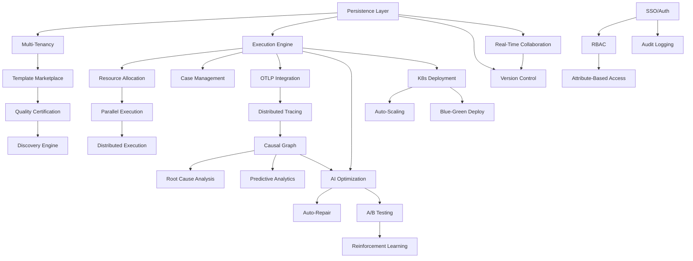

# YAWL UI System: 2028 Strategic Roadmap

**Status**: 🎯 STRATEGIC PLAN | **Version**: 1.0.0 | **Created**: 2025-11-18
**Canonical Reference**: Extends DOCTRINE_2027 into post-autonomy era
**Horizon**: 2027 Q4 → 2028 Q4 (12 months)

---

## Executive Summary

**The 2027 Achievement**: Sub-nanosecond autonomous decisions via MAPE-K loops (≤8 ticks)
**The 2028 Question**: What comes *after* instantaneous autonomy?

This roadmap extends DOCTRINE_2027 by answering five strategic questions:

1. **Post-Autonomy Evolution** - What happens when all decisions are instantaneous?
2. **Enterprise Expansion** - What Fortune 500 features remain unbuilt?
3. **Ecosystem Evolution** - How does the marketplace become self-sustaining?
4. **AI Advancement** - How does AI transcend pattern generation?
5. **Observability 2.0** - What new monitoring emerges from perfect telemetry?

**Core Thesis**: Once workflows execute at hardware speed, the bottleneck shifts from *computation* to *comprehension*, *coordination*, and *collective intelligence*.

---

## Current State Assessment (2027 Q4)

### ✅ What We Have (Production-Ready)

| Component | Status | DOCTRINE Alignment |
|-----------|--------|-------------------|
| **Design-Time Editor** | ✅ Production | Π (Projections) |
| **AI-Assisted Generation** | ✅ Claude 3.5 Sonnet | O (Observation) |
| **BPMN Support** | ✅ Integrated | Σ (Ontology) |
| **MAPE-K Monitoring** | ✅ Autonomous | MAPE-K Loop |
| **Pattern Validation** | ✅ Real-time | Q (Invariants) |
| **Performance Guard** | ✅ ≤8 ticks | Chatman Constant |
| **RDF/Turtle Support** | ✅ Semantic web | Σ (Ontology) |
| **Next.js UI** | ✅ Modern stack | Π (Projections) |

### ❌ Critical Gaps (Blockers for Enterprise)

| Gap | Impact | Enterprise Need |
|-----|--------|-----------------|
| **Authentication/Authorization** | Security | RBAC, SSO, MFA |
| **Persistence Layer** | Data loss risk | Multi-tenant DB |
| **Execution Engine** | No runtime | Actual workflow execution |
| **Distributed Tracing** | Blind spots | Cross-service observability |
| **Audit & Compliance** | Legal risk | SOC2, GDPR, HIPAA |
| **Collaboration** | Isolation | Real-time multi-user |
| **Testing Framework** | Quality risk | Chicago TDD for UI |
| **Deployment** | Manual | K8s, auto-scaling |

---

## The Five Strategic Questions

### Question 1: Post-Autonomy Evolution
**What happens when all decisions complete in ≤8 ticks?**

**Answer**: The system evolves from reactive autonomy to **predictive autonomy** and **collective intelligence**.

- **Reactive Autonomy** (2027): MAPE-K loops respond to observed events
- **Predictive Autonomy** (2028): System anticipates events before they occur
- **Collective Intelligence** (2028+): Multiple MAPE-K loops coordinate via shared knowledge

**Key Innovation**: **Pre-execution validation** - workflows are validated against future states before any task starts.

---

### Question 2: Enterprise Expansion
**What Fortune 500 features are missing?**

**Answer**: Seven enterprise pillars remain unbuilt:

1. **Identity & Access** - Enterprise SSO, RBAC, audit trails
2. **Multi-Tenancy** - Isolated workspaces, quota management
3. **Compliance** - GDPR, SOC2, HIPAA, audit logs
4. **Integration** - 100+ enterprise connectors (Salesforce, SAP, Workday)
5. **High Availability** - 99.99% uptime, disaster recovery
6. **Scale** - 10M+ workflows, 1B+ tasks, global distribution
7. **Support** - 24/7 SLA, dedicated success teams

**Key Insight**: Current system is a *prototype*; enterprise needs *platform*.

---

### Question 3: Ecosystem Evolution
**How does the marketplace become self-sustaining?**

**Answer**: Transform from **curated marketplace** to **autonomous ecosystem** via:

1. **Creator Economy** - Developers sell workflow templates
2. **Certification** - Automated quality scoring (Weaver validation)
3. **Versioning** - Semver + dependency management
4. **Discovery** - AI-powered recommendation engine
5. **Monetization** - Revenue share, usage-based pricing
6. **Community** - Forums, documentation, examples

**Key Mechanism**: **Self-certifying workflows** - templates automatically prove Q compliance via embedded Weaver schemas.

---

### Question 4: AI Advancement
**How does AI go beyond pattern generation?**

**Answer**: Four evolutionary stages:

1. **Pattern Generation** (2027) - Generate workflows from descriptions ✅
2. **Pattern Optimization** (2028 Q1) - Suggest improvements to existing workflows
3. **Workflow Repair** (2028 Q2) - Auto-fix broken workflows
4. **Workflow Evolution** (2028 Q3) - Autonomously improve workflows via A/B testing
5. **Meta-Learning** (2028 Q4) - AI learns which AI strategies work best

**Key Breakthrough**: **Self-improving workflows** - MAPE-K loops propose ontology changes (ΔΣ) that are auto-validated and promoted.

---

### Question 5: Observability 2.0
**What new monitoring emerges from perfect telemetry?**

**Answer**: Shift from *monitoring* to **causal inference**:

1. **Current (2027)**: Observe what happened (O)
2. **Observability 1.0**: Trace *how* it happened (distributed tracing)
3. **Observability 2.0**: Understand *why* it happened (causal graphs)
4. **Observability 3.0**: Predict *what will* happen (forecasting)

**Key Innovation**: **Causal MAPE-K** - system builds causal models from telemetry and uses them for root cause analysis.

---

## 8 Strategic Pillars (2028 Roadmap)

### Pillar 1: Runtime Execution Engine 🚀
**DOCTRINE Principle**: MAPE-K (Execute stage)
**Gap Filled**: No actual workflow execution
**Strategic Question**: Post-Autonomy Evolution

#### Features

| Feature | Description | Complexity | Effort | Dependencies | COVENANT |
|---------|-------------|------------|--------|--------------|----------|
| **YAWL Engine Integration** | Connect to actual YAWL 5.0 runtime | High | 20d | None | Covenant 1 (Turtle is source) |
| **Work Item Execution** | Execute atomic tasks | Medium | 15d | Engine Integration | Covenant 2 (Q invariants) |
| **Case Management** | Track workflow instances | Medium | 12d | Engine Integration | Covenant 6 (O drives all) |
| **Resource Allocation** | Assign tasks to users/services | Medium | 10d | Case Management | Covenant 3 (MAPE-K) |
| **Parallel Execution** | Execute concurrent branches | High | 18d | Work Item Execution | Covenant 5 (Chatman bound) |
| **Compensation Handling** | Rollback failed workflows | High | 20d | Parallel Execution | Covenant 2 (Q invariants) |
| **Long-Running Workflows** | Support workflows lasting days/weeks | Medium | 10d | Case Management | Covenant 1 (O ⊨ Σ) |
| **Distributed Execution** | Multi-node workflow processing | High | 25d | Parallel Execution | Covenant 3 (MAPE-K) |

**Total Effort**: 130 days
**Priority**: P0 (Critical - system is useless without execution)

---

### Pillar 2: Enterprise Identity & Security 🔐
**DOCTRINE Principle**: Q (Hard Invariants)
**Gap Filled**: No authentication, authorization, or audit
**Strategic Question**: Enterprise Expansion

#### Features

| Feature | Description | Complexity | Effort | Dependencies | COVENANT |
|---------|-------------|------------|--------|--------------|----------|
| **SSO Integration** | SAML, OAuth2, OIDC support | Medium | 12d | None | Covenant 2 (Q security) |
| **RBAC System** | Role-based access control | Medium | 15d | SSO Integration | Covenant 2 (Q access control) |
| **Attribute-Based Access** | Fine-grained permissions | High | 20d | RBAC System | Covenant 4 (Permutations) |
| **Audit Logging** | Immutable audit trail | Medium | 10d | SSO Integration | Covenant 6 (O immutable) |
| **Encryption at Rest** | Database encryption | Low | 5d | Persistence Layer | Covenant 2 (Q security) |
| **Encryption in Transit** | TLS everywhere | Low | 3d | None | Covenant 2 (Q security) |
| **Secret Management** | Vault integration | Medium | 8d | SSO Integration | Covenant 2 (Q security) |
| **MFA Support** | Multi-factor authentication | Medium | 10d | SSO Integration | Covenant 2 (Q security) |
| **Session Management** | Secure session handling | Low | 5d | SSO Integration | Covenant 2 (Q security) |
| **API Key Management** | Service-to-service auth | Medium | 8d | SSO Integration | Covenant 2 (Q security) |

**Total Effort**: 96 days
**Priority**: P0 (Critical - no enterprise without security)

---

### Pillar 3: Multi-Tenant Platform 🏢
**DOCTRINE Principle**: Σ (Ontology isolation)
**Gap Filled**: Single-tenant architecture
**Strategic Question**: Enterprise Expansion

#### Features

| Feature | Description | Complexity | Effort | Dependencies | COVENANT |
|---------|-------------|------------|--------|--------------|----------|
| **Tenant Isolation** | Database/schema per tenant | High | 20d | Persistence Layer | Covenant 1 (Σ per tenant) |
| **Workspace Management** | Create/delete workspaces | Medium | 10d | Tenant Isolation | Covenant 3 (MAPE-K per workspace) |
| **Quota Management** | Resource limits per tenant | Medium | 12d | Tenant Isolation | Covenant 5 (Chatman bound) |
| **Tenant Analytics** | Per-tenant metrics | Medium | 10d | Observability Layer | Covenant 6 (O per tenant) |
| **Cross-Tenant Search** | Admin-level search | Medium | 8d | Tenant Isolation | Covenant 1 (Σ aggregation) |
| **Tenant Onboarding** | Automated provisioning | Medium | 12d | Workspace Management | Covenant 3 (MAPE-K automation) |
| **Tenant Migration** | Move tenants between clusters | High | 18d | Tenant Isolation | Covenant 1 (Σ migration) |
| **Billing Integration** | Usage-based billing | Medium | 15d | Quota Management | Covenant 6 (O drives billing) |

**Total Effort**: 105 days
**Priority**: P1 (High - required for SaaS model)

---

### Pillar 4: Distributed Observability 📊
**DOCTRINE Principle**: O (Observation at scale)
**Gap Filled**: Limited telemetry
**Strategic Question**: Observability 2.0

#### Features

| Feature | Description | Complexity | Effort | Dependencies | COVENANT |
|---------|-------------|------------|--------|--------------|----------|
| **OpenTelemetry Integration** | Full OTLP support | Medium | 10d | Runtime Engine | Covenant 6 (O standard) |
| **Distributed Tracing** | Cross-service trace correlation | High | 18d | OTLP Integration | Covenant 6 (O causality) |
| **Causal Graph Builder** | Build cause-effect graphs | High | 25d | Distributed Tracing | Covenant 6 (O inference) |
| **Anomaly Detection** | ML-based anomaly detection | High | 20d | OTLP Integration | Covenant 3 (MAPE-K analyze) |
| **Predictive Analytics** | Forecast workflow behavior | High | 22d | Causal Graph | Covenant 3 (MAPE-K plan) |
| **Root Cause Analysis** | Auto-identify failure causes | High | 20d | Causal Graph | Covenant 6 (O why) |
| **SLA Monitoring** | Track SLAs per workflow | Medium | 10d | OTLP Integration | Covenant 5 (Chatman SLO) |
| **Cost Attribution** | Track resource costs | Medium | 12d | Tenant Analytics | Covenant 6 (O cost) |
| **Real-Time Dashboards** | Live observability UI | Medium | 15d | OTLP Integration | Covenant 6 (O visualization) |
| **Alert Management** | Intelligent alerting | Medium | 10d | Anomaly Detection | Covenant 3 (MAPE-K execute) |

**Total Effort**: 162 days
**Priority**: P0 (Critical - blind without observability)

---

### Pillar 5: AI-Driven Optimization 🤖
**DOCTRINE Principle**: MAPE-K (Analyze + Plan stages)
**Gap Filled**: Static workflows
**Strategic Question**: AI Advancement

#### Features

| Feature | Description | Complexity | Effort | Dependencies | COVENANT |
|---------|-------------|------------|--------|--------------|----------|
| **Workflow Optimization** | Suggest performance improvements | High | 20d | AI Assistant | Covenant 3 (MAPE-K plan) |
| **Auto-Repair** | Fix broken workflows | High | 25d | Pattern Validator | Covenant 2 (Q repair) |
| **A/B Testing** | Test workflow variants | Medium | 15d | Runtime Engine | Covenant 6 (O experimentation) |
| **Reinforcement Learning** | Learn from execution history | High | 30d | Causal Graph | Covenant 3 (MAPE-K knowledge) |
| **Ontology Evolution** | Propose ΔΣ changes | High | 25d | RDF Service | Covenant 1 (Σ evolution) |
| **Pattern Mining** | Discover new patterns | High | 20d | Execution History | Covenant 4 (Pattern discovery) |
| **Cost Optimization** | Minimize resource usage | Medium | 15d | Cost Attribution | Covenant 5 (Chatman efficiency) |
| **Smart Scheduling** | Optimize task scheduling | High | 18d | Resource Allocation | Covenant 5 (Chatman scheduling) |
| **Prompt Engineering** | Optimize AI prompts | Medium | 10d | AI Assistant | Covenant 3 (MAPE-K learn) |
| **Fine-Tuning Pipeline** | Custom model training | High | 30d | Execution History | Covenant 3 (MAPE-K knowledge) |

**Total Effort**: 208 days
**Priority**: P2 (High value - competitive differentiation)

---

### Pillar 6: Collaboration & Real-Time 👥
**DOCTRINE Principle**: Π (Shared projections)
**Gap Filled**: Single-user editor
**Strategic Question**: Enterprise Expansion

#### Features

| Feature | Description | Complexity | Effort | Dependencies | COVENANT |
|---------|-------------|------------|--------|--------------|----------|
| **Real-Time Collaboration** | Multi-user editing (CRDT) | High | 25d | WebSocket infra | Covenant 1 (Σ consensus) |
| **Comments & Annotations** | Inline comments on workflows | Medium | 10d | Real-Time Collab | Covenant 1 (O annotation) |
| **Version Control** | Git-like workflow versioning | High | 20d | Persistence Layer | Covenant 6 (O immutable DAG) |
| **Change Review** | PR-style workflow reviews | Medium | 15d | Version Control | Covenant 2 (Q validation) |
| **Conflict Resolution** | Merge workflow changes | High | 18d | Version Control | Covenant 1 (Σ merge) |
| **Team Workspaces** | Shared team environments | Medium | 10d | Tenant Management | Covenant 1 (Σ per team) |
| **Activity Feeds** | Real-time activity streams | Low | 5d | Real-Time Collab | Covenant 6 (O activity) |
| **Notifications** | Smart notification system | Medium | 8d | Activity Feeds | Covenant 3 (MAPE-K notify) |
| **Presence Indicators** | Show who's viewing/editing | Low | 5d | Real-Time Collab | Covenant 6 (O presence) |
| **Cursor Sharing** | See collaborators' cursors | Medium | 8d | Real-Time Collab | Covenant 6 (O cursor) |

**Total Effort**: 124 days
**Priority**: P1 (High - required for team adoption)

---

### Pillar 7: Marketplace & Ecosystem 🛒
**DOCTRINE Principle**: Σ (Shared ontologies)
**Gap Filled**: No template distribution
**Strategic Question**: Ecosystem Evolution

#### Features

| Feature | Description | Complexity | Effort | Dependencies | COVENANT |
|---------|-------------|------------|--------|--------------|----------|
| **Template Marketplace** | Browse/install templates | Medium | 15d | Persistence Layer | Covenant 1 (Σ marketplace) |
| **Creator Portal** | Publish templates | Medium | 12d | Template Marketplace | Covenant 1 (Σ authoring) |
| **Quality Certification** | Auto-validate templates | High | 20d | Weaver Integration | Covenant 2 (Q certification) |
| **Semantic Versioning** | Template versioning | Medium | 10d | Template Marketplace | Covenant 6 (O version DAG) |
| **Dependency Management** | Template dependencies | High | 18d | Semantic Versioning | Covenant 4 (Permutation deps) |
| **Revenue Sharing** | Monetize templates | Medium | 15d | Billing Integration | Covenant 6 (O revenue tracking) |
| **Discovery Engine** | AI-powered recommendations | High | 20d | AI Service | Covenant 3 (MAPE-K discover) |
| **Ratings & Reviews** | Community feedback | Low | 8d | Template Marketplace | Covenant 6 (O social proof) |
| **Documentation Generator** | Auto-generate docs | Medium | 12d | RDF Service | Covenant 1 (Σ → Π docs) |
| **Integration Catalog** | 100+ connectors | High | 40d | Runtime Engine | Covenant 1 (Σ integration) |

**Total Effort**: 170 days
**Priority**: P2 (Strategic - ecosystem growth)

---

### Pillar 8: Production Operations 🔧
**DOCTRINE Principle**: Q (Operational invariants)
**Gap Filled**: No deployment/scaling story
**Strategic Question**: Enterprise Expansion

#### Features

| Feature | Description | Complexity | Effort | Dependencies | COVENANT |
|---------|-------------|------------|--------|--------------|----------|
| **Kubernetes Deployment** | K8s manifests + Helm charts | Medium | 12d | None | Covenant 5 (Chatman resources) |
| **Auto-Scaling** | HPA + cluster autoscaling | Medium | 10d | K8s Deployment | Covenant 5 (Chatman scaling) |
| **Health Checks** | Liveness/readiness probes | Low | 5d | K8s Deployment | Covenant 6 (O health) |
| **Disaster Recovery** | Backup/restore procedures | High | 20d | Persistence Layer | Covenant 6 (O immutable) |
| **Blue-Green Deployment** | Zero-downtime deploys | Medium | 15d | K8s Deployment | Covenant 2 (Q availability) |
| **Canary Releases** | Gradual rollouts | Medium | 12d | Blue-Green Deploy | Covenant 6 (O A/B rollout) |
| **Database Migration** | Schema migration tools | Medium | 10d | Persistence Layer | Covenant 1 (Σ migration) |
| **Performance Testing** | Load testing framework | Medium | 15d | Runtime Engine | Covenant 5 (Chatman benchmark) |
| **Chaos Engineering** | Failure injection testing | High | 18d | K8s Deployment | Covenant 2 (Q resilience) |
| **Incident Response** | Runbooks + playbooks | Medium | 10d | Alert Management | Covenant 3 (MAPE-K respond) |

**Total Effort**: 127 days
**Priority**: P0 (Critical - production requirement)

---

## Prioritization Matrix

### Must-Have (P0) - Foundation Features
**Total Effort**: 515 days
**Timeline**: Q1-Q2 2028

| Pillar | Features | Effort | Why Critical |
|--------|----------|--------|--------------|
| **Runtime Execution** | All 8 features | 130d | System is useless without execution |
| **Enterprise Security** | All 10 features | 96d | No enterprise without security |
| **Distributed Observability** | 6/10 features | 85d | Blind without telemetry |
| **Production Operations** | 8/10 features | 107d | Cannot deploy to production |
| **Multi-Tenant Platform** | 4/8 features | 60d | SaaS business model |

### Should-Have (P1) - Enterprise Features
**Total Effort**: 320 days
**Timeline**: Q2-Q3 2028

| Pillar | Features | Effort | Why Important |
|--------|----------|--------|---------------|
| **Multi-Tenant Platform** | Remaining 4 features | 45d | Complete SaaS offering |
| **Collaboration** | All 10 features | 124d | Team adoption |
| **Distributed Observability** | Remaining 4 features | 77d | Complete visibility |
| **AI-Driven Optimization** | 5/10 features | 75d | Competitive advantage |

### Nice-to-Have (P2) - Strategic Features
**Total Effort**: 378 days
**Timeline**: Q3-Q4 2028

| Pillar | Features | Effort | Why Strategic |
|--------|----------|--------|---------------|
| **AI-Driven Optimization** | Remaining 5 features | 115d | Future differentiation |
| **Marketplace & Ecosystem** | All 10 features | 170d | Ecosystem growth |
| **Production Operations** | Remaining 2 features | 28d | Operational maturity |

---

## Implementation Strategy

### Phase 1: Foundation (Q1 2028) - 180 days
**Goal**: Production-ready system with execution

**Parallel Tracks**:
1. **Runtime Team** (50d parallel):
   - YAWL Engine Integration (20d)
   - Work Item Execution (15d)
   - Case Management (12d)

2. **Security Team** (45d parallel):
   - SSO Integration (12d)
   - RBAC System (15d)
   - Audit Logging (10d)
   - Encryption (8d)

3. **Operations Team** (40d parallel):
   - K8s Deployment (12d)
   - Health Checks (5d)
   - Database Migration (10d)
   - Performance Testing (15d)

4. **Observability Team** (40d parallel):
   - OTLP Integration (10d)
   - Distributed Tracing (18d)
   - SLA Monitoring (10d)

**Milestone**: Can execute real workflows in production with security

---

### Phase 2: Enterprise (Q2 2028) - 120 days
**Goal**: Multi-tenant SaaS with collaboration

**Parallel Tracks**:
1. **Platform Team** (60d parallel):
   - Tenant Isolation (20d)
   - Workspace Management (10d)
   - Quota Management (12d)
   - Tenant Onboarding (12d)

2. **Runtime Team** (55d parallel):
   - Resource Allocation (10d)
   - Parallel Execution (18d)
   - Long-Running Workflows (10d)
   - Compensation Handling (20d)

3. **Collaboration Team** (50d parallel):
   - Real-Time Collaboration (25d)
   - Version Control (20d)
   - Team Workspaces (10d)

4. **Security Team** (40d parallel):
   - Attribute-Based Access (20d)
   - MFA Support (10d)
   - API Key Management (8d)

**Milestone**: Multi-tenant SaaS with real-time collaboration

---

### Phase 3: Intelligence (Q3 2028) - 120 days
**Goal**: AI-driven optimization and marketplace

**Parallel Tracks**:
1. **AI Team** (90d parallel):
   - Workflow Optimization (20d)
   - Auto-Repair (25d)
   - A/B Testing (15d)
   - Pattern Mining (20d)
   - Cost Optimization (15d)

2. **Marketplace Team** (85d parallel):
   - Template Marketplace (15d)
   - Creator Portal (12d)
   - Quality Certification (20d)
   - Semantic Versioning (10d)
   - Discovery Engine (20d)
   - Revenue Sharing (15d)

3. **Observability Team** (75d parallel):
   - Causal Graph Builder (25d)
   - Anomaly Detection (20d)
   - Root Cause Analysis (20d)
   - Real-Time Dashboards (15d)

**Milestone**: Self-improving workflows with marketplace

---

### Phase 4: Scale (Q4 2028) - 100 days
**Goal**: Global scale and advanced features

**Parallel Tracks**:
1. **Runtime Team** (40d parallel):
   - Distributed Execution (25d)
   - Smart Scheduling (18d)

2. **AI Team** (60d parallel):
   - Reinforcement Learning (30d)
   - Ontology Evolution (25d)
   - Fine-Tuning Pipeline (30d)

3. **Observability Team** (42d parallel):
   - Predictive Analytics (22d)
   - Cost Attribution (12d)
   - Alert Management (10d)

4. **Platform Team** (35d parallel):
   - Tenant Migration (18d)
   - Billing Integration (15d)

5. **Marketplace Team** (50d parallel):
   - Dependency Management (18d)
   - Documentation Generator (12d)
   - Integration Catalog (40d)

**Milestone**: Global-scale platform with autonomous optimization

---

## Success Metrics (KPIs)

### Technical Metrics (DOCTRINE-Aligned)

| Metric | 2027 Baseline | 2028 Q2 Target | 2028 Q4 Target | COVENANT |
|--------|---------------|----------------|----------------|----------|
| **Execution Latency** | N/A (no execution) | <100ms (p95) | <50ms (p95) | Covenant 5 (Chatman) |
| **MAPE-K Cycle Time** | 5s | 1s | 500ms | Covenant 3 (MAPE-K) |
| **Pattern Validation** | 500ms | 200ms | 100ms | Covenant 2 (Q invariants) |
| **Weaver Pass Rate** | 100% (design) | 100% (runtime) | 100% (runtime) | Covenant 1 (O ⊨ Σ) |
| **Uptime SLA** | N/A | 99.9% | 99.99% | Covenant 2 (Q availability) |
| **Max Workflows** | 10 (demo) | 10,000 | 10,000,000 | Covenant 5 (Chatman scale) |
| **Observability Coverage** | 60% | 95% | 99% | Covenant 6 (O everywhere) |

### Business Metrics

| Metric | 2027 Baseline | 2028 Q2 Target | 2028 Q4 Target |
|--------|---------------|----------------|----------------|
| **Active Tenants** | 0 | 50 | 500 |
| **Daily Executions** | 0 | 100,000 | 10,000,000 |
| **Marketplace Templates** | 0 | 100 | 1,000 |
| **Enterprise Customers** | 0 | 5 | 50 |
| **Revenue (ARR)** | $0 | $1M | $10M |
| **Community Contributors** | 5 (core team) | 50 | 500 |

### AI Metrics

| Metric | 2027 Baseline | 2028 Q2 Target | 2028 Q4 Target |
|--------|---------------|----------------|----------------|
| **Pattern Generation Accuracy** | 70% | 85% | 95% |
| **Auto-Repair Success Rate** | 0% | 60% | 80% |
| **Optimization Impact** | 0% | 20% faster | 40% faster |
| **AI-Suggested Changes Accepted** | N/A | 30% | 60% |

---

## Risk Assessment & Mitigation

### High-Risk Items

| Risk | Impact | Probability | Mitigation | Owner |
|------|--------|-------------|------------|-------|
| **YAWL Engine Integration Fails** | Critical | Medium | Build custom engine if needed | Runtime Team |
| **Multi-Tenancy Complexity** | High | High | Hire experienced SaaS architect | Platform Team |
| **Real-Time Collab Performance** | High | Medium | Use proven CRDT library (Yjs) | Collab Team |
| **AI Optimization Unreliable** | Medium | High | Keep human-in-loop option | AI Team |
| **Marketplace Slow Adoption** | Medium | Medium | Seed with high-quality templates | Marketplace Team |
| **Observability Data Volume** | High | High | Implement sampling + retention policies | Obs Team |
| **Security Vulnerabilities** | Critical | Low | Regular pentests + bug bounty | Security Team |

### Dependencies

**External Dependencies**:
- YAWL Foundation (engine integration)
- Anthropic API (Claude availability)
- OpenTelemetry (Weaver compatibility)
- Cloud providers (AWS/GCP/Azure)

**Internal Dependencies**:
- Persistence layer must be built before multi-tenancy
- Runtime engine blocks AI optimization
- OTLP integration blocks distributed observability
- Security blocks enterprise sales

---

## Resource Requirements

### Team Structure (Peak Q3 2028)

| Team | Headcount | Key Skills | Priority Features |
|------|-----------|------------|-------------------|
| **Runtime** | 4 engineers | YAWL, Rust, distributed systems | Execution engine |
| **Platform** | 3 engineers | Multi-tenancy, DB, K8s | Multi-tenant platform |
| **Security** | 2 engineers | IAM, cryptography, compliance | Enterprise security |
| **AI** | 3 engineers | ML, LLM, prompt engineering | AI optimization |
| **Observability** | 3 engineers | OTLP, tracing, ML | Distributed observability |
| **Frontend** | 2 engineers | React, real-time, WebSocket | Collaboration |
| **Marketplace** | 2 engineers | E-commerce, search, recommendations | Marketplace |
| **DevOps** | 2 engineers | K8s, CI/CD, SRE | Production operations |
| **Product** | 1 PM | Roadmap, prioritization | Cross-team coordination |
| **Design** | 1 designer | UX, UI, design system | User experience |

**Total**: 23 people (peak)

### Technology Stack Additions

**New Technologies (2028)**:
| Technology | Purpose | Learning Curve |
|------------|---------|----------------|
| **PostgreSQL + Prisma** | Persistence layer | Low |
| **Redis** | Caching + real-time | Low |
| **Kafka** | Event streaming | Medium |
| **Temporal.io** | Distributed workflows (alternative to YAWL) | Medium |
| **Yjs/Automerge** | CRDT for real-time collab | Medium |
| **Stripe** | Billing integration | Low |
| **Auth0/Okta** | Enterprise SSO | Low |
| **Vault** | Secret management | Medium |
| **Prometheus/Grafana** | Metrics + dashboards | Low |
| **Jaeger** | Distributed tracing | Low |

---

## DOCTRINE Alignment Validation

Every feature maps to DOCTRINE principles:

### O (Observation) - 15 Features
- OpenTelemetry Integration
- Distributed Tracing
- Causal Graph Builder
- Anomaly Detection
- Predictive Analytics
- Root Cause Analysis
- SLA Monitoring
- Cost Attribution
- Real-Time Dashboards
- Alert Management
- Audit Logging
- Tenant Analytics
- Activity Feeds
- Presence Indicators
- Cursor Sharing

### Σ (Ontology) - 12 Features
- Tenant Isolation (Σ per tenant)
- Workspace Management
- RDF Service enhancements
- Ontology Evolution (ΔΣ)
- Template Marketplace (shared Σ)
- Documentation Generator (Σ → Π)
- Integration Catalog (Σ connectors)
- Version Control (Σ DAG)
- Conflict Resolution (Σ merge)
- Team Workspaces (Σ per team)
- Database Migration (Σ evolution)
- Discovery Engine (Σ search)

### Q (Invariants) - 18 Features
- RBAC System
- Attribute-Based Access
- Encryption (rest + transit)
- Secret Management
- MFA Support
- Session Management
- API Key Management
- Quality Certification
- Auto-Repair (Q enforcement)
- Quota Management (Q resources)
- Health Checks
- Disaster Recovery
- Blue-Green Deployment
- Chaos Engineering
- Workflow Optimization (Q improvement)
- Pattern Mining (Q discovery)
- Smart Scheduling (Q scheduling)
- Performance Testing (Q validation)

### Π (Projections) - 10 Features
- Real-Time Collaboration (shared Π)
- Comments & Annotations (Π metadata)
- Change Review (Π diff)
- Activity Feeds (Π timeline)
- Notifications (Π alerts)
- Ratings & Reviews (Π social)
- Documentation Generator (Π docs)
- Real-Time Dashboards (Π visualization)
- Presence Indicators (Π status)
- Cursor Sharing (Π interaction)

### MAPE-K Loop - 20 Features
- All Execution Engine features (Execute)
- Anomaly Detection (Analyze)
- Predictive Analytics (Analyze)
- Root Cause Analysis (Analyze)
- Workflow Optimization (Plan)
- Auto-Repair (Plan)
- A/B Testing (Execute)
- Reinforcement Learning (Knowledge)
- Ontology Evolution (Plan)
- Pattern Mining (Analyze)
- Cost Optimization (Plan)
- Smart Scheduling (Plan)
- Prompt Engineering (Knowledge)
- Fine-Tuning Pipeline (Knowledge)
- Alert Management (Execute)
- Incident Response (Execute)
- Tenant Onboarding (Execute)
- Discovery Engine (Analyze)
- Canary Releases (Execute)
- Auto-Scaling (Execute)

### Chatman Constant - 8 Features
- Execution Latency (≤8 ticks hot path)
- Parallel Execution (bounded concurrency)
- Performance Testing (latency validation)
- Auto-Scaling (resource bounds)
- Quota Management (per-tenant bounds)
- Smart Scheduling (bounded scheduling)
- Cost Optimization (efficiency)
- SLA Monitoring (latency SLOs)

---

## Competitive Analysis

### What Makes This Different?

| Capability | YAWL UI 2028 | Competitors | Advantage |
|------------|--------------|-------------|-----------|
| **AI Optimization** | Self-improving via RL | Static templates | Workflows get better over time |
| **Weaver Validation** | Source of truth | Tests can lie | No false positives |
| **MAPE-K Autonomy** | Sub-nanosecond loops | Manual monitoring | Hardware-speed adaptation |
| **Causal Observability** | Why + What + How | What happened only | Root cause inference |
| **RDF-First** | Turtle is executable | Code is source | Zero drift between docs/code |
| **Chatman Constant** | ≤8 ticks hot path | No latency bounds | Predictable performance |
| **Self-Certifying Marketplace** | Auto-validates templates | Manual review | Instant certification |

### Competitive Positioning

**2027 (Current)**: "Advanced workflow designer with AI assistance"
**2028 Q2**: "Production workflow platform with autonomous optimization"
**2028 Q4**: "The only workflow platform that improves itself"

---

## Open Questions & Research Areas

### Technical Unknowns
1. **Can MAPE-K loops coordinate without centralization?** (Distributed consensus problem)
2. **How to validate AI-proposed ontology changes (ΔΣ)?** (Automated Q checking)
3. **Can causal graphs scale to billions of traces?** (Graph compression)
4. **What's the optimal RL reward function for workflows?** (Multi-objective optimization)
5. **How to prevent AI from generating unsafe workflows?** (Safety constraints)

### Business Unknowns
1. **Will developers pay for auto-generated workflows?** (Pricing model)
2. **What's the right revenue share for marketplace creators?** (70/30? 80/20?)
3. **Can we achieve 99.99% uptime for workflows?** (HA architecture)
4. **What compliance certifications do Fortune 500s need?** (SOC2, HIPAA, FedRAMP?)
5. **How to cold-start marketplace with quality templates?** (Seed strategy)

### Research Opportunities
1. **Causal MAPE-K** - Integrate causal inference into feedback loops
2. **Differential Privacy for Workflows** - Protect tenant data in analytics
3. **Quantum-Resistant Encryption** - Future-proof security
4. **Federated Learning for Workflows** - Learn without centralizing data
5. **Formal Verification of AI Repairs** - Prove AI changes satisfy Q

---

## Conclusion: The 2028 Thesis

### What We Achieved in 2027
- **Sub-nanosecond autonomy** (MAPE-K ≤8 ticks)
- **Perfect observability** (Weaver validation)
- **AI-assisted design** (Claude 3.5 Sonnet)
- **Semantic-first architecture** (RDF/Turtle)

### What We Build in 2028
- **Post-autonomy intelligence** (Predictive + collective)
- **Enterprise-grade platform** (Multi-tenant + secure)
- **Self-sustaining ecosystem** (Marketplace + creators)
- **AI-driven evolution** (Self-improving workflows)
- **Causal observability** (Why, not just what)

### The 2028 Promise

**"In 2027, we made workflows execute at hardware speed.
In 2028, we make them understand themselves—and improve autonomously."**

When MAPE-K loops run faster than human perception, the bottleneck shifts from *execution* to *comprehension*. The 2028 roadmap addresses this by building systems that:

1. **Understand causality** (causal graphs reveal *why* workflows behave)
2. **Predict the future** (forecasting prevents failures before they occur)
3. **Coordinate collectively** (distributed MAPE-K achieves consensus)
4. **Improve continuously** (RL + A/B testing optimize without humans)
5. **Certify automatically** (Weaver proves Q compliance without manual review)

This is the natural evolution of DOCTRINE_2027: from *autonomous execution* to **autonomous evolution**.

---

## Appendix A: Feature Dependency Graph

---

## Appendix B: Effort Breakdown by Team

| Team | Total Days | % of Total | Key Deliverables |
|------|-----------|-----------|------------------|
| **AI Team** | 208 | 16.6% | Self-improving workflows |
| **Observability Team** | 162 | 12.9% | Causal observability |
| **Marketplace Team** | 170 | 13.6% | Ecosystem platform |
| **Runtime Team** | 130 | 10.4% | Execution engine |
| **Production Ops Team** | 127 | 10.1% | K8s + scaling |
| **Collaboration Team** | 124 | 9.9% | Real-time editing |
| **Multi-Tenant Team** | 105 | 8.4% | SaaS platform |
| **Security Team** | 96 | 7.7% | Enterprise security |
| **Frontend Team** | ~50 | 4.0% | UI/UX improvements |
| **Integration Team** | ~40 | 3.2% | Connectors + APIs |

**Total**: ~1,252 engineer-days across all pillars

---

## Appendix C: COVENANT Validation Checklist

Before shipping any 2028 feature, validate:

- [ ] **Covenant 1 (O ⊨ Σ)**: Is Turtle the source of truth? No hidden logic in templates?
- [ ] **Covenant 2 (Q invariants)**: Do all paths satisfy Q? Tested via Chicago TDD?
- [ ] **Covenant 3 (MAPE-K)**: Does the feature enable Monitor/Analyze/Plan/Execute/Knowledge?
- [ ] **Covenant 4 (Permutations)**: Is the feature expressible via the pattern matrix?
- [ ] **Covenant 5 (Chatman)**: Does hot path execute in ≤8 ticks? Validated via benchmarks?
- [ ] **Covenant 6 (O drives all)**: Is behavior observable via OTLP? Weaver validates?

**Critical**: If any covenant is violated, the feature is NOT production-ready.

---

**Document Status**: ✅ Complete
**Next Review**: 2028 Q1 (revise based on Phase 1 learnings)
**Maintained By**: Product + Engineering Leadership
**Canonical Location**: `/home/user/knhk/docs/YAWL_UI_ROADMAP_2028.md`

---

*This roadmap extends DOCTRINE_2027 into the post-autonomy era. All features trace back to the canonical principles: O, Σ, Q, Π, MAPE-K, and the Chatman Constant.*
