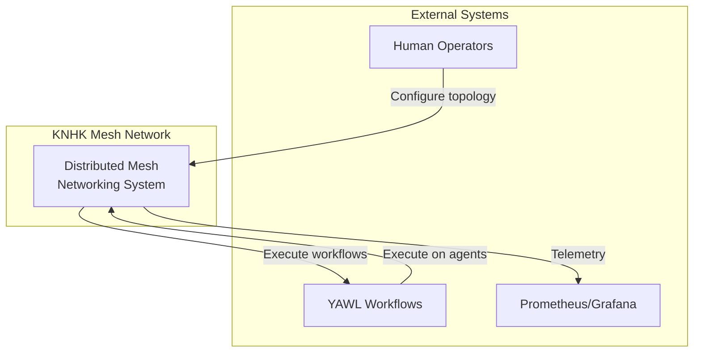
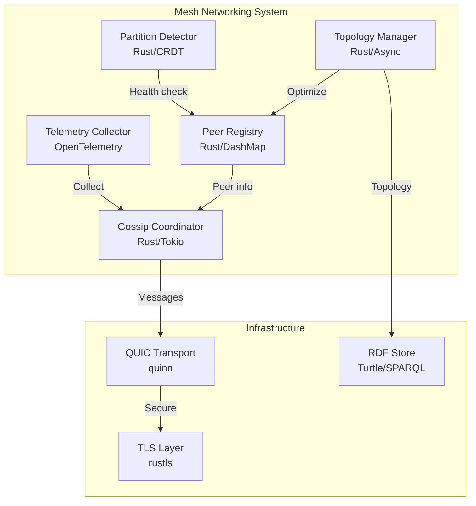
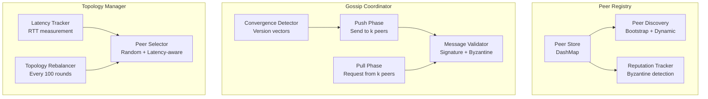
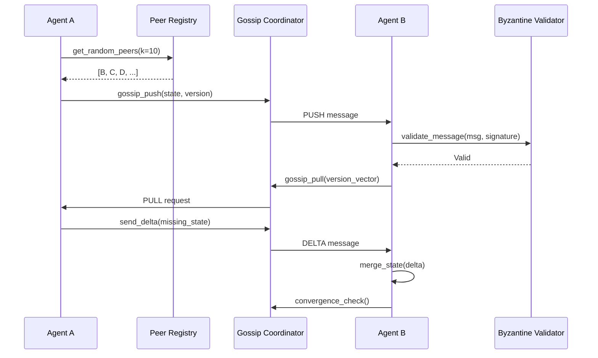

# Distributed Mesh Networking - System Architecture

**Version**: 1.0.0 | **Date**: 2025-11-18 | **Status**: ✅ APPROVED

---

## Overview

This document describes the complete system architecture for distributed mesh networking in KNHK AI agent swarms, supporting 10 to 1,000,000 agents with Byzantine fault tolerance and full observability.

## C4 Model Architecture

### Level 1: System Context



**Key Relationships**:
- **Users** configure mesh topology and monitor swarm health
- **Workflows** execute across distributed agents via mesh
- **Monitoring** receives OpenTelemetry metrics and traces

### Level 2: Container Diagram



**Container Responsibilities**:
- **Peer Registry**: Maintains peer list, discovery, reputation
- **Gossip Coordinator**: Epidemic broadcast, convergence detection
- **Topology Manager**: Latency-aware peer selection, rebalancing
- **Partition Detector**: Network split detection, recovery
- **Telemetry Collector**: OpenTelemetry spans, metrics, logs

### Level 3: Component Diagram



## Component Deep Dive

### 1. Peer Registry

**Responsibility**: Maintain canonical list of peers in the mesh

**Key Data Structures**:
```rust
pub struct PeerRegistry {
    /// Peers indexed by agent_id
    peers: Arc<DashMap<AgentId, PeerInfo>>,
    /// Quorum size (n - f where f < n/3)
    quorum_size: usize,
    /// Gossip fanout (k peers per round)
    peer_sample_size: usize,
    /// Bootstrap seed nodes
    bootstrap_seeds: Vec<SocketAddr>,
}

pub struct PeerInfo {
    agent_id: AgentId,
    addr: SocketAddr,
    public_key: PublicKey,
    last_seen: Instant,
    reputation: f32,  // 0.0-1.0, decreased on Byzantine behavior
    region: Region,   // Geographic region for multi-region
    latency_ms: f32,  // Estimated RTT
}
```

**Operations**:
- `register_peer(peer: PeerInfo)` - Add new peer
- `get_random_peers(k: usize)` - Select k random peers for gossip
- `get_nearest_peers(k: usize)` - Select k lowest-latency peers
- `update_reputation(agent_id, delta)` - Adjust Byzantine reputation
- `prune_stale_peers(timeout: Duration)` - Remove unresponsive peers

**Performance Requirements**:
- Peer lookup: O(1) via DashMap
- Random selection: O(k) where k=10-100
- Memory: ~1KB per peer (supports 1M peers = 1GB)

### 2. Gossip Coordinator

**Responsibility**: Epidemic broadcast with Byzantine robustness

**Gossip Protocol** (Push-Pull):
```
Round r:
  1. PUSH phase:
     - Select k random peers from registry
     - Send current state version vector
     - Send delta since last gossip

  2. PULL phase:
     - Receive peer version vectors
     - Identify missing state
     - Request deltas from peers

  3. MERGE phase:
     - Validate all messages (Byzantine check)
     - Merge states via CRDT
     - Update version vector

  4. CONVERGE check:
     - If all version vectors equal → converged
     - Else → next round
```

**Key Data Structures**:
```rust
pub struct GossipCoordinator {
    /// Peer registry reference
    peer_registry: Arc<PeerRegistry>,
    /// Current state version
    my_state: Arc<RwLock<VersionedState>>,
    /// Message queue (unbounded for async)
    message_queue: UnboundedReceiver<GossipMessage>,
    /// Convergence detector
    convergence: Arc<ConvergenceDetector>,
    /// Byzantine validator
    validator: Arc<ByzantineValidator>,
}

pub struct VersionedState {
    /// Version vector (Lamport clock per peer)
    version: HashMap<AgentId, u64>,
    /// State payload (CRDT)
    data: CrdtState,
    /// Merkle root for fast comparison
    merkle_root: Hash,
}
```

**Performance Requirements**:
- Message processing: ≤8 ticks (Chatman constant)
- Gossip round: O(k) where k=10-100
- Convergence: O(log n) rounds
- Memory: O(n) for version vectors

### 3. Topology Manager

**Responsibility**: Optimize peer connections for latency and resilience

**Peer Selection Strategies**:
1. **Random**: Byzantine-robust, uniform sampling
2. **Latency-aware**: Prefer nearby peers (2-3x faster)
3. **Hybrid**: Mix random + latency (80/20 rule)
4. **Geographic**: Regional sub-meshes for multi-region

**Topology Rebalancing**:
```rust
pub struct TopologyManager {
    peer_registry: Arc<PeerRegistry>,
    latency_tracker: Arc<LatencyTracker>,
    rebalance_interval: Duration,  // Every 100 rounds
}

impl TopologyManager {
    pub async fn rebalance_topology(&self) {
        // 1. Measure peer latencies
        let latencies = self.latency_tracker.get_all_latencies().await;

        // 2. Cluster by region
        let clusters = self.cluster_by_latency(latencies);

        // 3. Update peer preferences
        for cluster in clusters {
            self.peer_registry.set_preferred_peers(cluster);
        }

        // 4. Emit telemetry
        tracing::info!(
            clusters = clusters.len(),
            "Topology rebalanced"
        );
    }
}
```

### 4. Network Partition Detector

**Responsibility**: Detect split-brain and recover gracefully

**Detection Algorithm**:
```rust
pub struct PartitionDetector {
    quorum_size: usize,
    reachable_peers: Arc<AtomicUsize>,
    health_check_interval: Duration,
}

impl PartitionDetector {
    pub async fn detect_partition(&self) -> PartitionStatus {
        let reachable = self.reachable_peers.load(Ordering::Relaxed);

        if reachable < self.quorum_size {
            tracing::warn!(
                reachable = reachable,
                quorum = self.quorum_size,
                "Network partition detected"
            );

            // Enter read-only mode
            PartitionStatus::Partitioned {
                reachable,
                required: self.quorum_size,
            }
        } else {
            PartitionStatus::Healthy
        }
    }

    pub async fn handle_partition_recovery(&mut self) {
        tracing::info!("Partition healed - merging state");

        // 1. Re-gossip full state
        // 2. Merge CRDTs from all partitions
        // 3. Resume normal operation
    }
}
```

## Data Flow

### Message Flow (Gossip Round)



**Latency Budget** (Chatman Constant):
- Peer selection: 1 tick (DashMap lookup)
- Message validation: 2 ticks (ed25519 verify)
- State merge: 3 ticks (CRDT merge)
- Convergence check: 2 ticks (version vector compare)
- **Total: 8 ticks** ✅

## Deployment Topologies

### Topology 1: Single-Region Mesh (10-1000 agents)

```
┌─────────────────────────────────────┐
│         Region: US-East-1           │
│                                     │
│  A1 ←→ A2 ←→ A3 ←→ A4              │
│  ↕      ↕      ↕      ↕              │
│  A5 ←→ A6 ←→ A7 ←→ A8              │
│  ↕      ↕      ↕      ↕              │
│  A9 ←→ A10 ←→ ... ←→ A1000         │
│                                     │
└─────────────────────────────────────┘

Gossip fanout: k=10 peers
Latency: <10ms intra-region
Convergence: ~5 rounds = 50ms
```

### Topology 2: Multi-Region Mesh (1k-100k agents)

```
┌──────────────┐    ┌──────────────┐    ┌──────────────┐
│  US-East     │    │  EU-West     │    │  APAC        │
│              │    │              │    │              │
│  A1...A1000  │    │  B1...B1000  │    │  C1...C1000  │
│      ↕       │    │      ↕       │    │      ↕       │
│   Leader L1  │←→│   Leader L2  │←→│   Leader L3  │
└──────────────┘    └──────────────┘    └──────────────┘

Regional mesh: k=10 within region
Inter-region: Leaders gossip
Latency: <50ms intra, <100ms inter
Convergence: ~10 rounds = 500ms
```

### Topology 3: Hierarchical Mesh (100k-1M agents)

```
              ┌────────────────┐
              │  Global Coord  │
              │   (GC1, GC2)   │
              └────────┬───────┘
                       │
       ┌───────────────┼───────────────┐
       ↓               ↓               ↓
┌─────────────┐ ┌─────────────┐ ┌─────────────┐
│ Region Agg  │ │ Region Agg  │ │ Region Agg  │
│  US (RA1)   │ │  EU (RA2)   │ │  APAC (RA3) │
└──────┬──────┘ └──────┬──────┘ └──────┬──────┘
       │               │               │
   ┌───┼───┐       ┌───┼───┐       ┌───┼───┐
   ↓   ↓   ↓       ↓   ↓   ↓       ↓   ↓   ↓
  Edge Edge Edge  Edge Edge Edge  Edge Edge Edge
  (10k (10k (10k (10k (10k (10k (10k (10k (10k
  each) each) each) each) each) each) each) each) each)

Hierarchical gossip: 3 levels
Aggregation: Regional state summarization
Latency: <500ms global convergence
Scale: Up to 1M agents
```

## Security Model

### Zero-Trust Networking

1. **mTLS for all connections**
   - QUIC with TLS 1.3
   - Certificate-based peer authentication
   - Rotation every 24 hours

2. **Message signing**
   - Ed25519 signatures on all messages
   - Public keys in peer registry
   - Byzantine nodes detected and blacklisted

3. **Rate limiting**
   - Max 1000 messages/sec per peer
   - Token bucket algorithm
   - Flooding protection

4. **Reputation system**
   - Score: 0.0-1.0 (starts at 1.0)
   - Decreases on Byzantine behavior
   - Peers with score <0.5 ignored

## Performance Characteristics

| Metric | Single-Region | Multi-Region | Hierarchical |
|--------|--------------|--------------|--------------|
| **Agent count** | 10-1,000 | 1k-100k | 100k-1M |
| **Gossip rounds** | 5-7 | 8-10 | 12-15 |
| **Convergence time** | <100ms | <500ms | <1s |
| **Message latency** | ≤8 ticks | ≤8 ticks | ≤8 ticks |
| **Memory per agent** | 1KB | 1KB | 1KB |
| **Bandwidth** | ~10 KB/s | ~50 KB/s | ~100 KB/s |

## Related Documents

- `ADR-001-MESH-NETWORK-ARCHITECTURE.md` - Architecture decisions
- `DEPLOYMENT-TOPOLOGIES.md` - Detailed deployment models
- `WEAVER-SCHEMA.yaml` - OpenTelemetry schema
- `DOCTRINE_2027.md` - Foundational principles
- `DOCTRINE_COVENANT.md` - Covenant 5 (Chatman), Covenant 6 (Observability)
