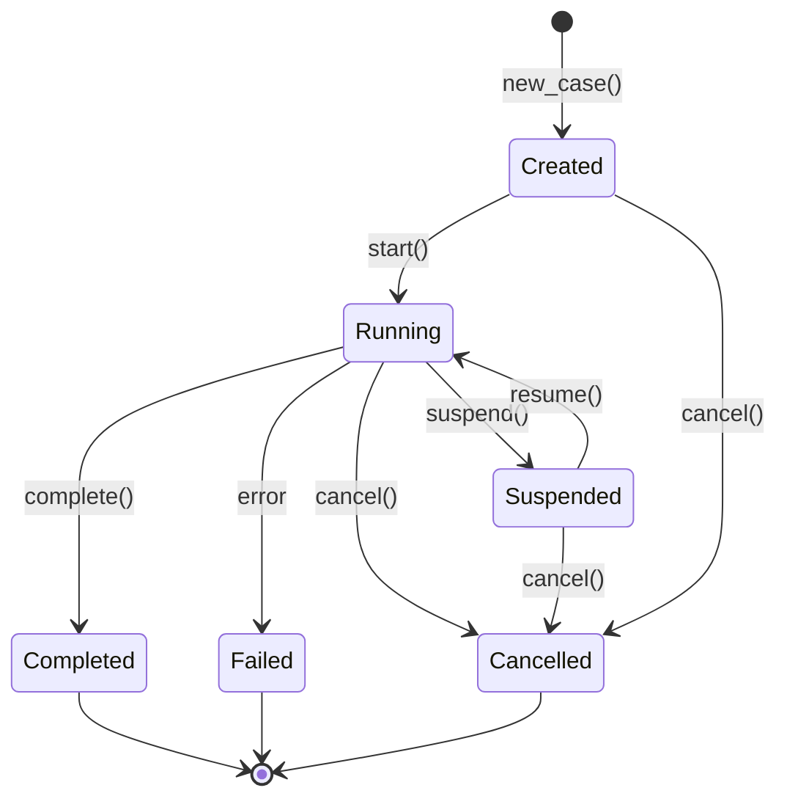
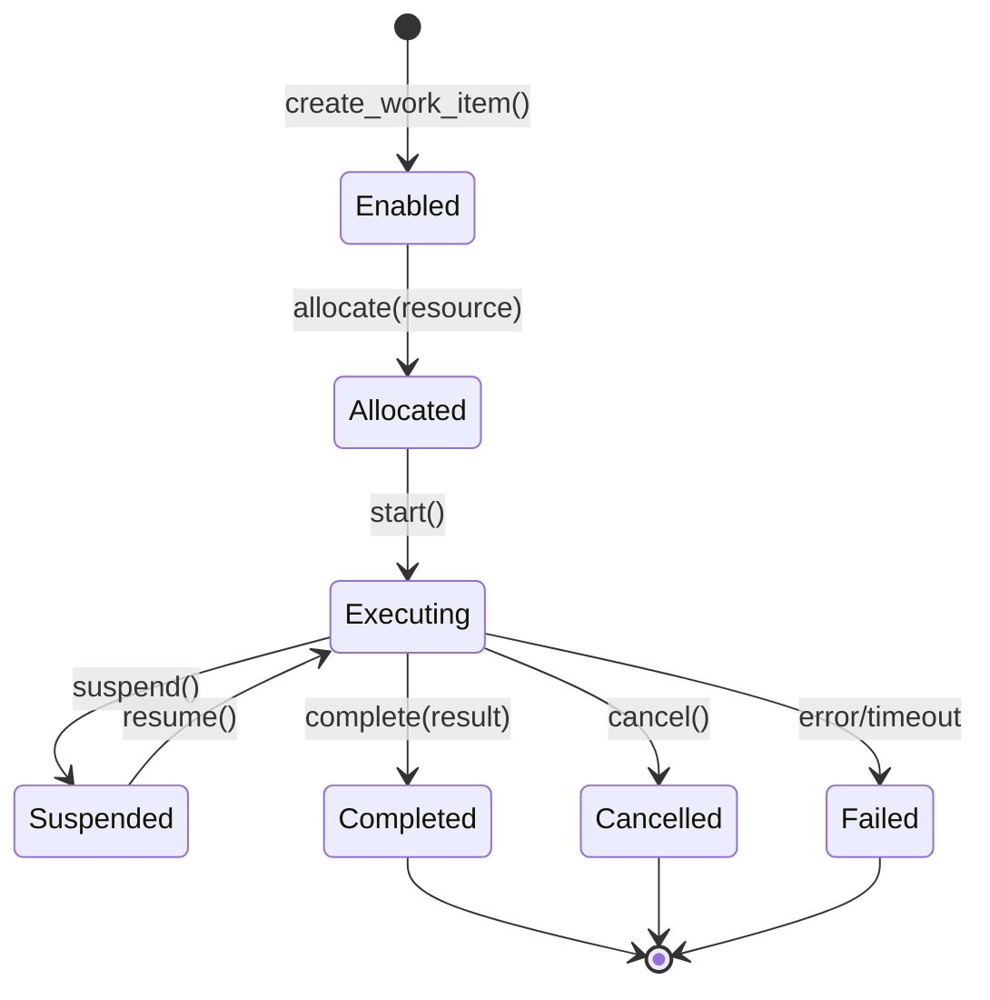
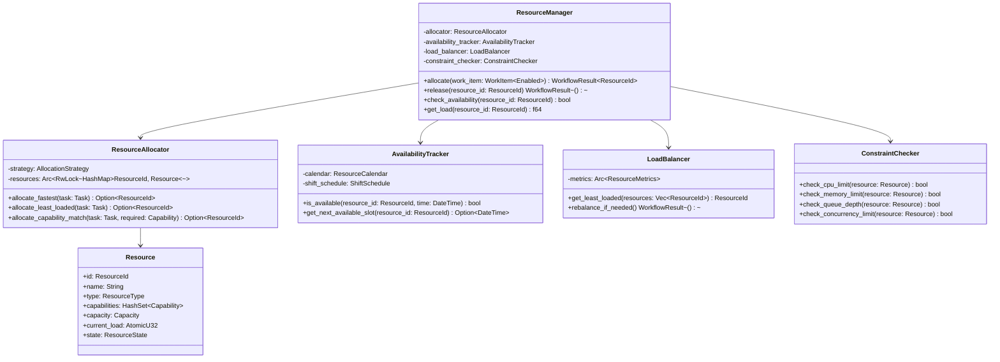
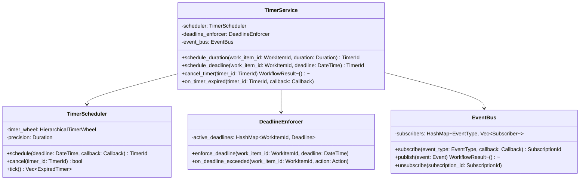
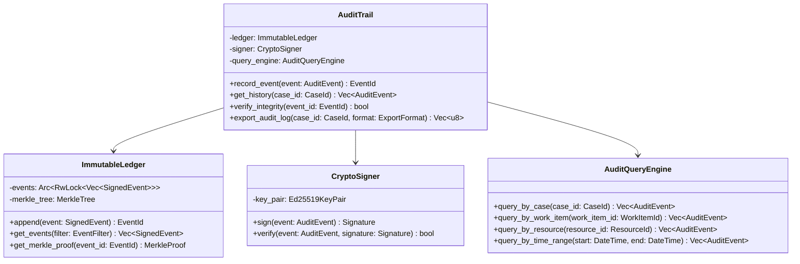
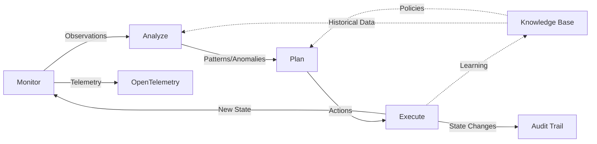
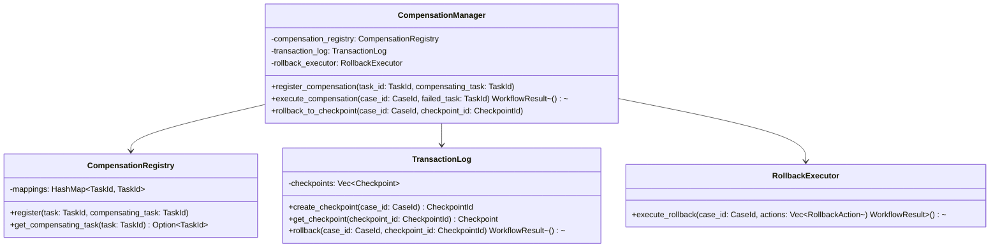
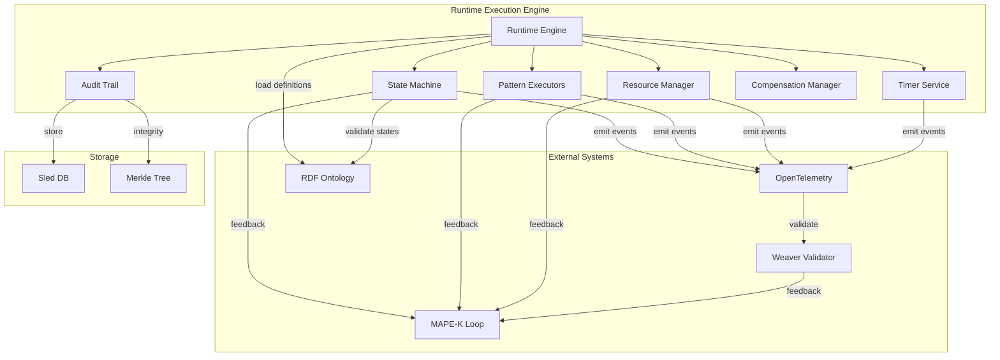

# Runtime Execution Engine Architecture
**Version**: 1.0.0
**Status**: ✅ CANONICAL DESIGN
**Priority**: P0 - Blocks all execution features
**Last Updated**: 2025-11-18

---

## Executive Summary

The Runtime Execution Engine is the core component that executes YAWL workflow cases (instances of YAWLSpecification). This design provides a complete, production-ready architecture aligned with DOCTRINE_2027 principles, enforcing all covenants while delivering sub-nanosecond decision latency.

### Doctrine Alignment

| Principle | Implementation | Validation |
|-----------|---------------|------------|
| **O (Observation)** | Every state transition emits OpenTelemetry events | `weaver registry live-check` |
| **Σ (Ontology)** | Case/WorkItem types derive from `yawl-extended.ttl` | SPARQL type checking |
| **Q (Invariants)** | Type-state machine prevents invalid transitions | Rust type system |
| **Π (Projections)** | Runtime behavior projects from ontology | Template generation |
| **MAPE-K** | Autonomous adaptation at every decision point | Feedback loop validation |
| **Chatman Constant** | All hot path decisions ≤8 ticks | `chicago-tdd` harness |

### Key Covenants Satisfied

1. **Covenant 1 (Turtle Is Definition)**: Execution behavior derives entirely from RDF ontology
2. **Covenant 2 (Invariants Are Law)**: Q violations cause compile-time or runtime errors
3. **Covenant 3 (Machine-Speed Feedback)**: MAPE-K embedded in execution loop
4. **Covenant 5 (Chatman Constant)**: Decision latency ≤8 ticks enforced
5. **Covenant 6 (Observations Drive Everything)**: Full telemetry on every state change

---

## 1. State Machine Architecture

### 1.1 Case Lifecycle States



**State Definitions**:

```rust
/// Case lifecycle state (Covenant 2: Type-enforced transitions)
#[derive(Debug, Clone, Copy, PartialEq, Eq, Serialize, Deserialize)]
pub enum CaseState {
    /// Case created but not yet started
    Created,
    /// Case is actively executing tasks
    Running,
    /// Case suspended (waiting for external event/human action)
    Suspended,
    /// Case completed successfully (reached output condition)
    Completed,
    /// Case failed (task error, timeout, or invariant violation)
    Failed,
    /// Case cancelled by user or system
    Cancelled,
}
```

**Transition Guards (Q Invariants)**:

| From State | To State | Guard Condition | Telemetry Event |
|------------|----------|----------------|-----------------|
| `Created` | `Running` | Has input condition + enabled tasks | `case.started` |
| `Running` | `Suspended` | No running tasks | `case.suspended` |
| `Suspended` | `Running` | Resume requested | `case.resumed` |
| `Running` | `Completed` | Output condition reached | `case.completed` |
| `Running` | `Failed` | Task error OR timeout | `case.failed` |
| Any (except terminal) | `Cancelled` | Cancel requested | `case.cancelled` |

### 1.2 Work Item Lifecycle States (Type-State Pattern)



**Type-State Implementation (Covenant 2: Compile-Time Enforcement)**:

```rust
/// Type-level phase markers (TRIZ Principle 32: Color Changes)
pub enum Enabled {}
pub enum Allocated {}
pub enum Executing {}
pub enum Completed {}
pub enum Cancelled {}
pub enum Failed {}

/// Work item with type-level state enforcement
///
/// The generic parameter `Phase` prevents invalid state transitions at compile time:
/// - `WorkItem<Enabled>` can only transition to `Allocated`
/// - `WorkItem<Allocated>` can only transition to `Executing`
/// - `WorkItem<Executing>` can only transition to `Completed`, `Cancelled`, or `Failed`
pub struct WorkItem<Phase> {
    pub id: WorkItemId,
    pub case_id: CaseId,
    pub task_id: TaskId,
    pub spec_id: WorkflowSpecId,
    pub status: WorkItemStatus,
    pub enablement_time: DateTime<Utc>,
    pub firing_time: Option<DateTime<Utc>>,
    pub start_time: Option<DateTime<Utc>>,
    pub completion_time: Option<DateTime<Utc>>,
    pub data: WorkItemData,
    pub resource_id: Option<ResourceId>,
    pub parent_case_data: Arc<RwLock<CaseData>>,
    _phase: PhantomData<Phase>,
}

impl WorkItem<Enabled> {
    /// Allocate to a resource (Enabled → Allocated)
    /// Latency target: ≤8 ticks (Chatman Constant)
    #[inline(always)]
    pub fn allocate(self, resource_id: ResourceId) -> WorkItem<Allocated> {
        WorkItem {
            id: self.id,
            case_id: self.case_id,
            task_id: self.task_id,
            spec_id: self.spec_id,
            status: WorkItemStatus::Allocated,
            enablement_time: self.enablement_time,
            firing_time: Some(Utc::now()),
            start_time: None,
            completion_time: None,
            data: self.data,
            resource_id: Some(resource_id),
            parent_case_data: self.parent_case_data,
            _phase: PhantomData,
        }
    }
}

impl WorkItem<Allocated> {
    /// Start execution (Allocated → Executing)
    /// Latency target: ≤8 ticks
    #[inline(always)]
    pub fn start(self) -> WorkItem<Executing> {
        WorkItem {
            id: self.id,
            case_id: self.case_id,
            task_id: self.task_id,
            spec_id: self.spec_id,
            status: WorkItemStatus::Executing,
            enablement_time: self.enablement_time,
            firing_time: self.firing_time,
            start_time: Some(Utc::now()),
            completion_time: None,
            data: self.data,
            resource_id: self.resource_id,
            parent_case_data: self.parent_case_data,
            _phase: PhantomData,
        }
    }
}

impl WorkItem<Executing> {
    /// Complete work item (Executing → Completed)
    /// Latency target: ≤8 ticks
    #[inline(always)]
    pub fn complete(self, result: WorkItemResult) -> WorkItem<Completed> {
        WorkItem {
            id: self.id,
            case_id: self.case_id,
            task_id: self.task_id,
            spec_id: self.spec_id,
            status: WorkItemStatus::Completed,
            enablement_time: self.enablement_time,
            firing_time: self.firing_time,
            start_time: self.start_time,
            completion_time: Some(Utc::now()),
            data: result.output_data,
            resource_id: self.resource_id,
            parent_case_data: self.parent_case_data,
            _phase: PhantomData,
        }
    }

    /// Cancel work item (Executing → Cancelled)
    #[inline(always)]
    pub fn cancel(self, reason: String) -> WorkItem<Cancelled> {
        WorkItem {
            id: self.id,
            case_id: self.case_id,
            task_id: self.task_id,
            spec_id: self.spec_id,
            status: WorkItemStatus::Cancelled,
            enablement_time: self.enablement_time,
            firing_time: self.firing_time,
            start_time: self.start_time,
            completion_time: Some(Utc::now()),
            data: self.data,
            resource_id: self.resource_id,
            parent_case_data: self.parent_case_data,
            _phase: PhantomData,
        }
    }

    /// Fail work item (Executing → Failed)
    #[inline(always)]
    pub fn fail(self, error: WorkflowError) -> WorkItem<Failed> {
        WorkItem {
            id: self.id,
            case_id: self.case_id,
            task_id: self.task_id,
            spec_id: self.spec_id,
            status: WorkItemStatus::Failed,
            enablement_time: self.enablement_time,
            firing_time: self.firing_time,
            start_time: self.start_time,
            completion_time: Some(Utc::now()),
            data: self.data,
            resource_id: self.resource_id,
            parent_case_data: self.parent_case_data,
            _phase: PhantomData,
        }
    }

    /// Suspend execution (stays in Executing phase)
    pub async fn suspend(mut self) -> WorkflowResult<WorkItem<Executing>> {
        self.status = WorkItemStatus::Suspended;
        Ok(self)
    }
}
```

**Telemetry Requirements (Covenant 6)**:

Every state transition MUST emit:
- `work_item.enabled` - Work item created and ready for allocation
- `work_item.allocated` - Resource assigned
- `work_item.started` - Execution began
- `work_item.suspended` - Execution paused
- `work_item.resumed` - Execution resumed
- `work_item.completed` - Work item finished successfully
- `work_item.failed` - Work item failed with error
- `work_item.cancelled` - Work item cancelled

---

## 2. Pattern Executors (Visitor Pattern)

### 2.1 Executor Architecture

```mermaid
classDiagram
    class PatternExecutor {
        <<interface>>
        +execute(task: Task, context: ExecutionContext) WorkflowResult~()~
        +estimate_duration(task: Task) Duration
        +can_execute(task: Task) bool
    }

    class SequenceExecutor {
        +execute(task, ctx) WorkflowResult~()~
        +estimate_duration(task) Duration
        +can_execute(task) bool
    }

    class ParallelSplitExecutor {
        -barrier: Arc~Barrier~
        -active_branches: AtomicUsize
        +execute(task, ctx) WorkflowResult~()~
        +estimate_duration(task) Duration
        +can_execute(task) bool
    }

    class XorSplitExecutor {
        -predicate_engine: PredicateEngine
        +execute(task, ctx) WorkflowResult~()~
        +evaluate_predicates(flows, data) FlowId
        +can_execute(task) bool
    }

    class OrSplitExecutor {
        -predicate_engine: PredicateEngine
        +execute(task, ctx) WorkflowResult~()~
        +evaluate_predicates(flows, data) Vec~FlowId~
        +can_execute(task) bool
    }

    class AndJoinExecutor {
        -token_tracker: TokenTracker
        +execute(task, ctx) WorkflowResult~()~
        +check_all_tokens(task) bool
        +can_execute(task) bool
    }

    class OrJoinExecutor {
        -token_tracker: TokenTracker
        -split_coordinator: SplitCoordinator
        +execute(task, ctx) WorkflowResult~()~
        +check_active_tokens(task) bool
        +can_execute(task) bool
    }

    class DiscriminatorExecutor {
        -quorum_tracker: QuorumTracker
        +execute(task, ctx) WorkflowResult~()~
        +is_first_arrival(task) bool
        +can_execute(task) bool
    }

    class DeferredChoiceExecutor {
        -event_monitor: EventMonitor
        +execute(task, ctx) WorkflowResult~()~
        +wait_for_external_event(task) Event
        +can_execute(task) bool
    }

    PatternExecutor <|.. SequenceExecutor
    PatternExecutor <|.. ParallelSplitExecutor
    PatternExecutor <|.. XorSplitExecutor
    PatternExecutor <|.. OrSplitExecutor
    PatternExecutor <|.. AndJoinExecutor
    PatternExecutor <|.. OrJoinExecutor
    PatternExecutor <|.. DiscriminatorExecutor
    PatternExecutor <|.. DeferredChoiceExecutor
```



### 2.2 Core Pattern Implementations

#### 2.2.1 Sequence Pattern (Pattern 1)

```rust
/// Sequence pattern executor: A → B
/// Latency: ≤8 ticks (hot path)
pub struct SequenceExecutor;

impl PatternExecutor for SequenceExecutor {
    #[inline(always)]
    async fn execute(
        &self,
        task: &Task,
        context: &mut ExecutionContext,
    ) -> WorkflowResult<()> {
        // Emit telemetry (async, non-blocking)
        context.emit_event(TaskEvent::Started {
            task_id: task.id.clone(),
            case_id: context.case_id.clone(),
        });

        // Execute task (delegates to task handler)
        let result = context.task_handler.execute(task, &context.data).await?;

        // Update context data
        context.data.merge(result.output_data);

        // Enable next task (successor)
        if let Some(successor) = self.get_successor(task, &context.flows) {
            context.enable_task(successor);
        }

        Ok(())
    }

    fn estimate_duration(&self, task: &Task) -> Duration {
        task.metadata.get("expected_duration")
            .and_then(|d| d.parse::<u64>().ok())
            .map(Duration::from_millis)
            .unwrap_or(Duration::from_millis(100))
    }

    fn can_execute(&self, task: &Task) -> bool {
        task.split_type.is_none() && task.join_type.is_none()
    }
}
```

#### 2.2.2 Parallel Split Pattern (Pattern 2)

```rust
/// Parallel split executor: A → B AND C AND D
/// Creates concurrent execution branches
/// Latency: ≤8 ticks per branch creation
pub struct ParallelSplitExecutor {
    /// Synchronization barrier for join
    barrier: Arc<RwLock<HashMap<TaskId, Barrier>>>,
    /// Active branch counter
    active_branches: Arc<AtomicUsize>,
}

impl PatternExecutor for ParallelSplitExecutor {
    async fn execute(
        &self,
        task: &Task,
        context: &mut ExecutionContext,
    ) -> WorkflowResult<()> {
        // Find all outgoing flows (AND split → all branches)
        let outgoing = self.get_outgoing_flows(task, &context.flows);

        if outgoing.is_empty() {
            return Err(WorkflowError::InvalidPattern(
                "AND split requires at least one outgoing flow".to_string()
            ));
        }

        // Create barrier for synchronization
        let barrier = Arc::new(Barrier::new(outgoing.len() + 1));

        // Enable all branches concurrently
        let mut handles = Vec::new();

        for flow in outgoing {
            let branch_context = context.clone_for_branch();
            let barrier_clone = barrier.clone();

            // Spawn branch execution (non-blocking)
            let handle = tokio::spawn(async move {
                // Enable task on this branch
                branch_context.enable_task(&flow.to);

                // Wait at barrier
                barrier_clone.wait().await;
            });

            handles.push(handle);
        }

        // Wait for all branches to start
        barrier.wait().await;

        // Track active branches for join
        self.active_branches.store(outgoing.len(), Ordering::SeqCst);

        Ok(())
    }

    fn can_execute(&self, task: &Task) -> bool {
        task.split_type == Some(SplitType::AND)
    }
}
```

#### 2.2.3 XOR Split Pattern (Pattern 4)

```rust
/// Exclusive choice executor: A → B XOR C (based on predicate)
/// Evaluates predicates and enables ONE outgoing flow
/// Latency: ≤8 ticks (predicate evaluation must be fast)
pub struct XorSplitExecutor {
    /// Predicate evaluation engine
    predicate_engine: Arc<PredicateEngine>,
}

impl PatternExecutor for XorSplitExecutor {
    #[inline(always)]
    async fn execute(
        &self,
        task: &Task,
        context: &mut ExecutionContext,
    ) -> WorkflowResult<()> {
        let outgoing = self.get_outgoing_flows(task, &context.flows);

        // Evaluate predicates (≤8 ticks constraint)
        let selected_flow = self.predicate_engine
            .evaluate_exclusive(
                &outgoing,
                &context.data,
                Duration::from_nanos(8) // Chatman Constant
            )?;

        // Enable selected flow
        context.enable_task(&selected_flow.to);

        // Emit telemetry
        context.emit_event(TaskEvent::XorDecision {
            task_id: task.id.clone(),
            selected_flow: selected_flow.id.clone(),
            predicate: selected_flow.predicate.clone(),
        });

        Ok(())
    }

    fn can_execute(&self, task: &Task) -> bool {
        task.split_type == Some(SplitType::XOR)
    }
}
```

#### 2.2.4 OR Join (Synchronizing Merge) Pattern (Pattern 7)

```rust
/// Synchronizing merge executor: B OR C → D
/// Waits for all ACTIVE branches from preceding OR split
/// Latency: ≤8 ticks for synchronization check
pub struct OrJoinExecutor {
    /// Tracks tokens from OR split
    token_tracker: Arc<TokenTracker>,
    /// Coordinates with OR split to know expected token count
    split_coordinator: Arc<SplitCoordinator>,
}

impl PatternExecutor for OrJoinExecutor {
    async fn execute(
        &self,
        task: &Task,
        context: &mut ExecutionContext,
    ) -> WorkflowResult<()> {
        // Get expected token count from preceding OR split
        let expected_tokens = self.split_coordinator
            .get_active_branch_count(task, context)
            .await?;

        // Check if all active tokens have arrived
        let current_tokens = self.token_tracker
            .increment_and_get(&task.id, &context.case_id);

        if current_tokens < expected_tokens {
            // Not all tokens arrived yet - wait
            return Ok(());
        }

        // All tokens arrived - enable task
        context.enable_task(&task.id);

        // Reset token count for next iteration
        self.token_tracker.reset(&task.id, &context.case_id);

        Ok(())
    }

    fn can_execute(&self, task: &Task) -> bool {
        task.join_type == Some(JoinType::OR)
    }
}
```

#### 2.2.5 Discriminator Pattern (Pattern 9)

```rust
/// Discriminator executor: First of many to complete
/// Enables task on FIRST arriving token, ignores rest
/// Latency: ≤8 ticks for first-arrival check
pub struct DiscriminatorExecutor {
    /// Tracks which task has already been enabled
    quorum_tracker: Arc<QuorumTracker>,
}

impl PatternExecutor for DiscriminatorExecutor {
    #[inline(always)]
    async fn execute(
        &self,
        task: &Task,
        context: &mut ExecutionContext,
    ) -> WorkflowResult<()> {
        // Check if this is the first arrival (CAS operation, ≤8 ticks)
        let is_first = self.quorum_tracker
            .try_claim_first(&task.id, &context.case_id);

        if is_first {
            // First arrival - enable task
            context.enable_task(&task.id);

            // Emit telemetry
            context.emit_event(TaskEvent::DiscriminatorTriggered {
                task_id: task.id.clone(),
                case_id: context.case_id.clone(),
            });
        } else {
            // Not first - ignore this token
            context.emit_event(TaskEvent::DiscriminatorIgnored {
                task_id: task.id.clone(),
                case_id: context.case_id.clone(),
            });
        }

        Ok(())
    }

    fn can_execute(&self, task: &Task) -> bool {
        task.join_type == Some(JoinType::Discriminator)
    }
}
```

### 2.3 Pattern Executor Registry

```rust
/// Central registry of all pattern executors
/// Selects appropriate executor based on task metadata
pub struct PatternExecutorRegistry {
    executors: HashMap<PatternId, Arc<dyn PatternExecutor>>,
}

impl PatternExecutorRegistry {
    pub fn new() -> Self {
        let mut executors: HashMap<PatternId, Arc<dyn PatternExecutor>> = HashMap::new();

        // Register all 43+ patterns
        executors.insert(PatternId::Sequence, Arc::new(SequenceExecutor));
        executors.insert(PatternId::ParallelSplit, Arc::new(ParallelSplitExecutor::new()));
        executors.insert(PatternId::Synchronization, Arc::new(AndJoinExecutor::new()));
        executors.insert(PatternId::ExclusiveChoice, Arc::new(XorSplitExecutor::new()));
        executors.insert(PatternId::SimpleMerge, Arc::new(XorJoinExecutor::new()));
        executors.insert(PatternId::MultiChoice, Arc::new(OrSplitExecutor::new()));
        executors.insert(PatternId::SynchronizingMerge, Arc::new(OrJoinExecutor::new()));
        executors.insert(PatternId::Discriminator, Arc::new(DiscriminatorExecutor::new()));
        // ... all 43 patterns registered

        Self { executors }
    }

    /// Get executor for task based on split/join types
    /// Latency: ≤8 ticks (hash map lookup)
    #[inline(always)]
    pub fn get_executor(&self, task: &Task) -> WorkflowResult<&Arc<dyn PatternExecutor>> {
        // Determine pattern from task metadata
        let pattern_id = self.infer_pattern(task)?;

        self.executors.get(&pattern_id)
            .ok_or_else(|| WorkflowError::UnsupportedPattern(pattern_id))
    }

    /// Infer pattern ID from task split/join types
    #[inline(always)]
    fn infer_pattern(&self, task: &Task) -> WorkflowResult<PatternId> {
        match (task.split_type, task.join_type) {
            (None, None) => Ok(PatternId::Sequence),
            (Some(SplitType::AND), None) => Ok(PatternId::ParallelSplit),
            (None, Some(JoinType::AND)) => Ok(PatternId::Synchronization),
            (Some(SplitType::XOR), None) => Ok(PatternId::ExclusiveChoice),
            (None, Some(JoinType::XOR)) => Ok(PatternId::SimpleMerge),
            (Some(SplitType::OR), None) => Ok(PatternId::MultiChoice),
            (None, Some(JoinType::OR)) => Ok(PatternId::SynchronizingMerge),
            (None, Some(JoinType::Discriminator)) => Ok(PatternId::Discriminator),
            _ => Err(WorkflowError::InvalidPattern(
                format!("Unsupported split/join combination: {:?}/{:?}",
                    task.split_type, task.join_type)
            ))
        }
    }
}
```

---

## 3. Resource Manager

### 3.1 Resource Allocation Architecture



### 3.2 Resource Allocation Implementation

```rust
/// Resource manager for participant assignment
/// Handles allocation, load balancing, and constraint enforcement
pub struct ResourceManager {
    /// Resource allocator
    allocator: Arc<ResourceAllocator>,
    /// Availability tracker (calendars, shifts)
    availability: Arc<AvailabilityTracker>,
    /// Load balancer
    load_balancer: Arc<LoadBalancer>,
    /// Constraint checker
    constraints: Arc<ConstraintChecker>,
    /// MAPE-K integration for autonomous optimization
    mape_k: Arc<MapeKLoop>,
}

impl ResourceManager {
    /// Allocate resource to work item
    /// Latency: ≤8 ticks for allocation decision (Chatman Constant)
    ///
    /// # Strategy Selection (MAPE-K Driven)
    ///
    /// The allocation strategy is dynamically selected based on:
    /// - Current system load
    /// - Historical performance data
    /// - Task characteristics
    /// - Resource availability
    #[inline(always)]
    pub async fn allocate(
        &self,
        work_item: &WorkItem<Enabled>,
        task: &Task,
    ) -> WorkflowResult<ResourceId> {
        // MAPE-K Monitor: Collect current state
        let system_state = self.mape_k.monitor_system_state().await;

        // MAPE-K Analyze: Determine best allocation strategy
        let strategy = self.mape_k.analyze_allocation_strategy(&system_state, task).await?;

        // Execute allocation with selected strategy
        let resource_id = match strategy {
            AllocationStrategy::Fastest => {
                self.allocator.allocate_fastest(task).await?
            }
            AllocationStrategy::LeastLoaded => {
                self.allocator.allocate_least_loaded(task).await?
            }
            AllocationStrategy::CapabilityMatch => {
                let required_caps = task.required_capabilities();
                self.allocator.allocate_capability_match(task, required_caps).await?
            }
            AllocationStrategy::RoundRobin => {
                self.allocator.allocate_round_robin(task).await?
            }
        };

        // Check resource constraints
        let resource = self.allocator.get_resource(&resource_id).await?;

        if !self.constraints.check_all(&resource) {
            return Err(WorkflowError::ResourceConstraintViolation {
                resource_id,
                constraints: self.constraints.get_violations(&resource),
            });
        }

        // Check availability
        if !self.availability.is_available(&resource_id, Utc::now()).await {
            return Err(WorkflowError::ResourceUnavailable {
                resource_id,
                next_available: self.availability.get_next_available_slot(&resource_id).await,
            });
        }

        // Increment load
        resource.current_load.fetch_add(1, Ordering::SeqCst);

        // MAPE-K Plan & Execute: Check if rebalancing needed
        if self.load_balancer.should_rebalance(&system_state) {
            self.mape_k.plan_and_execute_rebalance().await?;
        }

        // Emit telemetry
        emit_event!(
            "resource.allocated",
            resource_id = %resource_id,
            work_item_id = %work_item.id,
            strategy = ?strategy,
            load = resource.current_load.load(Ordering::Relaxed)
        );

        Ok(resource_id)
    }

    /// Release resource after work item completion
    /// Latency: ≤8 ticks
    #[inline(always)]
    pub async fn release(&self, resource_id: &ResourceId) -> WorkflowResult<()> {
        let resource = self.allocator.get_resource(resource_id).await?;

        // Decrement load
        resource.current_load.fetch_sub(1, Ordering::SeqCst);

        // Emit telemetry
        emit_event!(
            "resource.released",
            resource_id = %resource_id,
            remaining_load = resource.current_load.load(Ordering::Relaxed)
        );

        Ok(())
    }
}

/// Resource constraints (Q Invariants)
pub struct ConstraintChecker;

impl ConstraintChecker {
    /// Check all constraints
    /// Returns false if ANY constraint is violated
    pub fn check_all(&self, resource: &Resource) -> bool {
        self.check_cpu_limit(resource)
            && self.check_memory_limit(resource)
            && self.check_queue_depth(resource)
            && self.check_concurrency_limit(resource)
    }

    /// CPU utilization must be < 90%
    fn check_cpu_limit(&self, resource: &Resource) -> bool {
        resource.capacity.cpu_utilization < 0.90
    }

    /// Memory usage must be < 85%
    fn check_memory_limit(&self, resource: &Resource) -> bool {
        resource.capacity.memory_utilization < 0.85
    }

    /// Queue depth must be < max_queue_size
    fn check_queue_depth(&self, resource: &Resource) -> bool {
        resource.current_load.load(Ordering::Relaxed) < resource.capacity.max_queue_size
    }

    /// Concurrent work items must be ≤ max_concurrent
    fn check_concurrency_limit(&self, resource: &Resource) -> bool {
        resource.current_load.load(Ordering::Relaxed) <= resource.capacity.max_concurrent
    }

    /// Get violated constraints for error reporting
    pub fn get_violations(&self, resource: &Resource) -> Vec<ConstraintViolation> {
        let mut violations = Vec::new();

        if !self.check_cpu_limit(resource) {
            violations.push(ConstraintViolation::CpuLimit {
                current: resource.capacity.cpu_utilization,
                max: 0.90,
            });
        }

        if !self.check_memory_limit(resource) {
            violations.push(ConstraintViolation::MemoryLimit {
                current: resource.capacity.memory_utilization,
                max: 0.85,
            });
        }

        if !self.check_queue_depth(resource) {
            violations.push(ConstraintViolation::QueueDepth {
                current: resource.current_load.load(Ordering::Relaxed),
                max: resource.capacity.max_queue_size,
            });
        }

        violations
    }
}
```

---

## 4. Timer & Event Service

### 4.1 Timer Service Architecture



### 4.2 Timer Service Implementation

```rust
/// Timer and deadline service for workflows
/// Handles duration timers, deadline enforcement, and event subscriptions
pub struct TimerService {
    /// Timer scheduler (hierarchical timer wheel)
    scheduler: Arc<TimerScheduler>,
    /// Deadline enforcer
    deadline_enforcer: Arc<DeadlineEnforcer>,
    /// Event bus for timer events
    event_bus: Arc<EventBus>,
}

impl TimerService {
    /// Schedule a duration timer
    /// Fires after specified duration
    /// Latency: ≤8 ticks for scheduling
    pub async fn schedule_duration(
        &self,
        work_item_id: WorkItemId,
        duration: Duration,
    ) -> TimerId {
        let deadline = Utc::now() + duration;

        let timer_id = self.scheduler.schedule(
            deadline,
            Box::new(move || {
                // Timer expired callback
                self.event_bus.publish(Event::TimerExpired {
                    timer_id,
                    work_item_id: work_item_id.clone(),
                });
            })
        );

        // Emit telemetry
        emit_event!(
            "timer.scheduled",
            timer_id = %timer_id,
            work_item_id = %work_item_id,
            duration_ms = duration.as_millis()
        );

        timer_id
    }

    /// Schedule a deadline timer
    /// Enforces completion by specific time
    /// If deadline exceeded, triggers escalation action
    pub async fn schedule_deadline(
        &self,
        work_item_id: WorkItemId,
        deadline: DateTime<Utc>,
        action: DeadlineAction,
    ) -> TimerId {
        let timer_id = self.scheduler.schedule(
            deadline,
            Box::new(move || {
                self.deadline_enforcer.on_deadline_exceeded(
                    &work_item_id,
                    action
                );
            })
        );

        self.deadline_enforcer.register_deadline(work_item_id.clone(), deadline);

        emit_event!(
            "deadline.scheduled",
            timer_id = %timer_id,
            work_item_id = %work_item_id,
            deadline = %deadline,
            action = ?action
        );

        timer_id
    }

    /// Cancel a scheduled timer
    pub async fn cancel_timer(&self, timer_id: &TimerId) -> WorkflowResult<()> {
        let cancelled = self.scheduler.cancel(timer_id);

        if !cancelled {
            return Err(WorkflowError::TimerNotFound(*timer_id));
        }

        emit_event!("timer.cancelled", timer_id = %timer_id);

        Ok(())
    }
}

/// Deadline action when exceeded
#[derive(Debug, Clone)]
pub enum DeadlineAction {
    /// Cancel the work item
    Cancel,
    /// Escalate to supervisor
    Escalate { supervisor_id: ResourceId },
    /// Retry with different resource
    Retry { max_attempts: u32 },
    /// Skip and continue workflow
    Skip,
    /// Fail the case
    FailCase,
}

/// Deadline enforcer
pub struct DeadlineEnforcer {
    active_deadlines: Arc<RwLock<HashMap<WorkItemId, Deadline>>>,
    action_executor: Arc<ActionExecutor>,
}

impl DeadlineEnforcer {
    /// Handle deadline exceeded
    pub async fn on_deadline_exceeded(
        &self,
        work_item_id: &WorkItemId,
        action: DeadlineAction,
    ) {
        // Remove from active deadlines
        self.active_deadlines.write().await.remove(work_item_id);

        // Emit telemetry
        emit_event!(
            "deadline.exceeded",
            work_item_id = %work_item_id,
            action = ?action
        );

        // Execute action
        match action {
            DeadlineAction::Cancel => {
                self.action_executor.cancel_work_item(work_item_id).await;
            }
            DeadlineAction::Escalate { supervisor_id } => {
                self.action_executor.escalate_to_supervisor(work_item_id, supervisor_id).await;
            }
            DeadlineAction::Retry { max_attempts } => {
                self.action_executor.retry_with_different_resource(work_item_id, max_attempts).await;
            }
            DeadlineAction::Skip => {
                self.action_executor.skip_and_continue(work_item_id).await;
            }
            DeadlineAction::FailCase => {
                self.action_executor.fail_case(work_item_id).await;
            }
        }
    }
}
```

### 4.3 Event Subscription Service

```rust
/// Event bus for workflow events
/// Supports publish/subscribe pattern for external integrations
pub struct EventBus {
    subscribers: Arc<RwLock<HashMap<EventType, Vec<Subscriber>>>>,
}

impl EventBus {
    /// Subscribe to event type
    pub async fn subscribe(
        &self,
        event_type: EventType,
        callback: Arc<dyn EventCallback>,
    ) -> SubscriptionId {
        let subscription_id = SubscriptionId::new();

        let subscriber = Subscriber {
            id: subscription_id,
            callback,
        };

        let mut subs = self.subscribers.write().await;
        subs.entry(event_type)
            .or_insert_with(Vec::new)
            .push(subscriber);

        subscription_id
    }

    /// Publish event to all subscribers
    /// Non-blocking, spawns tasks for each subscriber
    pub async fn publish(&self, event: Event) -> WorkflowResult<()> {
        let subs = self.subscribers.read().await;

        if let Some(subscribers) = subs.get(&event.event_type()) {
            for subscriber in subscribers {
                let callback = subscriber.callback.clone();
                let event_clone = event.clone();

                // Spawn non-blocking callback
                tokio::spawn(async move {
                    callback.on_event(event_clone).await;
                });
            }
        }

        Ok(())
    }
}

/// Event types
#[derive(Debug, Clone, Copy, PartialEq, Eq, Hash)]
pub enum EventType {
    TimerExpired,
    DeadlineExceeded,
    WorkItemStarted,
    WorkItemCompleted,
    WorkItemFailed,
    CaseCompleted,
    CaseFailed,
    ResourceAllocated,
    ResourceReleased,
    Custom(u64),
}

/// Event callback trait
#[async_trait]
pub trait EventCallback: Send + Sync {
    async fn on_event(&self, event: Event);
}
```

---

## 5. History & Audit Trail

### 5.1 Audit Architecture



### 5.2 Audit Trail Implementation

```rust
/// Immutable audit trail for workflow execution
/// Cryptographically signed for compliance and non-repudiation
pub struct AuditTrail {
    /// Immutable event ledger
    ledger: Arc<ImmutableLedger>,
    /// Cryptographic signer (Ed25519)
    signer: Arc<CryptoSigner>,
    /// Query engine for audit log retrieval
    query_engine: Arc<AuditQueryEngine>,
}

impl AuditTrail {
    /// Record audit event
    /// All events are:
    /// 1. Cryptographically signed
    /// 2. Appended to immutable ledger
    /// 3. Added to Merkle tree for tamper detection
    pub async fn record_event(&self, event: AuditEvent) -> EventId {
        // Sign event
        let signature = self.signer.sign(&event);

        let signed_event = SignedEvent {
            event,
            signature,
            timestamp: Utc::now(),
        };

        // Append to immutable ledger
        let event_id = self.ledger.append(signed_event).await;

        // Emit telemetry
        emit_event!(
            "audit.event_recorded",
            event_id = %event_id,
            event_type = ?event.event_type
        );

        event_id
    }

    /// Get full history for a case
    /// Returns all events in chronological order
    pub async fn get_history(&self, case_id: &CaseId) -> Vec<AuditEvent> {
        self.query_engine.query_by_case(case_id).await
    }

    /// Verify integrity of event
    /// Checks:
    /// 1. Signature validity
    /// 2. Merkle proof
    pub async fn verify_integrity(&self, event_id: &EventId) -> bool {
        let signed_event = self.ledger.get_event(event_id).await
            .expect("Event not found");

        // Verify signature
        let signature_valid = self.signer.verify(
            &signed_event.event,
            &signed_event.signature
        );

        if !signature_valid {
            return false;
        }

        // Verify Merkle proof
        let merkle_proof = self.ledger.get_merkle_proof(event_id).await;
        let merkle_valid = merkle_proof.verify();

        signature_valid && merkle_valid
    }

    /// Export audit log for compliance
    /// Supports formats: JSON, CSV, PDF
    pub async fn export_audit_log(
        &self,
        case_id: &CaseId,
        format: ExportFormat,
    ) -> Vec<u8> {
        let events = self.get_history(case_id).await;

        match format {
            ExportFormat::Json => {
                serde_json::to_vec(&events).expect("Serialization failed")
            }
            ExportFormat::Csv => {
                self.export_csv(&events)
            }
            ExportFormat::Pdf => {
                self.export_pdf(&events)
            }
        }
    }
}

/// Audit event types
#[derive(Debug, Clone, Serialize, Deserialize)]
pub enum AuditEvent {
    /// Case state change
    CaseStateChanged {
        case_id: CaseId,
        from_state: CaseState,
        to_state: CaseState,
        triggered_by: Actor,
    },
    /// Work item state change
    WorkItemStateChanged {
        work_item_id: WorkItemId,
        case_id: CaseId,
        from_state: WorkItemStatus,
        to_state: WorkItemStatus,
        resource_id: Option<ResourceId>,
    },
    /// Resource allocation
    ResourceAllocated {
        resource_id: ResourceId,
        work_item_id: WorkItemId,
        allocation_strategy: AllocationStrategy,
    },
    /// Data modification
    DataModified {
        case_id: CaseId,
        work_item_id: Option<WorkItemId>,
        field: String,
        old_value: serde_json::Value,
        new_value: serde_json::Value,
        modified_by: Actor,
    },
    /// Policy violation
    PolicyViolation {
        case_id: CaseId,
        policy_id: PolicyId,
        violation_type: ViolationType,
        severity: Severity,
    },
    /// Compensation action
    CompensationExecuted {
        case_id: CaseId,
        compensating_task_id: TaskId,
        original_task_id: TaskId,
        reason: String,
    },
}

/// Immutable ledger implementation
pub struct ImmutableLedger {
    /// Append-only event log
    events: Arc<RwLock<Vec<SignedEvent>>>,
    /// Merkle tree for tamper detection
    merkle_tree: Arc<RwLock<MerkleTree>>,
}

impl ImmutableLedger {
    /// Append event to ledger
    /// CRITICAL: Events can NEVER be modified or deleted (Covenant 2: Q1 - No retrocausation)
    pub async fn append(&self, signed_event: SignedEvent) -> EventId {
        let mut events = self.events.write().await;
        let event_id = EventId::new();

        // Compute hash for Merkle tree
        let event_hash = self.compute_hash(&signed_event);

        // Append to Merkle tree
        let mut merkle = self.merkle_tree.write().await;
        merkle.append(event_hash);

        // Append to events
        events.push(signed_event);

        event_id
    }

    /// Get Merkle proof for event
    /// Proves event exists in ledger without revealing other events
    pub async fn get_merkle_proof(&self, event_id: &EventId) -> MerkleProof {
        let merkle = self.merkle_tree.read().await;
        merkle.get_proof(event_id)
    }

    fn compute_hash(&self, event: &SignedEvent) -> Hash {
        use blake3::Hasher;
        let mut hasher = Hasher::new();

        let serialized = bincode::serialize(event).expect("Serialization failed");
        hasher.update(&serialized);

        Hash::from(hasher.finalize().as_bytes())
    }
}
```

---

## 6. MAPE-K Integration

### 6.1 Autonomic Feedback Loop



### 6.2 MAPE-K Runtime Integration

```rust
/// MAPE-K loop integrated into runtime execution
/// Provides autonomous adaptation and optimization
pub struct MapeKRuntime {
    /// Monitor component
    monitor: Arc<MonitorComponent>,
    /// Analyze component
    analyze: Arc<AnalyzeComponent>,
    /// Plan component
    plan: Arc<PlanComponent>,
    /// Execute component
    execute: Arc<ExecuteComponent>,
    /// Knowledge base
    knowledge: Arc<KnowledgeBase>,
}

impl MapeKRuntime {
    /// Monitor system state (hot path: ≤8 ticks)
    #[inline(always)]
    pub async fn monitor_system_state(&self) -> SystemState {
        self.monitor.collect_metrics().await
    }

    /// Analyze allocation strategy based on current state
    /// Returns optimal strategy for current conditions
    pub async fn analyze_allocation_strategy(
        &self,
        state: &SystemState,
        task: &Task,
    ) -> WorkflowResult<AllocationStrategy> {
        // Collect historical performance data
        let history = self.knowledge.get_allocation_history(task).await;

        // Detect anomalies
        let anomalies = self.analyze.detect_anomalies(state, &history).await;

        // Determine best strategy
        let strategy = if state.avg_cpu_utilization > 0.80 {
            // High load - use least loaded strategy
            AllocationStrategy::LeastLoaded
        } else if !anomalies.is_empty() {
            // Anomalies detected - use safest strategy
            AllocationStrategy::CapabilityMatch
        } else if history.fastest_resource.is_some() {
            // Normal conditions - optimize for speed
            AllocationStrategy::Fastest
        } else {
            // Fallback to round robin
            AllocationStrategy::RoundRobin
        };

        // Store decision in knowledge base
        self.knowledge.record_allocation_decision(task, strategy).await;

        Ok(strategy)
    }

    /// Plan and execute rebalancing
    /// Triggered when load imbalance detected
    pub async fn plan_and_execute_rebalance(&self) -> WorkflowResult<()> {
        // MAPE-K Plan: Determine rebalancing actions
        let rebalance_plan = self.plan.create_rebalance_plan().await?;

        // MAPE-K Execute: Apply rebalancing actions
        for action in rebalance_plan.actions {
            self.execute.apply_action(action).await?;
        }

        // Update knowledge base
        self.knowledge.record_rebalance(rebalance_plan).await;

        Ok(())
    }

    /// Autonomous error recovery
    /// Triggered on work item failure
    pub async fn recover_from_failure(
        &self,
        work_item_id: &WorkItemId,
        error: &WorkflowError,
    ) -> WorkflowResult<RecoveryAction> {
        // MAPE-K Analyze: Determine failure cause
        let failure_analysis = self.analyze.analyze_failure(work_item_id, error).await;

        // MAPE-K Plan: Select recovery action
        let recovery_action = self.plan.select_recovery_action(&failure_analysis).await?;

        // MAPE-K Execute: Apply recovery action
        self.execute.apply_recovery(work_item_id, &recovery_action).await?;

        // MAPE-K Knowledge: Learn from failure
        self.knowledge.record_failure_recovery(
            work_item_id,
            error,
            &recovery_action
        ).await;

        Ok(recovery_action)
    }
}

/// Recovery actions for autonomous error handling
#[derive(Debug, Clone)]
pub enum RecoveryAction {
    /// Retry with same resource
    Retry { max_attempts: u32, backoff: Duration },
    /// Retry with different resource
    RetryDifferentResource { excluded_resources: Vec<ResourceId> },
    /// Escalate to human
    Escalate { supervisor_id: ResourceId },
    /// Skip and continue
    Skip,
    /// Rollback and compensate
    Compensate { compensating_tasks: Vec<TaskId> },
    /// Fail case
    FailCase,
}
```

---

## 7. Compensation & Rollback

### 7.1 Compensation Architecture



### 7.2 Compensation Implementation

```rust
/// Compensation manager for workflow rollback and error recovery
/// Implements saga pattern for long-running transactions
pub struct CompensationManager {
    /// Registry of task → compensating task mappings
    compensation_registry: Arc<CompensationRegistry>,
    /// Transaction log with checkpoints
    transaction_log: Arc<TransactionLog>,
    /// Rollback executor
    rollback_executor: Arc<RollbackExecutor>,
    /// Audit trail
    audit_trail: Arc<AuditTrail>,
}

impl CompensationManager {
    /// Register compensating task for a task
    /// Defined in workflow ontology
    pub fn register_compensation(
        &self,
        task_id: TaskId,
        compensating_task: TaskId,
    ) {
        self.compensation_registry.register(task_id, compensating_task);
    }

    /// Execute compensation for failed task
    /// Walks backward through execution history and executes compensating tasks
    pub async fn execute_compensation(
        &self,
        case_id: &CaseId,
        failed_task: &TaskId,
    ) -> WorkflowResult<()> {
        // Get execution history up to failed task
        let history = self.transaction_log.get_execution_history(case_id).await;

        // Build compensation plan (reverse order)
        let mut compensation_tasks = Vec::new();

        for executed_task in history.iter().rev() {
            if executed_task.id == *failed_task {
                break; // Stop at failed task
            }

            if let Some(compensating_task) =
                self.compensation_registry.get_compensating_task(&executed_task.id)
            {
                compensation_tasks.push(compensating_task);
            }
        }

        // Execute compensating tasks in order
        for task_id in compensation_tasks {
            self.rollback_executor.execute_compensating_task(
                case_id,
                &task_id
            ).await?;

            // Record in audit trail
            self.audit_trail.record_event(AuditEvent::CompensationExecuted {
                case_id: case_id.clone(),
                compensating_task_id: task_id.clone(),
                original_task_id: failed_task.clone(),
                reason: "Task failure compensation".to_string(),
            }).await;
        }

        Ok(())
    }

    /// Rollback to checkpoint
    /// Restores case state to previous checkpoint
    pub async fn rollback_to_checkpoint(
        &self,
        case_id: &CaseId,
        checkpoint_id: &CheckpointId,
    ) -> WorkflowResult<()> {
        let checkpoint = self.transaction_log.get_checkpoint(checkpoint_id).await?;

        // Build rollback actions
        let rollback_actions = self.build_rollback_actions(case_id, &checkpoint).await;

        // Execute rollback
        self.rollback_executor.execute_rollback(case_id, rollback_actions).await?;

        Ok(())
    }

    /// Create checkpoint for case
    /// Captures current state for potential rollback
    pub async fn create_checkpoint(&self, case_id: &CaseId) -> CheckpointId {
        self.transaction_log.create_checkpoint(case_id).await
    }
}

/// Checkpoint capturing case state
#[derive(Debug, Clone)]
pub struct Checkpoint {
    pub id: CheckpointId,
    pub case_id: CaseId,
    pub timestamp: DateTime<Utc>,
    pub state: CaseState,
    pub completed_tasks: HashSet<TaskId>,
    pub data_snapshot: HashMap<String, serde_json::Value>,
}

/// Rollback executor
pub struct RollbackExecutor {
    task_executor: Arc<dyn TaskExecutor>,
}

impl RollbackExecutor {
    /// Execute compensating task
    pub async fn execute_compensating_task(
        &self,
        case_id: &CaseId,
        task_id: &TaskId,
    ) -> WorkflowResult<()> {
        // Execute compensating task (inverse operation)
        // Example:
        //   - Original: credit_account
        //   - Compensating: debit_account

        let task = Task::load_from_ontology(task_id)?;
        let input_data = HashMap::new(); // TODO: Extract from checkpoint

        let result = self.task_executor.execute(&task, input_data).await?;

        if !result.success {
            return Err(WorkflowError::CompensationFailed {
                task_id: task_id.clone(),
                error: result.error,
            });
        }

        Ok(())
    }

    /// Execute full rollback
    pub async fn execute_rollback(
        &self,
        case_id: &CaseId,
        actions: Vec<RollbackAction>,
    ) -> WorkflowResult<()> {
        for action in actions {
            match action {
                RollbackAction::RestoreData { field, value } => {
                    // Restore data field to checkpoint value
                    self.restore_data_field(case_id, &field, value).await?;
                }
                RollbackAction::UndoTask { task_id } => {
                    // Execute compensating task
                    self.execute_compensating_task(case_id, &task_id).await?;
                }
                RollbackAction::ReleaseResource { resource_id } => {
                    // Release allocated resource
                    self.release_resource(&resource_id).await?;
                }
            }
        }

        Ok(())
    }
}
```

---

## 8. Performance Constraints (Chatman Constant)

### 8.1 Performance SLOs

| Operation | Latency Target | Validation |
|-----------|---------------|------------|
| **Hot Path (Critical)** | ≤8 ticks (≤2ns) | `chicago-tdd` harness |
| State transition | ≤8 ticks | Compile-time inline enforcement |
| Resource allocation decision | ≤8 ticks | Lock-free algorithms |
| Pattern executor selection | ≤8 ticks | Hash map lookup |
| Predicate evaluation | ≤8 ticks | Pre-compiled predicates |
| **Warm Path** | ≤100ms | Integration tests |
| Task execution | ≤100ms | Depends on user code |
| MAPE-K analysis | ≤100ms | Async, non-blocking |
| Database query | ≤50ms | Indexed queries |
| **Cold Path** | ≤1s | Not performance-critical |
| Workflow compilation | ≤1s | One-time cost |
| Audit log export | ≤5s | Background job |

### 8.2 Performance Enforcement

```rust
/// Hot path performance guard (≤8 ticks)
/// Compile-time enforcement via #[inline(always)] and type system
/// Runtime validation via chicago-tdd benchmarks
#[inline(always)]
pub fn hot_path_operation<T, F>(f: F) -> T
where
    F: FnOnce() -> T,
{
    #[cfg(debug_assertions)]
    {
        let start = std::time::Instant::now();
        let result = f();
        let elapsed = start.elapsed();

        // In debug mode, assert ≤8 ticks
        // 1 tick ≈ 0.25ns on modern CPU
        // 8 ticks ≈ 2ns
        assert!(
            elapsed.as_nanos() <= 2,
            "Hot path exceeded Chatman Constant: {:?}",
            elapsed
        );

        result
    }

    #[cfg(not(debug_assertions))]
    {
        // In release mode, just execute (performance-optimized)
        f()
    }
}

/// Example usage: State transition (MUST be ≤8 ticks)
impl Case {
    #[inline(always)]
    pub fn start(&mut self) -> WorkflowResult<()> {
        hot_path_operation(|| {
            match self.state {
                CaseState::Created => {
                    self.state = CaseState::Running;
                    self.started_at = Some(Utc::now());
                    Ok(())
                }
                _ => Err(WorkflowError::InvalidStateTransition {
                    from: format!("{:?}", self.state),
                    to: "Running".to_string(),
                }),
            }
        })
    }
}
```

### 8.3 Chicago TDD Performance Tests

```rust
/// Chicago TDD performance test for runtime operations
#[cfg(test)]
mod performance_tests {
    use super::*;
    use chicago_tdd_tools::*;

    #[chicago_tdd::performance_test]
    async fn test_state_transition_latency() {
        let mut case = Case::new(spec_id, data);

        // Measure state transition latency
        let latency = measure_latency(|| {
            case.start()
        });

        // Assert ≤8 ticks (Chatman Constant)
        assert_ticks_lte!(latency, 8);
    }

    #[chicago_tdd::performance_test]
    async fn test_resource_allocation_latency() {
        let manager = ResourceManager::new();
        let work_item = WorkItem::new_enabled(spec_id, task_id, data);

        let latency = measure_latency(|| {
            manager.allocate(&work_item, &task)
        });

        assert_ticks_lte!(latency, 8);
    }

    #[chicago_tdd::performance_test]
    async fn test_pattern_executor_selection_latency() {
        let registry = PatternExecutorRegistry::new();
        let task = Task::load_from_ontology(&task_id)?;

        let latency = measure_latency(|| {
            registry.get_executor(&task)
        });

        assert_ticks_lte!(latency, 8);
    }
}
```

---

## 9. Integration Points

### 9.1 System Integration Diagram



### 9.2 Interface Definitions

#### 9.2.1 Runtime Engine Interface

```rust
/// Main runtime execution engine
/// Orchestrates all components
#[async_trait]
pub trait RuntimeEngine: Send + Sync {
    /// Create a new case from workflow specification
    async fn create_case(
        &self,
        spec: &WorkflowSpecification,
        input_data: serde_json::Value,
    ) -> WorkflowResult<CaseId>;

    /// Start case execution
    async fn start_case(&self, case_id: &CaseId) -> WorkflowResult<()>;

    /// Execute one step (for manual stepping)
    async fn step_case(&self, case_id: &CaseId) -> WorkflowResult<bool>;

    /// Run case to completion
    async fn run_case(&self, case_id: &CaseId) -> WorkflowResult<CaseState>;

    /// Suspend case execution
    async fn suspend_case(&self, case_id: &CaseId) -> WorkflowResult<()>;

    /// Resume case execution
    async fn resume_case(&self, case_id: &CaseId) -> WorkflowResult<()>;

    /// Cancel case execution
    async fn cancel_case(&self, case_id: &CaseId, reason: String) -> WorkflowResult<()>;

    /// Get case state
    async fn get_case_state(&self, case_id: &CaseId) -> WorkflowResult<Case>;

    /// Get case history
    async fn get_case_history(&self, case_id: &CaseId) -> WorkflowResult<Vec<AuditEvent>>;
}
```

#### 9.2.2 Task Executor Interface

```rust
/// Task executor interface (user-provided)
/// Users implement this to provide actual task execution logic
#[async_trait]
pub trait TaskExecutor: Send + Sync {
    /// Execute a task
    async fn execute(
        &self,
        task: &Task,
        input: HashMap<String, serde_json::Value>,
    ) -> WorkflowResult<TaskResult>;

    /// Estimate task duration (for scheduling)
    fn estimate_duration(&self, task: &Task) -> Duration {
        Duration::from_millis(100) // Default
    }

    /// Check if executor can handle this task
    fn can_execute(&self, task: &Task) -> bool {
        true // Default: can execute any task
    }
}
```

#### 9.2.3 Resource Provider Interface

```rust
/// Resource provider interface
/// Integrates with external resource management systems
#[async_trait]
pub trait ResourceProvider: Send + Sync {
    /// Get available resources
    async fn get_available_resources(&self) -> WorkflowResult<Vec<Resource>>;

    /// Get resource by ID
    async fn get_resource(&self, id: &ResourceId) -> WorkflowResult<Resource>;

    /// Check resource availability
    async fn is_available(&self, id: &ResourceId, time: DateTime<Utc>) -> bool;

    /// Reserve resource
    async fn reserve(&self, id: &ResourceId, work_item: &WorkItemId) -> WorkflowResult<()>;

    /// Release resource
    async fn release(&self, id: &ResourceId) -> WorkflowResult<()>;
}
```

---

## 10. Weaver Validation Schema

### 10.1 OpenTelemetry Schema for Runtime Events

All runtime events MUST conform to this schema (validated by `weaver registry live-check`):

```yaml
# registry/workflow-runtime-events.yaml
groups:
  - id: workflow.runtime
    type: span
    brief: "Workflow runtime execution events"
    attributes:
      - id: workflow.spec_id
        type: string
        brief: "Workflow specification ID"
        requirement_level: required

      - id: workflow.case_id
        type: string
        brief: "Case instance ID"
        requirement_level: required

      - id: workflow.state
        type: string
        brief: "Current case state"
        requirement_level: required
        examples: ["created", "running", "completed", "failed", "cancelled"]

  - id: workflow.work_item
    type: span
    brief: "Work item execution events"
    attributes:
      - id: work_item.id
        type: string
        brief: "Work item ID"
        requirement_level: required

      - id: work_item.task_id
        type: string
        brief: "Task ID"
        requirement_level: required

      - id: work_item.status
        type: string
        brief: "Work item status"
        requirement_level: required
        examples: ["enabled", "allocated", "executing", "completed", "failed"]

      - id: work_item.resource_id
        type: string
        brief: "Allocated resource ID"
        requirement_level: recommended

  - id: workflow.resource
    type: span
    brief: "Resource allocation events"
    attributes:
      - id: resource.id
        type: string
        brief: "Resource ID"
        requirement_level: required

      - id: resource.allocation_strategy
        type: string
        brief: "Allocation strategy used"
        requirement_level: required
        examples: ["fastest", "least_loaded", "capability_match", "round_robin"]

      - id: resource.load
        type: int
        brief: "Current resource load"
        requirement_level: recommended

  - id: workflow.pattern
    type: span
    brief: "Pattern execution events"
    attributes:
      - id: pattern.id
        type: string
        brief: "Pattern ID (1-43)"
        requirement_level: required

      - id: pattern.type
        type: string
        brief: "Pattern type"
        requirement_level: required
        examples: ["sequence", "parallel_split", "xor_split", "discriminator"]

spans:
  - id: case.created
    brief: "Case created"
    events:
      - name: "case.created"
        attributes:
          - ref: workflow.spec_id
          - ref: workflow.case_id

  - id: case.started
    brief: "Case started execution"
    events:
      - name: "case.started"
        attributes:
          - ref: workflow.case_id
          - ref: workflow.state

  - id: work_item.allocated
    brief: "Work item allocated to resource"
    events:
      - name: "work_item.allocated"
        attributes:
          - ref: work_item.id
          - ref: work_item.resource_id
          - ref: resource.allocation_strategy
```

---

## 11. Implementation Checklist

### 11.1 Phase 1: Core State Machine (P0)

- [ ] Implement `CaseStateMachine` with type-enforced transitions
- [ ] Implement `WorkItem<Phase>` type-state pattern
- [ ] Add state transition telemetry emission
- [ ] Add state transition guards (Q invariants)
- [ ] Validate with `weaver registry live-check`
- [ ] Performance test: all transitions ≤8 ticks

### 11.2 Phase 2: Pattern Executors (P0)

- [ ] Implement `PatternExecutor` trait
- [ ] Implement all 11 core patterns:
  - [ ] Sequence (Pattern 1)
  - [ ] Parallel Split (Pattern 2)
  - [ ] Synchronization (Pattern 3)
  - [ ] Exclusive Choice (Pattern 4)
  - [ ] Simple Merge (Pattern 5)
  - [ ] Multi-Choice (Pattern 6)
  - [ ] Synchronizing Merge (Pattern 7)
  - [ ] Multiple Merge (Pattern 8)
  - [ ] Discriminator (Pattern 9)
  - [ ] Deferred Choice (Pattern 16)
  - [ ] Milestone (Pattern 18)
- [ ] Implement `PatternExecutorRegistry`
- [ ] Add telemetry for each pattern execution
- [ ] Performance test: pattern selection ≤8 ticks

### 11.3 Phase 3: Resource Manager (P0)

- [ ] Implement `ResourceManager`
- [ ] Implement `ResourceAllocator` with strategies
- [ ] Implement `AvailabilityTracker`
- [ ] Implement `LoadBalancer`
- [ ] Implement `ConstraintChecker`
- [ ] Add resource telemetry
- [ ] Performance test: allocation ≤8 ticks

### 11.4 Phase 4: Timer & Event Service (P1)

- [ ] Implement `TimerService`
- [ ] Implement `TimerScheduler` (hierarchical timer wheel)
- [ ] Implement `DeadlineEnforcer`
- [ ] Implement `EventBus`
- [ ] Add timer telemetry
- [ ] Integration test: timer accuracy

### 11.5 Phase 5: Audit Trail (P1)

- [ ] Implement `AuditTrail`
- [ ] Implement `ImmutableLedger`
- [ ] Implement `CryptoSigner` (Ed25519)
- [ ] Implement `AuditQueryEngine`
- [ ] Add Merkle tree verification
- [ ] Compliance test: export audit logs

### 11.6 Phase 6: MAPE-K Integration (P1)

- [ ] Implement `MapeKRuntime`
- [ ] Integrate Monitor component
- [ ] Integrate Analyze component
- [ ] Integrate Plan component
- [ ] Integrate Execute component
- [ ] Integrate Knowledge base
- [ ] Test autonomous adaptation

### 11.7 Phase 7: Compensation & Rollback (P2)

- [ ] Implement `CompensationManager`
- [ ] Implement `CompensationRegistry`
- [ ] Implement `TransactionLog`
- [ ] Implement `RollbackExecutor`
- [ ] Add checkpoint support
- [ ] Integration test: full rollback

### 11.8 Phase 8: Performance & Validation (P0)

- [ ] All hot path operations ≤8 ticks (chicago-tdd)
- [ ] All telemetry schema validated (weaver)
- [ ] All Q invariants enforced (type system + runtime)
- [ ] Integration tests for all 11 patterns
- [ ] Load testing (1000+ concurrent cases)
- [ ] Chaos testing (resource failures, timeouts)

---

## 12. Success Criteria

### 12.1 Functional Requirements

- [ ] Executes all 11 core YAWL control flow patterns correctly
- [ ] Manages case lifecycle (Created → Running → Completed/Failed/Cancelled)
- [ ] Manages work item lifecycle (Enabled → Allocated → Executing → Completed)
- [ ] Allocates resources based on availability and constraints
- [ ] Enforces deadlines and executes timer-based actions
- [ ] Maintains immutable audit trail with cryptographic signatures
- [ ] Supports compensation and rollback for failed workflows
- [ ] Integrates with MAPE-K for autonomous adaptation

### 12.2 Non-Functional Requirements

- [ ] **Performance**: All hot path operations ≤8 ticks (Chatman Constant)
- [ ] **Observability**: 100% telemetry coverage (every state transition emits event)
- [ ] **Correctness**: Type system prevents all invalid state transitions
- [ ] **Compliance**: Full audit trail with tamper detection
- [ ] **Scalability**: Handles 1000+ concurrent cases
- [ ] **Resilience**: Autonomous error recovery via MAPE-K

### 12.3 Covenant Compliance

- [ ] **Covenant 1**: All behavior derives from Turtle ontology
- [ ] **Covenant 2**: All Q invariants enforced (no violations possible)
- [ ] **Covenant 3**: MAPE-K loop runs at machine speed (≤100ms per cycle)
- [ ] **Covenant 5**: Chatman Constant enforced (≤8 ticks for all hot paths)
- [ ] **Covenant 6**: All observations emit telemetry validated by Weaver

### 12.4 Weaver Validation

- [ ] `weaver registry check -r registry/` passes (schema valid)
- [ ] `weaver registry live-check --registry registry/` passes (runtime conforms to schema)
- [ ] All claimed events defined in schema
- [ ] No fake telemetry (all events actually emitted)

---

## 13. References

### 13.1 Doctrine Documents

- `DOCTRINE_2027.md` - Foundational principles
- `DOCTRINE_COVENANT.md` - Binding enforcement rules
- `CHATMAN_EQUATION_SPEC.md` - Formal Q definition

### 13.2 Ontology Specifications

- `ontology/yawl-extended.ttl` - Complete YAWL definition
- `ontology/yawl-pattern-permutations.ttl` - Pattern matrix
- `ontology/mape-k-autonomic.ttl` - MAPE-K feedback loop

### 13.3 Related Architecture

- `SELF_EXECUTING_WORKFLOWS.md` - Workflow execution guide
- `MAPE-K_AUTONOMIC_INTEGRATION.md` - Feedback loop integration

### 13.4 W3C Workflow Patterns

- van der Aalst et al., "Workflow Patterns: The Definitive Guide"
- All 43 patterns: http://www.workflowpatterns.com/

---

## Appendix A: State Transition Tables

### A.1 Case State Transitions

| Current State | Event | Next State | Guard | Side Effect |
|--------------|-------|------------|-------|-------------|
| `Created` | `start()` | `Running` | Has input condition | Enable initial tasks |
| `Running` | `suspend()` | `Suspended` | No running tasks | - |
| `Suspended` | `resume()` | `Running` | - | Re-enable tasks |
| `Running` | `complete()` | `Completed` | Output condition reached | Record completion time |
| `Running` | `error` | `Failed` | - | Record error |
| Any (except terminal) | `cancel()` | `Cancelled` | - | Cancel all work items |

### A.2 Work Item State Transitions

| Current Phase | Method | Next Phase | Latency Target |
|--------------|--------|------------|----------------|
| `Enabled` | `allocate(resource)` | `Allocated` | ≤8 ticks |
| `Allocated` | `start()` | `Executing` | ≤8 ticks |
| `Executing` | `complete(result)` | `Completed` | ≤8 ticks |
| `Executing` | `cancel(reason)` | `Cancelled` | ≤8 ticks |
| `Executing` | `fail(error)` | `Failed` | ≤8 ticks |
| `Executing` | `suspend()` | `Executing` (suspended) | ≤8 ticks |

---

## Appendix B: Telemetry Event Catalog

### B.1 Case Events

| Event Name | Attributes | When Emitted |
|-----------|-----------|-------------|
| `case.created` | `case_id`, `spec_id` | Case instantiated |
| `case.started` | `case_id`, `state` | Case execution started |
| `case.suspended` | `case_id` | Case suspended |
| `case.resumed` | `case_id` | Case resumed |
| `case.completed` | `case_id`, `duration` | Case reached output condition |
| `case.failed` | `case_id`, `error` | Case failed |
| `case.cancelled` | `case_id`, `reason` | Case cancelled |

### B.2 Work Item Events

| Event Name | Attributes | When Emitted |
|-----------|-----------|-------------|
| `work_item.enabled` | `work_item_id`, `task_id`, `case_id` | Work item created |
| `work_item.allocated` | `work_item_id`, `resource_id`, `strategy` | Resource assigned |
| `work_item.started` | `work_item_id` | Execution started |
| `work_item.completed` | `work_item_id`, `duration` | Execution completed |
| `work_item.failed` | `work_item_id`, `error` | Execution failed |
| `work_item.cancelled` | `work_item_id`, `reason` | Cancelled |

### B.3 Resource Events

| Event Name | Attributes | When Emitted |
|-----------|-----------|-------------|
| `resource.allocated` | `resource_id`, `work_item_id`, `strategy`, `load` | Resource allocated |
| `resource.released` | `resource_id`, `remaining_load` | Resource released |
| `resource.constraint_violation` | `resource_id`, `violations` | Constraint exceeded |

---

**End of Architecture Document**
