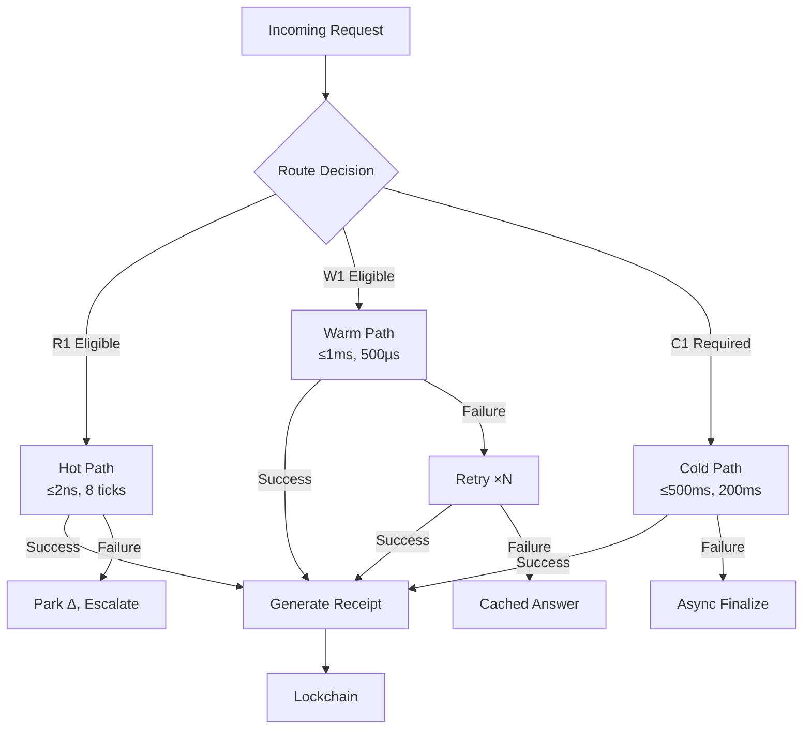
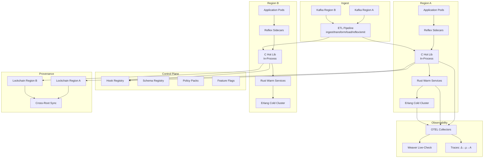
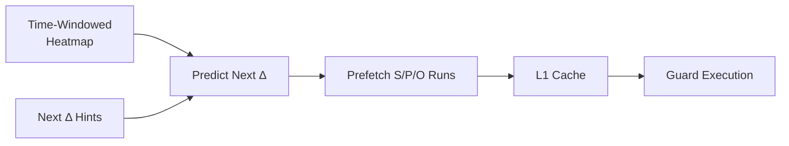
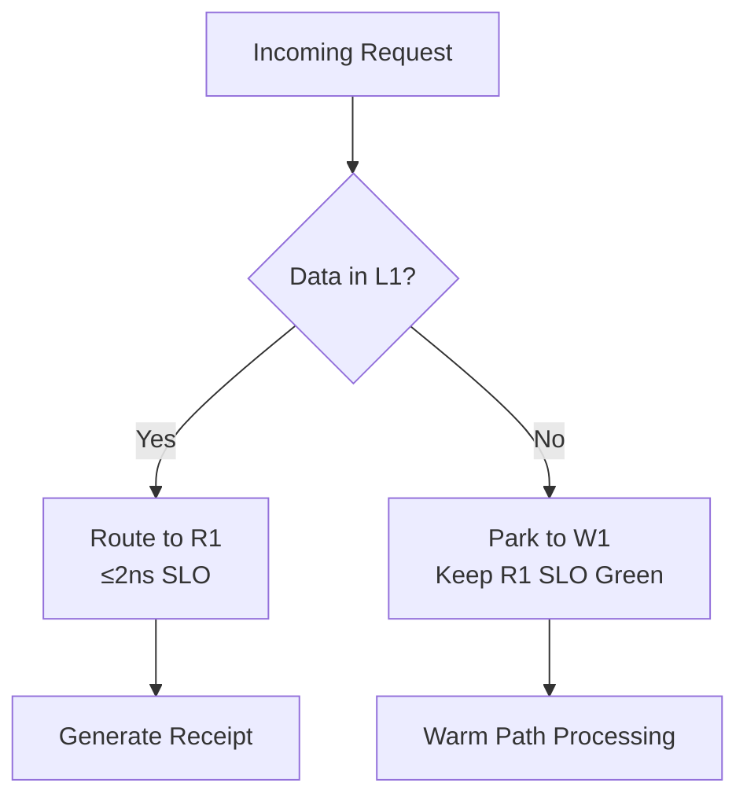
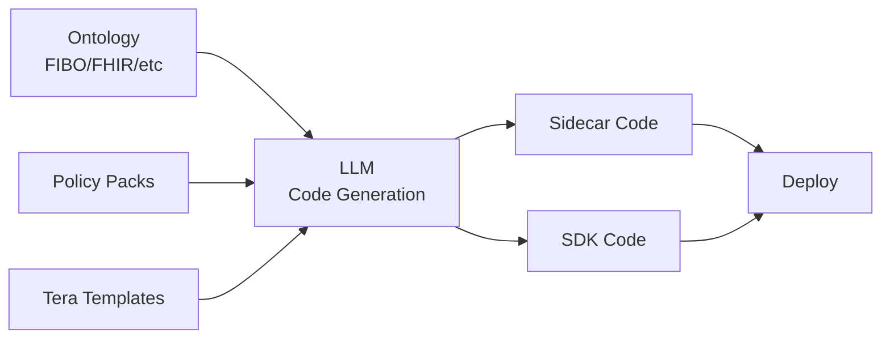
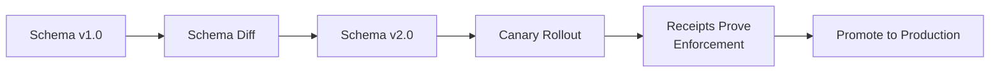
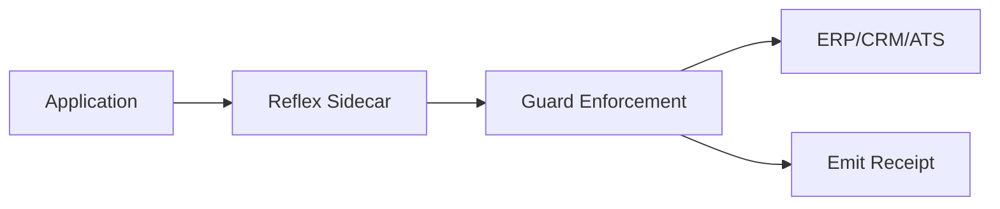
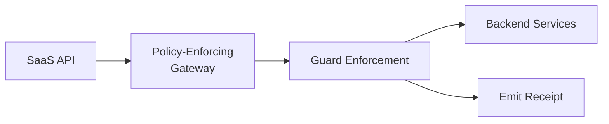
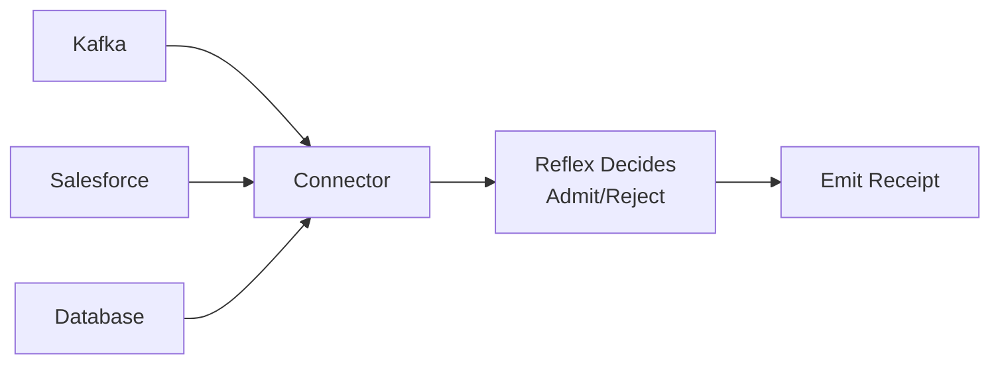
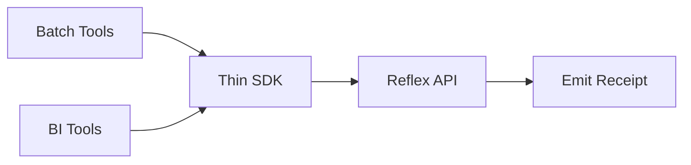

# Reflex Enterprise Blueprint (Fortune-5)

**Version**: 1.0  
**Status**: Production-Ready Blueprint  
**Classification**: Enterprise Architecture  
**Last Updated**: 2025-11-06

---

## Executive Summary

Reflex Enterprise is a 2-ns law-driven compute fabric that replaces procedural validation with deterministic guards, cryptographic receipts, and multi-region zero-trust architecture. This blueprint defines the Fortune-5-grade implementation for mission-critical ERP/CRM/ATS workloads.

**Key Principles**:
- **Correctness at ingress**: Guards prevent bad state, not detect it
- **Provenance by default**: Every action has a verifiable receipt
- **Performance at scale**: 2-ns hot path holds under production load
- **Zero-trust security**: mTLS everywhere, ABAC in RDF
- **Multi-region resilience**: Active-active with RTO ≤15 min, RPO ≤1 min

---

## 1) Objectives

### Primary Objectives

* **Replace procedural checks** with 2 ns hot-path guards
* **Push correctness to ingress** - prevent defects, don't detect them
* **Make provenance default** - every state change has a receipt
* **Route everything else** to warm/cold with bounded latency

### Success Criteria

- ≥80% of validations execute on hot path (R1)
- ≤10 ppm policy-violation admission rate
- 100% receipt coverage for all admitted deltas
- p99 hot-path latency ≤2 ns under production load
- ≥70% reduction in Sev-1 incidents vs baseline

---

## 2) Runtime Classes and SLOs

### Runtime Class Definitions

| Class       | What runs                            |  Budget |            SLO (p99) | Failure action                      |
| ----------- | ------------------------------------ | ------: | -------------------: | ----------------------------------- |
| **R1 Hot**  | ASK/COUNT/COMPARE/VALIDATE, ≤8 items | 8 ticks | **≤2 ns/op** on-core | Drop/park Δ, emit receipt, escalate |
| **W1 Warm** | CONSTRUCT8, prebind, AOT transforms  | ≤500 µs |                ≤1 ms | Retry ×N, degrade to cached answer  |
| **C1 Cold** | Full SPARQL/SHACL, joins, analytics  | ≤200 ms |              ≤500 ms | Async finalize; never block R1      |

### SLO Enforcement



### RTO/RPO Requirements

- **RTO**: ≤15 minutes (Recovery Time Objective)
- **RPO**: ≤1 minute (Recovery Point Objective)
- **Cross-region**: Active-active replication

---

## 3) Topology (Multi-Region, Zero-Trust)

### Data Plane Architecture



### Zero-Trust Security Model

- **mTLS everywhere**: All inter-service communication via SPIFFE/SPIRE
- **SPIFFE IDs**: Service identity via SPIFFE (Secure Production Identity Framework)
- **SPIRE**: SPIFFE Runtime Environment for certificate management
- **Sidecar enforcement**: Every app pod has a sidecar enforcing mTLS

### Control Plane Components

- **Hook Registry**: Centralized registry of all guard hooks
- **Schema Registry**: Versioned schema management (FIBO, FHIR, etc.)
- **Policy Packs**: Versioned policy packages with canary rollout
- **Feature Flags**: Runtime feature toggles for gradual rollout

---

## 4) Performance Engineering (How 2 ns Holds at Scale)

### AOT Specialization

```rust
// Example: AOT-compiled ASK_SP guard
#[inline(always)]
#[target_feature(enable = "avx2")]
pub fn aot_ask_sp_guard(
    s: &[u64; 8],  // SoA-aligned, 64-byte aligned
    p: &[u64; 8],
    o: &[u64; 8],
) -> u8 {
    // Branchless SIMD operation
    // Constants hoisted at compile time
    // Fully unrolled for N=8
    unsafe {
        // AVX2 intrinsics for vectorized comparison
        // Returns mask of matches
    }
}
```

**Key Techniques**:
- Compile fixed ASK/COUNT/COMPARE into branchless kernels
- Hoist constants at compile time
- Fully unroll loops for N=8 (Chatman Constant)

### Predictive Preloading



**Strategy**:
- Prefetch S/P/O runs into L1 using next-Δ hints
- Time-windowed heatmaps predict access patterns
- NUMA-aware placement for multi-socket systems

### MPHF Caches

```rust
// Minimal Perfect Hash Function cache
pub struct MPHFCache {
    predicates: MinimalPerfectHash<PredicateId>,
    ids: MinimalPerfectHash<ResourceId>,
}

impl MPHFCache {
    pub fn lookup_predicate(&self, id: PredicateId) -> Option<&Predicate> {
        // O(1) lookup without collisions
        self.predicates.get(id)
    }
}
```

**Benefits**:
- O(1) lookups without collisions
- Minimal memory footprint
- Cache hot predicates and IDs

### Workload Shaping

- **Shard by predicate**: Distribute load across predicates
- **Cap run_len ≤ 8**: Enforce Chatman Constant
- **Coalesce Δ**: Preserve SoA (Structure of Arrays) locality
- **Admission control**: Park to W1 if L1 miss

### Memory Policy

- **Pin hot arrays**: Keep frequently accessed data resident
- **64-byte alignment**: Align with cache line boundaries
- **NUMA-aware placement**: Place data on local NUMA node
- **LLC bypass**: Direct to L1 where possible

### Admission Control



---

## 5) Security (Default-Deny)

### mTLS Everywhere

- **SPIFFE IDs**: Service identity via SPIFFE
- **SPIRE**: Certificate management and rotation
- **HSM/KMS**: Hardware Security Module / Key Management Service
- **Key rotation**: ≤24 hours rotation cycle

### ABAC in RDF

```turtle
# Example: ABAC policy in RDF
:User123 :hasRole :FinanceManager .
:FinanceManager :canApprove :Invoice .
:Invoice :requiresApproval :FinanceManager .

# Guard checks: ASK { :User123 :canApprove ?invoice }
```

**Key Principle**: Decisions are guards, not app code. Policies expressed in RDF, enforced as guards.

### Receipts and Audit

- **Receipt formula**: `hash(A) = hash(μ(O))`
- **Chain anchoring**: Merkle tree with periodic cross-rooting
- **SOX compliance**: Change to policy = PR + receipt + canary pass
- **GDPR compliance**: Data lineage = lockchain path; RTBF = Δ with proofs
- **HIPAA compliance**: Audit trail by construction

---

## 6) Reliability

### Active-Active Regions

```mermaid
graph TB
    subgraph "Region A (Primary)"
        HotA[Hot Path]
        WarmA[Warm Path]
        ColdA[Cold Path]
        LockchainA[Lockchain]
    end
    
    subgraph "Region B (Secondary)"
        HotB[Hot Path]
        WarmB[Warm Path]
        ColdB[Cold Path]
        LockchainB[Lockchain]
    end
    
    subgraph "Quorum"
        Quorum[Quorum for<br/>Lockchain Roots]
    end
    
    LockchainA --> Quorum
    LockchainB --> Quorum
    Quorum --> CrossRoot[Cross-Root Sync]
```

### Deterministic Replay

- **Δ logs**: All deltas logged with timestamps
- **Receipts**: Cryptographic receipts for all state changes
- **Reconstruction**: `μ(O)` can be reconstructed exactly from logs + receipts

### Brownout Modes

| Mode | R1 | W1 | C1 | SLOs |
|------|----|----|----|------|
| **Normal** | ✅ | ✅ | ✅ | All SLOs met |
| **R1 Only** | ✅ | ⚠️ Degraded | ❌ Paused | R1 SLO preserved |
| **W1 Degraded** | ✅ | ⚠️ Limited | ❌ Paused | R1 + W1 SLO preserved |
| **C1 Paused** | ✅ | ✅ | ❌ Paused | R1 + W1 SLO preserved |

---

## 7) Developer Platform (Generated, Not Hand-Coded)

### Sidecars/SDKs Generation



**Workflow**:
1. Define ontology and policy packs
2. LLM generates sidecar/SDK code from Tera templates
3. Human review and approval
4. Automated deployment via GitOps

### Noun-Verb CLI

- **Framework**: `clap-noun-verb` v3.3.0
- **Output format**: JSON-first for agent consumption
- **Auto-discovery**: Commands auto-discovered at compile time
- **Examples**:
  ```bash
  knhk boot init schema.ttl invariants.sparql
  knhk hook execute ASK_SP --predicate "http://example.org/hasPermission"
  knhk metrics weaver-validate --timeout 10
  ```

### Pipelines

- **GitOps**: Schemas, hooks, routes managed via Git
- **Canary rollout**: Per policy pack with automatic rollback
- **CI/CD**: Automated testing and deployment

### No Defensive Code in Apps

- **Guards at ingress**: All validation at the guard layer
- **App simplification**: Remove app-level validation logic
- **Error handling**: Guards prevent bad state, apps handle business logic only

---

## 8) Data and Ontology Management

### Enterprise Ontologies

| Ontology | Domain | Use Case |
|----------|--------|----------|
| **FIBO** | Finance | Financial instruments, transactions |
| **schema.org** | Commerce | Products, reviews, ratings |
| **GS1** | Supply Chain | Product identification, logistics |
| **HL7** | Healthcare | Patient data, clinical records |
| **ISO 20022** | Finance | Payment messages, securities |
| **NIEM** | Government | Information exchange |
| **SNOMED** | Healthcare | Clinical terminology |
| **FOAF** | Social | Person, organization relationships |
| **SKOS** | Knowledge | Taxonomies, thesauri |

### Mapping Strategy

1. **Map ERP/CRM/ATS fields** to predicates once
2. **LLM generates hooks** for invariants and access rules
3. **Versioned schemas** with diff tracking
4. **Staged rollout** with receipts proving enforcement

### Schema Versioning



---

## 9) Integration Patterns

### Sidecar (Default)



**Use Case**: Intercept ERP/CRM/ATS I/O; enforce guards; emit receipts

### Gateway



**Use Case**: For SaaS APIs without pods; policy-enforcing proxy

### Connector



**Use Case**: Kafka/Salesforce/DB tailers feed Δ; reflex decides admit/reject

### SDK



**Use Case**: Thin clients for batch and BI tools

---

## 10) ERP/CRM/ATS Replacement Path

### Phase 1: Wrap (Sidecar)

- **Action**: Wrap existing ERP/CRM/ATS with sidecar
- **Outcome**: Block bad Δ, add provenance
- **Timeline**: Day 0-30

### Phase 2: Externalize Rules

- **Action**: Move rules into hooks
- **Outcome**: Remove app validation and retry logic
- **Timeline**: Day 31-90

### Phase 3: Move Critical Workflows

- **Action**: Move critical workflows to reflex templates (AOT)
- **Outcome**: Legacy becomes a view
- **Timeline**: Day 91-180

### Phase 4: Retire Modules

- **Action**: Retire modules with zero net new logic
- **Outcome**: Reduced codebase, lower maintenance
- **Timeline**: Day 181+

---

## 11) Lean Six Sigma (Designing Out Defects)

### Cost of Quality

- **Prevention**: Guards prevent defects at ingress
- **Appraisal**: Reduced need for testing and validation
- **Failure**: Defects shift to data misses, not logic errors

### DPMO Target

- **Target**: < 3.4 DPMO (Defects Per Million Opportunities) for guarded predicates
- **Measurement**: Track defects by predicate and guard type
- **Improvement**: Continuous reduction via guard refinement

### Queue Math

- **Fewer retries**: Guards prevent invalid requests
- **Shorter tails**: Reduced latency variance
- **Capacity reclaimed**: More capacity for revenue work

---

## 12) FinOps Model

### Cost Optimization

- **Hot path CPU**: Cheap (in-process, optimized)
- **Cache misses**: Expensive (memory bandwidth, latency)
- **Spend priorities**:
  - RAM channels
  - L1/L2 cache size
  - NUMA topology
  - NIC offloads

### Cost Reduction

- **Turn off redundant validation**: Remove app-level checks
- **Cut egress**: Reduce network traffic via sidecar batching
- **Cut DB CPU**: Reduce database load via guard filtering

### Chargeback Model

- **By Δ volume**: Charge per delta processed
- **By guard complexity**: Charge by guard type and predicate count
- **By SLO tier**: Different rates for R1/W1/C1

---

## 13) Governance and Audit

### Every Decision Has a Receipt

- **Receipt generation**: 100% coverage for all admitted deltas
- **Receipt verification**: Cryptographic verification of `hash(A) = hash(μ(O))`
- **Audit trail**: Complete provenance chain via lockchain

### SOX Compliance

- **Change to policy**: PR + receipt + canary pass required
- **Audit trail**: All policy changes tracked in lockchain
- **Verification**: Receipts prove policy enforcement

### GDPR Compliance

- **Data lineage**: Lockchain path shows data flow
- **RTBF (Right to Be Forgotten)**: Δ with proofs for data deletion
- **Consent tracking**: Receipts prove consent management

### Vendor Attestations

- **Guard coverage report**: Export per integration
- **Compliance metrics**: Track guard coverage and violation rates
- **Audit readiness**: Receipts enable rapid audit response

---

## 14) Org Model

### Ontology Ops (Small Team)

- **Role**: Curates schemas
- **Responsibilities**:
  - Schema versioning
  - Ontology mapping
  - Schema registry management

### Policy Engineering

- **Role**: Authors hooks
- **Responsibilities**:
  - Hook generation (mostly LLM-generated, human-approved)
  - Policy pack management
  - Guard catalog maintenance

### SRE

- **Role**: Owns SLOs and capacity
- **Responsibilities**:
  - SLO enforcement
  - Capacity planning
  - Admission control

### Risk

- **Role**: Accesses receipts, not app logs
- **Responsibilities**:
  - Receipt analysis
  - Compliance verification
  - Audit support

---

## 15) Rollout Plan

### Day 0-30: Foundation

- [ ] Baseline ontologies mapped
- [ ] Wrap 3 golden paths with sidecars
- [ ] SLO canaries deployed
- [ ] Evidence: [Link to rollout tracking](./rollout/day-0-30.md)

### Day 31-90: Expansion

- [ ] Expand to top-10 predicates by volume
- [ ] Retire app validators
- [ ] Prove SOX flows
- [ ] Evidence: [Link to rollout tracking](./rollout/day-31-90.md)

### Day 91-180: Migration

- [ ] Migrate ERP/CRM/ATS critical workflows to reflex
- [ ] Decommission retries/queues
- [ ] Evidence: [Link to rollout tracking](./rollout/day-91-180.md)

### Exit Criteria

- [ ] 80% transactions touch R1 only
- [ ] Provenance 100%
- [ ] Zero critical Sev-1 from rule drift
- [ ] Evidence: [Link to exit criteria](./rollout/exit-criteria.md)

---

## 16) Enterprise Bill of Materials

### Core Components

- **C hot lib**: Branchless SIMD, SoA-aligned
- **Rust**: ETL, AOT, connectors, OTEL, lockchain
- **Erlang**: Cold reasoning, routing

### Infrastructure

- **Kafka**: Event streaming (region-local)
- **Object store**: S3-compatible for receipts and logs
- **HSM/KMS**: Hardware Security Module / Key Management Service
- **OTEL stack**: OpenTelemetry collectors, exporters
- **Weaver**: Live-check for telemetry validation

### Gateways/Sidecars

- **Per domain**: Custom sidecars for ERP/CRM/ATS domains
- **Generated**: LLM + Tera template generation

---

## 17) Hard Guarantees

### Invariants

- **Same O → same A**: Deterministic reflex map
- **Idempotent μ**: `μ∘μ = μ`
- **Shard law**: `μ(O ⊔ Δ) = μ(O) ⊔ μ(Δ)`
- **Order Λ total**: Total ordering of operations
- **Guard budget enforced**: τ ≤ 8 ticks for R1

### Failure Behavior

- **R1 cannot meet cache locality**: Refuses, not degrades silently
- **L1 miss**: Parks to W1, keeps R1 SLO green
- **W1 failure**: Retries ×N, degrades to cached answer
- **C1 failure**: Async finalize; never blocks R1

---

## 18) What "Fortune-5-Ready" Adds Over Prototype

### Multi-Region Receipts

- **Cross-region sync**: Receipts synchronized across regions
- **Legal hold**: Receipts retained for legal/compliance requirements
- **Quorum consensus**: Cross-root sync with quorum validation

### Zero-Trust Service Mesh

- **SPIFFE/SPIRE**: Service identity and certificate management
- **Hardware HSM**: Hardware-backed key management
- **mTLS everywhere**: All inter-service communication encrypted

### Capacity Planning

- **Cache heat models**: Predictive models for cache behavior
- **Δ spike handling**: Capacity planning for delta spikes
- **SLO enforcement**: Automatic admission control

### Formal Promotion Gates

- **Policy promotion**: Canary → staging → production
- **Automated rollback**: Feature flags enable instant rollback
- **Receipt verification**: Receipts prove policy enforcement

### Disaster Recovery

- **DR drills**: Measured by receipts, not logs
- **RTO ≤15 min**: Recovery Time Objective
- **RPO ≤1 min**: Recovery Point Objective

---

## 19) Risks and Mitigations

### Cold Cache Bursts

- **Risk**: Cache misses cause R1 SLO violations
- **Mitigation**: Predictive preloading + parking to W1
- **Evidence**: [Link to mitigation plan](./risks/cold-cache-bursts.md)

### Ontology Drift

- **Risk**: Schema changes break guards
- **Mitigation**: Schema diffs with regression hooks
- **Evidence**: [Link to mitigation plan](./risks/ontology-drift.md)

### Vendor Variance

- **Risk**: Different vendors have different data formats
- **Mitigation**: Gateway normalization before guards
- **Evidence**: [Link to mitigation plan](./risks/vendor-variance.md)

### Human Change Risk

- **Risk**: Policy changes cause production issues
- **Mitigation**: Canary + auto-rollback via feature flags
- **Evidence**: [Link to mitigation plan](./risks/human-change-risk.md)

---

## 20) Acceptance Criteria (Exec-Level)

### Performance

- [ ] **p99 R1 ≤ 2 ns/op** under heat ≥ 95% for top-N predicates
  - Evidence: [Link to performance dashboard](./dashboards/performance.md)

- [ ] **≥ 98% of Δ evaluated at R1 or W1**; C1 < 2%
  - Evidence: [Link to routing dashboard](./dashboards/routing.md)

### Provenance

- [ ] **100% transactions carry a valid receipt**
  - Evidence: [Link to receipt dashboard](./dashboards/receipts.md)

### Quality

- [ ] **Sev-1 reduction ≥ 70%** vs baseline
  - Evidence: [Link to incident dashboard](./dashboards/incidents.md)

- [ ] **Change lead-time −50%**
  - Evidence: [Link to change dashboard](./dashboards/changes.md)

### Migration

- [ ] **ERP/CRM/ATS**: At least two modules operated in "reflex primary, procedural secondary"
  - Evidence: [Link to migration status](./rollout/migration-status.md)

---

## References

- [DFLSS Project Charter](./reflex-enterprise-dflss-charter.md)
- [Definition of Done](./reflex-enterprise-dod.md)
- [DMADV Phase Tracking](./reflex-enterprise-dmadv-tracking.md)
- [Metrics Dashboard Specification](./reflex-enterprise-metrics-dashboard.md)
- [Weaver Live-Check Integration](./reflex-enterprise-weaver-integration.md)

---

**This is the Fortune-5 template: multi-region, zero-trust, receipts by default, high cache-hit engineering, and phased displacement of procedural systems.**

