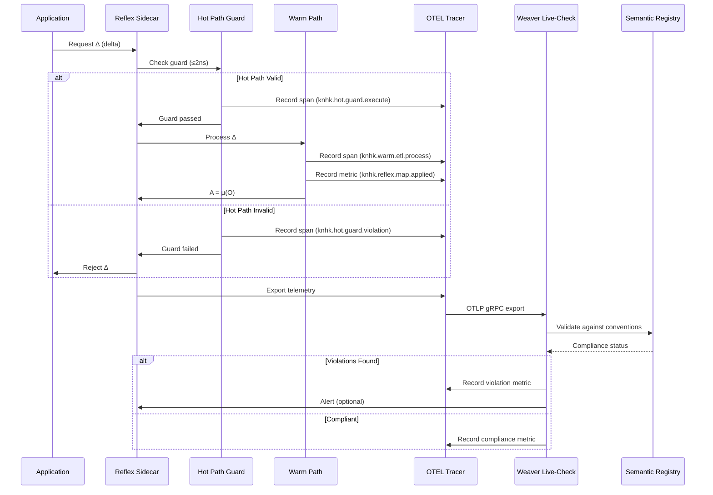
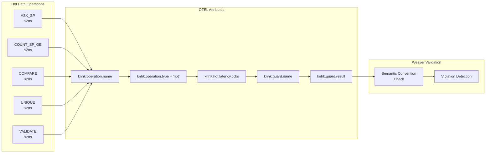
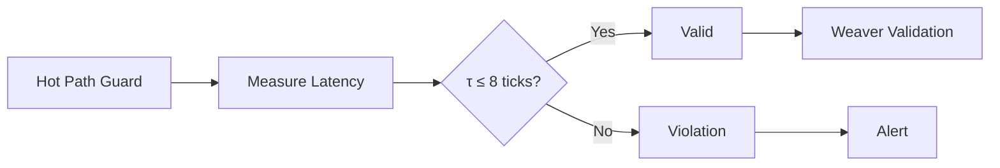
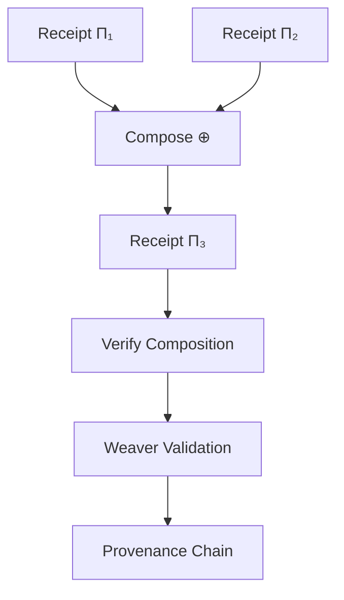
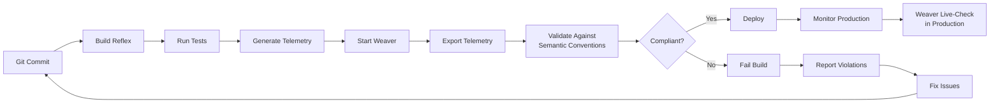
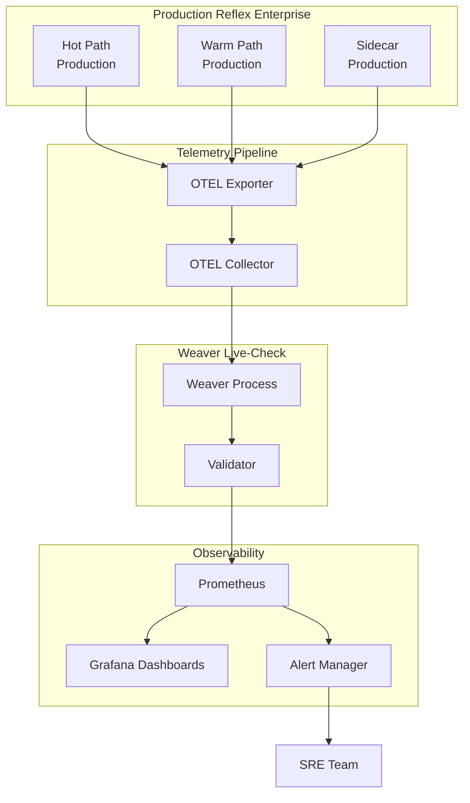

# Reflex Enterprise™ - Weaver Live-Check Integration

## Overview

Reflex Enterprise™ leverages OpenTelemetry Weaver live-check to validate that the **2-ns hot-path guards** and **warm/cold path operations** produce telemetry that conforms to semantic conventions. This ensures that the **A = μ(O)** reflex map produces auditable, compliant, and observable outcomes.

## Architecture Integration

```mermaid
graph TB
    subgraph "Reflex Enterprise Layers"
        Hot[Hot Path<br/>C, ≤2ns, SIMD, SoA]
        Warm[Warm Path<br/>Rust, AOT, MPHF]
        Cold[Cold Path<br/>Erlang/OTP, SPARQL]
        Sidecar[Sidecar<br/>Rust, gRPC, mTLS]
    end
    
    subgraph "Telemetry Generation"
        OTEL[OpenTelemetry<br/>Tracer & Metrics]
        Receipts[Lockchain Receipts<br/>hash(A) = hash(μ(O))]
    end
    
    subgraph "Weaver Live-Check"
        Weaver[Weaver Process<br/>OTLP gRPC :4317]
        Validator[Semantic Convention<br/>Validator]
        Registry[Registry<br/>FIBO, FHIR, SCORVoc]
    end
    
    subgraph "Observability"
        OTELCollector[OTEL Collector]
        Metrics[Prometheus/Grafana]
        Logs[Structured Logs]
    end
    
    Hot --> OTEL
    Warm --> OTEL
    Cold --> OTEL
    Sidecar --> OTEL
    
    OTEL --> Receipts
    OTEL --> Weaver
    
    Weaver --> Validator
    Validator --> Registry
    
    Weaver --> OTELCollector
    OTELCollector --> Metrics
    OTELCollector --> Logs
    
    Receipts --> Registry
```

## Reflex Map Validation



## Hot Path Telemetry Semantics



## Reflex Enterprise Telemetry Model

### Hot Path Spans

```rust
// Hot path guard execution span
Span {
    name: "knhk.hot.guard.execute",
    attributes: {
        "knhk.operation.name": "ASK_SP",
        "knhk.operation.type": "hot",
        "knhk.guard.name": "entitlement_check",
        "knhk.guard.predicate": "http://example.org/hasPermission",
        "knhk.hot.latency.ticks": 5,  // ≤8 ticks (Chatman Constant)
        "knhk.guard.result": "passed" | "failed",
        "knhk.reflex.map.applied": true,
    },
    status: SpanStatus::Ok | SpanStatus::Error,
}
```

### Warm Path Spans

```rust
// Warm path ETL processing span
Span {
    name: "knhk.warm.etl.process",
    attributes: {
        "knhk.operation.name": "etl.transform",
        "knhk.operation.type": "warm",
        "knhk.etl.batch_size": 100,
        "knhk.etl.mphf_cache_hit": true,
        "knhk.reflex.map.applied": true,
    },
    status: SpanStatus::Ok,
}
```

### Receipt Generation Spans

```rust
// Lockchain receipt generation span
Span {
    name: "knhk.receipt.generate",
    attributes: {
        "knhk.operation.name": "receipt.generate",
        "knhk.operation.type": "receipt",
        "knhk.receipt.hash": "0x...",
        "knhk.receipt.merkle_root": "0x...",
        "knhk.reflex.map.applied": true,
        "knhk.receipt.verifiable": true,
    },
    status: SpanStatus::Ok,
}
```

## Weaver Validation Rules

### Semantic Convention Compliance

```yaml
# Semantic conventions for Reflex Enterprise
semantic_conventions:
  knhk:
    operation:
      name:
        type: string
        required: true
        pattern: "^knhk\\.(hot|warm|cold|sidecar|receipt)\\..+"
      
      type:
        type: string
        required: true
        enum: ["hot", "warm", "cold", "sidecar", "receipt"]
    
    hot:
      latency:
        ticks:
          type: integer
          required: true
          max: 8  # Chatman Constant
      
      guard:
        name:
          type: string
          required: true
        result:
          type: string
          enum: ["passed", "failed"]
    
    reflex:
      map:
        applied:
          type: boolean
          required: true
```

## Integration with Reflex Enterprise Tenets

### Tenet 1: A = μ(O) at epoch end

```mermaid
graph TD
    O[Knowledge Graph O] --> μ[Reflex Map μ]
    μ --> A[Actions A]
    A --> Receipt[Receipt hash(A)]
    μ --> OTEL[OTEL Span]
    OTEL --> Weaver[Weaver Validation]
    Weaver --> Verify{Verify<br/>A = μ(O)?}
    Verify -->|Yes| Compliant[Compliant]
    Verify -->|No| Violation[Violation]
```

### Tenet 4: Λ total; τ ≤ 8 ticks



### Tenet 5: Π receipts form a ⊕-monoid



## CI/CD Integration for Reflex Enterprise



## Production Monitoring



## Key Metrics Validated by Weaver

### Hot Path Metrics

- `knhk.hot.guard.execute` - Guard execution count
- `knhk.hot.latency.ticks` - Latency in ticks (must be ≤8)
- `knhk.hot.guard.violations` - Guard violation count
- `knhk.hot.guard.passed` - Guard pass count

### Warm Path Metrics

- `knhk.warm.etl.process` - ETL processing count
- `knhk.warm.mphf.cache_hit_rate` - MPHF cache hit rate
- `knhk.warm.aot.specialization_count` - AOT specialization count

### Reflex Map Metrics

- `knhk.reflex.map.applied` - Reflex map application count
- `knhk.reflex.map.latency` - Reflex map latency
- `knhk.reflex.map.errors` - Reflex map error count

### Receipt Metrics

- `knhk.receipt.generated` - Receipt generation count
- `knhk.receipt.verified` - Receipt verification count
- `knhk.receipt.merkle_depth` - Merkle tree depth

## Weaver Validation Commands

### Start Weaver for Reflex Enterprise

```bash
knhk metrics weaver-start \
    --registry ./schemas/reflex-enterprise-registry \
    --otlp-port 4317 \
    --admin-port 8080 \
    --format json \
    --output ./weaver-reports
```

### Validate Hot Path Telemetry

```bash
# Generate hot path telemetry
knhk boot init schema.ttl invariants.sparql
knhk hook execute ASK_SP --predicate "http://example.org/hasPermission"

# Validate
knhk metrics weaver-validate --timeout 10
```

### Validate Reflex Map Application

```bash
# Apply reflex map
knhk reflex apply --delta delta.json

# Validate telemetry
knhk metrics weaver-validate --timeout 30
```

## Compliance with Reflex Enterprise Goals

### ≥80% of validations executed on hot path

Weaver validates that hot path spans have:
- `knhk.operation.type = "hot"`
- `knhk.hot.latency.ticks ≤ 8`
- `knhk.guard.result` present

### ≥50% reduction in code volume

Weaver validates that:
- Guards are generated (not hand-coded)
- Semantic conventions are followed
- Receipts are automatically generated

### ≥10× improvement in p95 decision latency

Weaver validates that:
- Hot path operations complete in ≤8 ticks
- Warm path operations use AOT/MPHF optimization
- Sidecar batching reduces network overhead

### ≤0.1% policy-violation drift

Weaver validates that:
- All guards are enforced
- Receipts are generated for all state changes
- Semantic conventions are continuously validated

## References

- [Weaver Live-Check Diagrams](./weaver-live-check-diagrams.md)
- [Weaver Implementation Summary](./weaver-implementation-summary.md)
- [Reflex Enterprise Press Release](./reflex-enterprise-press-release.md)

