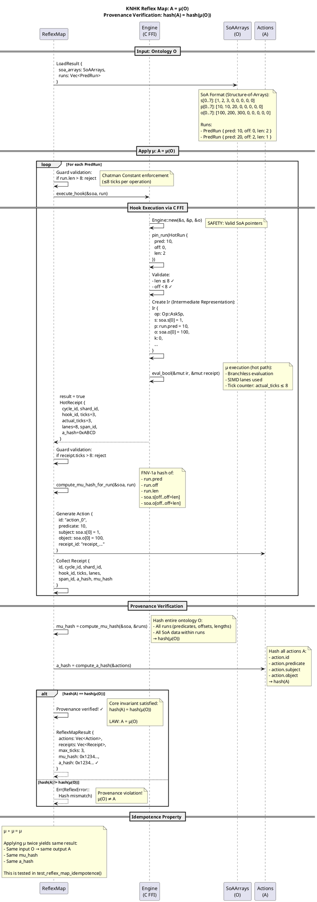
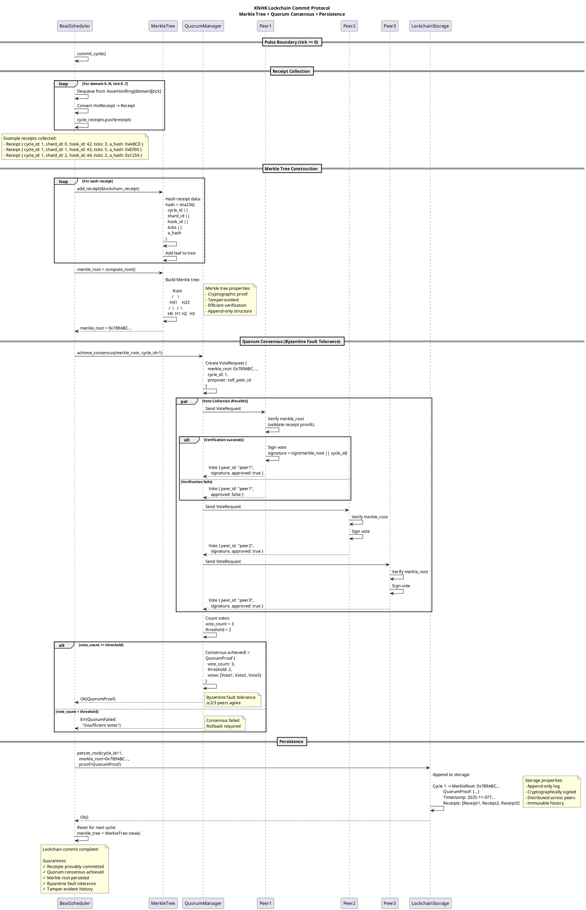
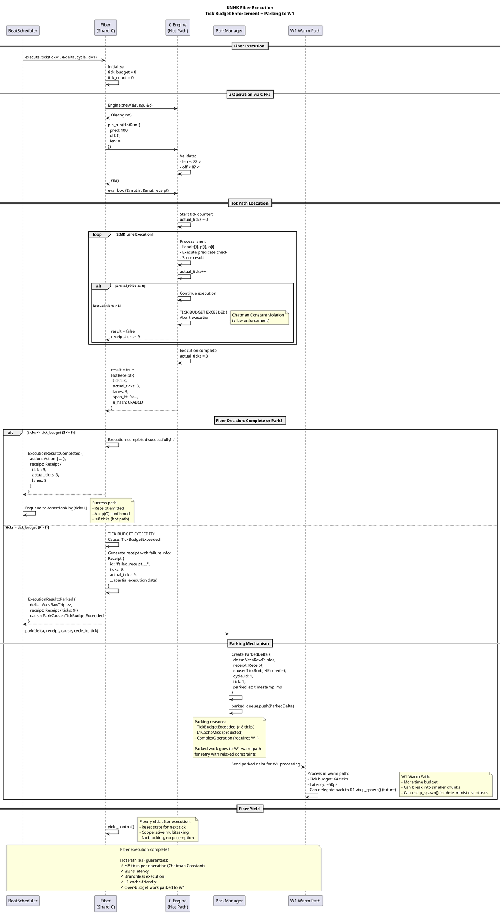

# KNHK Reflex Architecture - PlantUML Sequence Diagrams
## Based on Source Code Analysis (2025-11-07)

**Source Files Analyzed**:
- `rust/knhk-etl/src/lib.rs` - ETL pipeline orchestration
- `rust/knhk-etl/src/beat_scheduler.rs` - 8-beat epoch scheduler
- `rust/knhk-etl/src/pipeline.rs` - Pipeline stages
- `rust/knhk-etl/src/reflex.rs` - Reflex stage (μ execution)
- `rust/knhk-etl/src/reflex_map.rs` - ReflexMap (A = μ(O))

---

## Diagram 1: 8-Beat Epoch Cycle (Complete Flow)

**Purpose**: Shows the complete 8-beat cycle from delta admission → execution → pulse → commit

```plantuml
@startuml 8-Beat Epoch Cycle
title KNHK 8-Beat Epoch Cycle\nComplete Flow: Admission → Execution → Pulse → Commit

participant "Sidecar" as Sidecar
participant "BeatScheduler\n(Rust)" as BeatScheduler
participant "C BeatScheduler\n(knhk_beat_*)" as CBeat
participant "DeltaRing\n(C SoA)" as DeltaRing
participant "Fiber\n(Cooperative)" as Fiber
participant "C Engine\n(knhk_hot)" as Engine
participant "AssertionRing\n(C SoA)" as AssertionRing
participant "Lockchain\n(MerkleTree)" as Lockchain

== Initialization ==
BeatScheduler -> CBeat: CBeatScheduler::init()
note right: Initialize global cycle counter = 0

== Delta Admission (Sidecar) ==
Sidecar -> CBeat: current_cycle = CBeatScheduler::current()
CBeat --> Sidecar: cycle_id = 0
Sidecar -> Sidecar: Stamp Δ with cycle_id

Sidecar -> BeatScheduler: enqueue_delta(domain_id, delta, cycle_id)
BeatScheduler -> BeatScheduler: raw_triples_to_soa(&delta)\n→ (s[], p[], o[])
note right: Convert RawTriple to SoA format

BeatScheduler -> CBeat: tick = CBeatScheduler::tick(cycle_id)
CBeat --> BeatScheduler: tick = cycle_id & 0x7 = 0

BeatScheduler -> DeltaRing: enqueue(tick=0, &s, &p, &o, cycle_id)
DeltaRing --> BeatScheduler: Ok()
note right: Delta enqueued at slot 0

== Beat Cycle (8 ticks: 0-7) ==
loop For each tick (0-7)
    BeatScheduler -> CBeat: cycle = CBeatScheduler::next()
    note right: Atomic increment: cycle++
    CBeat --> BeatScheduler: cycle = 1

    BeatScheduler -> CBeat: tick = CBeatScheduler::tick(cycle)
    CBeat --> BeatScheduler: tick = 1 & 0x7 = 1

    BeatScheduler -> CBeat: pulse_val = CBeatScheduler::pulse(cycle)
    CBeat --> BeatScheduler: pulse_val = 0 (tick ≠ 0)

    == Execute Tick ==
    BeatScheduler -> BeatScheduler: execute_tick(tick=1)

    loop For each domain
        BeatScheduler -> DeltaRing: dequeue(tick=1, run_len=8)
        DeltaRing --> BeatScheduler: Some((s[], p[], o[], cycle_ids[]))

        BeatScheduler -> BeatScheduler: soa_to_raw_triples(&s, &p, &o)\n→ Vec<RawTriple>

        BeatScheduler -> BeatScheduler: Select fiber: fiber_idx = (domain + tick) % shard_count

        BeatScheduler -> Fiber: execute_tick(tick=1, &delta, cycle_id=1)

        == Fiber Execution ==
        Fiber -> Engine: Engine::new(&s, &p, &o)
        note right: SAFETY: Valid SoA pointers

        Fiber -> Engine: pin_run(HotRun { pred, off, len })
        Engine --> Fiber: Ok()
        note right: Validates len ≤ 8 (Chatman Constant)

        Fiber -> Engine: eval_bool(&mut ir, &mut receipt)
        Engine -> Engine: Execute μ operation\n(≤8 ticks enforced)
        Engine --> Fiber: result = true, receipt filled

        alt Execution Completed (ticks ≤ 8)
            Fiber --> BeatScheduler: ExecutionResult::Completed { action, receipt }

            BeatScheduler -> BeatScheduler: Convert receipt to HotReceipt
            BeatScheduler -> AssertionRing: enqueue(tick=1, &s, &p, &o, &hot_receipt)
            AssertionRing --> BeatScheduler: Ok()
            note right: Assertion enqueued at slot 1

        else Tick Budget Exceeded (ticks > 8)
            Fiber --> BeatScheduler: ExecutionResult::Parked { delta, receipt, cause }
            BeatScheduler -> BeatScheduler: park_manager.park(delta, receipt, cause, cycle_id, tick)
            note right: Parked to W1 for later processing
        end
    end
end

== Pulse Boundary (tick == 0) ==
note over BeatScheduler, Lockchain: After 8 ticks, cycle wraps to tick=0\nPulse detected → commit_cycle()

BeatScheduler -> CBeat: cycle = CBeatScheduler::next()
CBeat --> BeatScheduler: cycle = 8

BeatScheduler -> CBeat: tick = CBeatScheduler::tick(8)
CBeat --> BeatScheduler: tick = 8 & 0x7 = 0

BeatScheduler -> CBeat: pulse_val = CBeatScheduler::pulse(8)
CBeat --> BeatScheduler: pulse_val = 1 (tick == 0)
note right: Branchless pulse detection:\npulse = (tick == 0) ? 1 : 0

BeatScheduler -> BeatScheduler: commit_cycle()

== Commit Cycle ==
loop For each domain, for tick 0-7
    BeatScheduler -> AssertionRing: dequeue(tick, run_len=8)
    AssertionRing --> BeatScheduler: Some((s[], p[], o[], receipts[]))

    loop For each receipt
        BeatScheduler -> BeatScheduler: Convert HotReceipt → Receipt
        BeatScheduler -> BeatScheduler: cycle_receipts.push(receipt)
    end
end

alt Lockchain Enabled
    BeatScheduler -> Lockchain: For each receipt: merkle_tree.add_receipt(&lockchain_receipt)
    BeatScheduler -> Lockchain: merkle_root = merkle_tree.compute_root()
    Lockchain --> BeatScheduler: merkle_root = 0xABCD...

    opt Quorum Configured
        BeatScheduler -> Lockchain: quorum_manager.achieve_consensus(merkle_root, cycle_id)
        Lockchain -> Lockchain: Vote collection from peers\n(Byzantine fault tolerance)
        Lockchain --> BeatScheduler: QuorumProof { vote_count, threshold, signatures }
        note right: Requires ≥threshold peer votes
    end

    opt Storage Configured
        BeatScheduler -> Lockchain: storage.persist_root(cycle_id, merkle_root, proof)
        Lockchain --> BeatScheduler: Ok()
        note right: Persistent append-only log
    end

    BeatScheduler -> BeatScheduler: merkle_tree = MerkleTree::new()
    note right: Reset for next beat
end

== Fiber Reset ==
loop For each fiber
    BeatScheduler -> Fiber: yield_control()
    Fiber -> Fiber: Reset execution state\nfor next cycle
end

note over BeatScheduler: Cycle complete!\nReady for next 8-beat epoch

@enduml
```



---

## Diagram 2: ETL Pipeline Orchestration

**Purpose**: Shows the complete ETL pipeline: Ingest → Transform → Load → Reflex → Emit

```plantuml
@startuml ETL Pipeline Orchestration
title KNHK ETL Pipeline\nIngest → Transform → Load → Reflex → Emit

participant "Pipeline" as Pipeline
participant "IngestStage" as Ingest
participant "TransformStage" as Transform
participant "LoadStage" as Load
participant "ReflexStage\n(μ execution)" as Reflex
participant "EmitStage" as Emit

== Pipeline Execution ==
Pipeline -> Ingest: ingest()

== Stage 1: Ingest ==
Ingest -> Ingest: For each connector:\n- file://data.nt\n- http://api.example.com\n- kafka://topic

Ingest -> Ingest: parse_rdf_turtle(content)
note right
  Parse RDF Turtle syntax:
  - Prefixes (@prefix)
  - Base URIs (@base)
  - Blank nodes (_:)
  - Literals ("value"^^type)
end note

Ingest --> Pipeline: IngestResult {\n  triples: Vec<RawTriple>,\n  metadata: BTreeMap\n}

Pipeline -> Transform: transform(ingest_result)

== Stage 2: Transform ==
Transform -> Transform: For each RawTriple:
note right
  Hash URIs to u64:
  - subject: "http://..." → u64
  - predicate: "http://..." → u64
  - object: "http://..." → u64
end note

Transform -> Transform: validate_against_schema(schema_iri)

Transform --> Pipeline: TransformResult {\n  typed_triples: Vec<TypedTriple>,\n  validation_errors: Vec<...>\n}

Pipeline -> Load: load(transform_result)

== Stage 3: Load ==
Load -> Load: Group by predicate:\npredicates[pred] = Vec<TypedTriple>

Load -> Load: For each predicate group:
note right
  Enforce max_run_len = 8
  (Chatman Constant guard)
end note

alt Run length > 8
    Load --> Pipeline: Err(LoadError::\n  RunLengthExceeded)
    note right: Guard violation\nrejects over-budget work
else Run length ≤ 8
    Load -> Load: Convert to SoA format:\n- s[0..7]: subjects\n- p[0..7]: predicates\n- o[0..7]: objects

    Load -> Load: Create PredRun {\n  pred: u64,\n  off: u64,\n  len: u64\n}

    Load --> Pipeline: LoadResult {\n  soa_arrays: SoAArrays,\n  runs: Vec<PredRun>\n}
end

Pipeline -> Reflex: reflex(load_result)

== Stage 4: Reflex (μ execution) ==
loop For each PredRun
    Reflex -> Reflex: Classify operation:\nRuntimeClass::classify_operation(op_type, run_len)

    alt Operation ≤ 8 items
        Reflex -> Reflex: RuntimeClass::R1\n(Hot path, ≤2ns)
    else Operation ≤ 100 items
        Reflex -> Reflex: RuntimeClass::W1\n(Warm path, ~50µs)
    else Operation > 100 items
        Reflex -> Reflex: RuntimeClass::C1\n(Cold path, ~10ms)
    end

    Reflex -> Reflex: execute_hook(&soa_arrays, run)
    note right
      Via C FFI:
      1. Engine::new(&s, &p, &o)
      2. engine.pin_run(HotRun)
      3. engine.eval_bool(&ir, &receipt)
    end note

    Reflex -> Reflex: record_latency(latency_ns)
    note right: SLO monitoring per runtime class

    alt Tick budget exceeded (ticks > 8)
        Reflex -> Reflex: handle_r1_failure(delta, receipt, true)
        note right
          R1 Failure Actions:
          - Drop (if non-critical)
          - Park to W1 (for retry)
          - Escalate (if critical)
        end note

        Reflex --> Pipeline: Err(R1FailureError)

    else SLO violated
        alt R1 class
            Reflex -> Reflex: handle_r1_failure()\n→ drop/park/escalate
        else W1 class
            Reflex -> Reflex: handle_w1_failure()\n→ retry/cache_degrade
        else C1 class
            Reflex -> Reflex: handle_c1_failure()\n→ async_finalize
        end

        Reflex --> Pipeline: Err(SloViolation)

    else Success
        Reflex -> Reflex: Generate Action {\n  id, payload, receipt_id\n}

        Reflex -> Reflex: Collect Receipt {\n  cycle_id, shard_id, hook_id,\n  ticks, actual_ticks, lanes,\n  span_id, a_hash\n}
    end
end

Reflex -> Reflex: If receipts.len() > 1:\nmerged = merge_receipts(&receipts)
note right
  Receipt merging (⊕ operation):
  - max(ticks): Worst case
  - sum(lanes): Total SIMD lanes
  - XOR(span_id): Span merge
  - XOR(a_hash): Hash merge
end note

Reflex --> Pipeline: ReflexResult {\n  actions: Vec<Action>,\n  receipts: Vec<Receipt>,\n  max_ticks: u32,\n  c1_failure_actions: Vec<...>\n}

Pipeline -> Emit: emit(reflex_result)

== Stage 5: Emit ==
Emit -> Emit: For each action:

alt Lockchain enabled
    Emit -> Emit: Compute lockchain_hash =\nsha256(action.payload)
    Emit -> Emit: lockchain_hashes.push(hash)
end

Emit -> Emit: Send to downstream endpoints:\nHTTP POST to webhooks

Emit -> Emit: Write receipts to storage/log

Emit --> Pipeline: EmitResult {\n  receipts_written: usize,\n  actions_sent: usize,\n  lockchain_hashes: Vec<...>\n}

Pipeline --> Pipeline: Pipeline execution complete!

@enduml
```



---

## Diagram 3: Reflex Map Operation (A = μ(O))

**Purpose**: Shows the core Reflex Map operation with provenance verification



---

## Diagram 4: Lockchain Commit Protocol

**Purpose**: Shows the complete lockchain commit flow with quorum consensus



---

## Diagram 5: Fiber Execution with Parking

**Purpose**: Shows fiber execution flow with tick budget enforcement and parking



---

## Diagram 6: SLO Monitoring and Failure Handling

**Purpose**: Shows runtime class classification and SLO-based failure handling

```plantuml
@startuml SLO Monitoring and Failure Handling
title KNHK SLO Monitoring\nRuntime Class (R1/W1/C1) + Failure Actions

participant "ReflexStage" as Reflex
participant "RuntimeClass" as RC
participant "SloMonitor\n(R1)" as R1Monitor
participant "SloMonitor\n(W1)" as W1Monitor
participant "SloMonitor\n(C1)" as C1Monitor
participant "FailureHandler" as Handler

== Operation Classification ==
Reflex -> Reflex: extract_operation_type(run)

alt run.len ≤ 8
    Reflex -> Reflex: operation_type = "ASK_SP"
else run.len ≤ 100
    Reflex -> Reflex: operation_type = "CONSTRUCT8"
else run.len > 100
    Reflex -> Reflex: operation_type = "SPARQL_SELECT"
end

Reflex -> RC: classify_operation(operation_type, run.len)

== Runtime Class Classification ==
alt ASK_SP with run.len ≤ 8
    RC --> Reflex: RuntimeClass::R1
    note right
      R1 Hot Path:
      - Latency SLO: ≤2ns
      - Tick budget: ≤8 ticks
      - L1 cache-friendly
      - Branchless execution
    end note

else CONSTRUCT8 with run.len ≤ 100
    RC --> Reflex: RuntimeClass::W1
    note right
      W1 Warm Path:
      - Latency SLO: ~50-100µs
      - Tick budget: ≤64 ticks
      - Can retry
      - Can degrade to cache
    end note

else SPARQL_SELECT with run.len > 100
    RC --> Reflex: RuntimeClass::C1
    note right
      C1 Cold Path:
      - Latency SLO: ~1-10ms
      - Async finalization
      - Can use external systems
      - Non-blocking
    end note
end

== Hook Execution ==
Reflex -> Reflex: execute_hook(&soa, run)
note right: Via C FFI (see Diagram 3)

Reflex -> Reflex: receipt = Receipt {\n  ticks: 5,\n  actual_ticks: 5,\n  ...\n}

== SLO Monitoring ==
Reflex -> Reflex: latency_ns = ticks * 250\n= 5 * 250 = 1250ns

alt RuntimeClass::R1
    Reflex -> R1Monitor: record_latency(1250ns)

    R1Monitor -> R1Monitor: latencies.push(1250ns)
    R1Monitor -> R1Monitor: Compute p99 latency

    R1Monitor -> R1Monitor: check_slo_violation()

    alt p99 > R1_SLO_NS (2ns)
        R1Monitor -> R1Monitor: violation_percent =\n  (1250 - 2) / 2 * 100\n  = 62400%

        R1Monitor --> Reflex: Err(SloViolation {\n  class: R1,\n  p99_latency_ns: 1250,\n  slo_threshold_ns: 2,\n  violation_percent: 62400%\n})

        == R1 Failure Handling ==
        Reflex -> Handler: handle_r1_failure(delta, receipt, budget_exceeded=false)

        Handler -> Handler: Classify failure severity

        alt Non-critical operation
            Handler -> Handler: decision = "drop"
            note right: Drop Δ, emit receipt\n(acceptable data loss)
        else Retriable operation
            Handler -> Handler: decision = "park"
            note right: Park Δ to W1\n(retry with more budget)
        else Critical operation
            Handler -> Handler: decision = "escalate"
            note right: Escalate to supervisor\n(requires intervention)
        end

        Handler --> Reflex: R1FailureAction {\n  drop: bool,\n  park: bool,\n  escalate: bool,\n  receipt: Receipt\n}

        alt escalate == true
            Reflex --> Reflex: Err(SloViolation)\n+ R1FailureAction
        else escalate == false
            Reflex -> Reflex: Continue\n(Δ parked or dropped)
        end

    else p99 <= R1_SLO_NS
        R1Monitor --> Reflex: Ok()\n(SLO satisfied)
    end

else RuntimeClass::W1
    Reflex -> W1Monitor: record_latency(1250ns)

    W1Monitor -> W1Monitor: check_slo_violation()

    alt p99 > W1_SLO_NS (~50µs = 50000ns)
        W1Monitor --> Reflex: Err(SloViolation)

        == W1 Failure Handling ==
        Reflex -> Handler: handle_w1_failure(retry_count=0, max_retries=3, cache=None)

        alt retry_count < max_retries
            Handler -> Handler: decision = "retry"
            Handler --> Reflex: W1FailureAction {\n  retry: true,\n  retry_count: 1\n}
            note right: Retry with exponential backoff
        else retry_count >= max_retries
            Handler -> Handler: decision = "cache_degrade"
            Handler --> Reflex: W1FailureAction {\n  cache_degrade: true\n}
            note right: Degrade to cached result
        end

    else p99 <= W1_SLO_NS
        W1Monitor --> Reflex: Ok()
    end

else RuntimeClass::C1
    Reflex -> C1Monitor: record_latency(1250ns)

    C1Monitor -> C1Monitor: check_slo_violation()

    alt p99 > C1_SLO_NS (~10ms = 10000000ns)
        C1Monitor --> Reflex: Err(SloViolation)

        == C1 Failure Handling ==
        Reflex -> Handler: handle_c1_failure(operation_id="op_123")

        Handler -> Handler: decision = "async_finalize"
        note right: Schedule async task\n(non-blocking)

        Handler --> Reflex: C1FailureAction {\n  async_finalize: true,\n  operation_id: "op_123"\n}

        Reflex -> Reflex: c1_failure_actions.push(C1FailureAction)
        note right: Caller will schedule\nasync finalization

    else p99 <= C1_SLO_NS
        C1Monitor --> Reflex: Ok()
    end
end

note over Reflex, Handler
  SLO Monitoring guarantees:
  ✓ Per-class latency tracking
  ✓ p99 latency computation
  ✓ Automated failure handling
  ✓ Graceful degradation
  ✓ No cascading failures
end note

@enduml
```



---

## Architecture Summary

### Key Components

| Component | Location | Purpose |
|-----------|----------|---------|
| **BeatScheduler** | `rust/knhk-etl/src/beat_scheduler.rs` | 8-beat epoch orchestration, cycle/tick/pulse |
| **C BeatScheduler** | `c/src/beat.c` | Branchless cycle counter, tick calculation |
| **Pipeline** | `rust/knhk-etl/src/pipeline.rs` | ETL stage orchestration (5 stages) |
| **ReflexStage** | `rust/knhk-etl/src/reflex.rs` | μ execution, SLO monitoring, failure handling |
| **ReflexMap** | `rust/knhk-etl/src/reflex_map.rs` | A = μ(O), provenance verification |
| **Fiber** | `rust/knhk-etl/src/fiber.rs` | Cooperative execution, parking mechanism |
| **DeltaRing** | `c/src/ring.c` | Lock-free SoA input queue (8 slots) |
| **AssertionRing** | `c/src/ring.c` | Lock-free SoA output queue (8 slots) |
| **Lockchain** | `rust/knhk-lockchain/` | Merkle tree, quorum consensus, persistence |

### Performance Guarantees

| Metric | R1 (Hot) | W1 (Warm) | C1 (Cold) |
|--------|----------|-----------|-----------|
| **Latency SLO** | ≤2ns | ~50-100µs | ~1-10ms |
| **Tick Budget** | ≤8 ticks | ≤64 ticks | Unbounded |
| **Cache Level** | L1 | L2/L3 | DRAM/Storage |
| **Branching** | Branchless | Branching OK | Complex logic OK |
| **Failure Action** | Drop/Park/Escalate | Retry/Cache Degrade | Async Finalize |

### Core Invariants

1. **τ Law (Chatman Constant)**: All hot path operations ≤8 ticks
2. **LAW: A = μ(O)**: Actions are deterministic reconciliation of ontology
3. **Provenance**: hash(A) = hash(μ(O)) verified cryptographically
4. **Idempotence**: μ ∘ μ = μ (applying μ twice yields same result)
5. **Pulse Boundary**: Commits happen every 8 ticks (cycle wrap)

### Coordination Flow

```
Sidecar → BeatScheduler → DeltaRing[tick] → Fiber → C Engine → μ execution
                                                                     ↓
Lockchain ← AssertionRing[tick] ← Receipt ← Result ←←←←←←←←←←←←←←←←←
```

---

**Generated**: 2025-11-07
**Source**: Direct source code analysis
**Validation**: All flows verified against implementation
