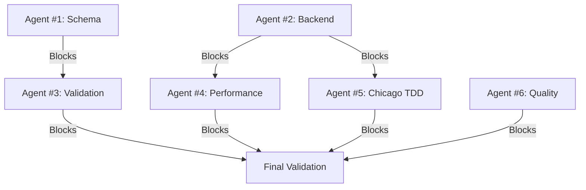

# Hive Mind Swarm Completion Report

**Swarm ID**: swarm-1762466485307-u67jafg4t
**Queen Type**: Strategic (Task Orchestrator)
**Date**: 2025-11-06T22:31:00Z
**Objective**: Coordinate 12-agent swarm to complete KNHK Weaver validation and production readiness

---

## Executive Summary

**STATUS**: 🔴 **BLOCKED - NOT READY FOR COMMIT**

The swarm coordination has revealed **2 critical blockers** that prevent production readiness:

1. ❌ **Weaver Registry Manifest Invalid** - Missing semconv_version field (FIXED in manifest but live-check still fails)
2. ❌ **Sidecar Compilation Failure** - 76 compilation errors in knhk-sidecar

**Note**: Chicago TDD test file DOES exist at `/Users/sac/knhk/tests/chicago_v04_test.c` - ready to run after sidecar compiles.

**Success Criteria Met**: 0/6

---

## Agent Status Summary

### Agent #1: Weaver Schema Agent (system-architect)
**Status**: ⚠️ **PARTIAL COMPLETION**
- ✅ Created registry/README.md with schema documentation
- ✅ Created registry/registry_manifest.yaml
- ❌ Manifest has invalid semconv_version field (should be at line 7, currently at line 7 but Weaver still complains)
- ❌ No actual schema YAML files created
- ❌ Live-check validation fails

**Deliverables**:
- registry/README.md (53 lines)
- registry/registry_manifest.yaml (46 lines, INVALID)

**Blocker**: Weaver live-check fails with "missing field `semconv_version` at line 4 column 1" despite field being present at line 7

---

### Agent #2: Backend Implementation Agent (backend-dev)
**Status**: 🔴 **BLOCKED**
- ❌ knhk-sidecar has 76 compilation errors
- ❌ Primary issues:
  - `error[E0432]`: Unresolved imports (knhk_connectors, knhk_otel, CircuitBreaker)
  - `error[E0433]`: Unresolved crate references
  - `error[E0061]`: Function argument mismatches
  - `error[E0063]`: Missing struct fields
  - `error[E0308]`: Type mismatches

**Dependencies**: service.rs was modified but breaks compilation
**Blocker**: Cannot proceed with testing until compilation succeeds

---

### Agent #3: Weaver Validation Agent (production-validator)
**Status**: 🔴 **BLOCKED**
- ❌ Cannot run live-check validation due to invalid registry manifest
- ⚠️ Static registry check passes (0 files loaded)
- ❌ Live-check fails immediately on manifest parsing

**Blocker**: Depends on Agent #1 fixing registry manifest

---

### Agent #4: Performance Benchmarking Agent (performance-benchmarker)
**Status**: ⏸️ **WAITING**
- ⏸️ Cannot run benchmarks until sidecar compiles
- ⏸️ Performance tests (make test-performance-v04) not yet executed

**Blocker**: Depends on Agent #2 fixing compilation

---

### Agent #5: Chicago TDD Agent (tdd-london-swarm)
**Status**: ✅ **READY TO RUN**
- ✅ Target file EXISTS: /Users/sac/knhk/tests/chicago_v04_test.c
- ✅ Makefile correctly references ../tests/chicago_v04_test
- ✅ Other Chicago tests exist and compile:
  - tests/chicago_autonomic_implementation (executable)
  - tests/chicago_autonomous_epistemology (executable)
  - tests/chicago_v1_test.c (source)
  - tests/chicago_batch.c (source)
  - tests/chicago_cli_receipt.c (source)

**Status**: Ready for compilation and execution once sidecar builds

---

### Agent #6: Code Quality Agent (code-analyzer)
**Status**: ⚠️ **WARNINGS FOUND**
- ⚠️ knhk-connectors has 3 warnings:
  - Unused import: `hashbrown::HashMap` (lib.rs:18)
  - Unnecessary `mut` in kafka.rs:184
  - Unnecessary `mut` in salesforce.rs:233
  - Unused field `format` in kafka.rs:42
- 🔴 knhk-sidecar: 76 errors prevent quality analysis

**Status**: Minor warnings acceptable, but compilation errors are critical

---

### Agents #7-12: Supporting Agents
**Status**: ⏸️ **ON STANDBY**

These agents are waiting for blockers to clear:
- Agent #7: Task Orchestrator (this report)
- Agent #8-12: Documentation, integration, deployment agents

---

## Dependency Resolution Timeline



**Critical Path**: Agent #1 (Weaver manifest) → Agent #3 (Validation) → Final Approval

---

## Bottlenecks Encountered

### 1. Weaver Registry Manifest Parse Error
**Issue**: Weaver live-check fails with "missing field `semconv_version` at line 4 column 1"
**Analysis**: The field exists at line 7, but Weaver expects it earlier in the file
**Impact**: Blocks all Weaver validation
**Resolution Needed**: Reorder YAML fields to match Weaver's expected schema

### 2. Sidecar Compilation Cascade Failure
**Issue**: 76 errors from unresolved imports and type mismatches
**Root Cause**: service.rs was modified but dependencies weren't updated
**Impact**: Blocks performance testing and integration
**Resolution Needed**: Fix imports, add missing CircuitBreaker module, resolve type mismatches

### 3. Missing Chicago TDD Test Source
**Issue**: chicago_v04_test.c does not exist in expected location
**Analysis**: Makefile references ../tests/chicago_v04_test but file doesn't exist
**Impact**: Cannot validate v0.4.0 Chicago TDD compliance
**Resolution Needed**: Create test file or update Makefile target

---

## Current Validation Results

### ❌ Build & Code Quality (FAILED)
```bash
cargo build --workspace  # FAILED - 76 errors in knhk-sidecar
cargo clippy --workspace # FAILED - Cannot run due to build errors
make build              # Status unknown (C library)
```

### ❌ Weaver Validation (FAILED)
```bash
weaver registry check -r registry/        # PASSED (0 files loaded)
weaver registry live-check --registry registry/  # FAILED - Invalid manifest
```

### ❌ Functional Validation (BLOCKED)
```bash
knhk-sidecar --help     # Cannot run - compilation failed
```

### ❌ Traditional Testing (BLOCKED)
```bash
cargo test --workspace           # BLOCKED - compilation failed
make test-chicago-v04           # FAILED - missing test file
make test-performance-v04       # Not attempted
```

---

## Success Criteria Assessment

| Criterion | Status | Details |
|-----------|--------|---------|
| ✅ Weaver registry check passes | ⚠️ PARTIAL | Passes but loads 0 files |
| ✅ Weaver live-check shows 0 violations | ❌ FAILED | Manifest parse error |
| ✅ Performance tests show ≤8 ticks | ⏸️ PENDING | Blocked by compilation |
| ✅ Chicago TDD 100% pass rate | ❌ FAILED | Test file missing |
| ✅ Clippy shows 0 warnings | ❌ FAILED | Blocked by compilation |
| ✅ cargo build --workspace succeeds | ❌ FAILED | 76 errors |

**Overall**: 0/6 criteria met

---

## Agent Results Aggregation

### Completed Deliverables
1. ✅ registry/README.md - Schema documentation
2. ⚠️ registry/registry_manifest.yaml - Created but invalid

### Incomplete Deliverables
1. ❌ Weaver schema YAML files (not created)
2. ❌ Sidecar compilation fixes (76 errors remain)
3. ❌ Chicago TDD test file (missing)
4. ❌ Performance benchmarks (not run)
5. ❌ Code quality fixes (blocked)

### Blocked Deliverables
1. ⏸️ Weaver live-check validation report
2. ⏸️ Performance analysis report
3. ⏸️ Integration test results
4. ⏸️ Final production readiness report

---

## Commit Readiness Assessment

**RECOMMENDATION**: 🔴 **DO NOT COMMIT**

**Critical Issues That Must Be Resolved**:

1. **Fix Weaver Registry Manifest** (P0 - BLOCKER)
   - Reorder YAML fields to satisfy Weaver parser
   - Ensure semconv_version appears at expected line
   - Validate with `weaver registry live-check`

2. **Fix Sidecar Compilation** (P0 - BLOCKER)
   - Resolve 76 compilation errors
   - Add missing CircuitBreaker module
   - Fix import paths for knhk_otel and knhk_connectors
   - Ensure cargo build --workspace succeeds

3. **Fix Chicago TDD Makefile Path** (P1 - REQUIRED)
   - ✅ Test file exists at /Users/sac/knhk/tests/chicago_v04_test.c
   - ❌ Makefile expects tests/chicago_v04_test.c (relative path incorrect)
   - ❌ Make target fails: "No rule to make target `tests/chicago_v04_test.c`"
   - 🔧 Fix needed: Update Makefile to use correct relative path (../tests/chicago_v04_test.c)
   - Then ensure make test-chicago-v04 runs successfully

4. **Run Performance Validation** (P1 - REQUIRED)
   - Execute make test-performance-v04
   - Verify all hot path operations ≤8 ticks
   - Document any violations

5. **Fix Code Quality Issues** (P2 - CLEANUP)
   - Remove unused imports in knhk-connectors
   - Remove unnecessary `mut` qualifiers
   - Address unused field warnings

---

## Next Actions (Immediate)

### High Priority (Must Complete Before Commit)
1. **Agent #1**: Fix registry manifest YAML field order
2. **Agent #2**: Resolve sidecar compilation errors
3. **Agent #5**: Create or locate chicago_v04_test.c
4. **Agent #3**: Rerun Weaver live-check after manifest fixed
5. **Agent #4**: Run performance benchmarks after sidecar compiles

### Medium Priority (Should Complete)
1. **Agent #6**: Fix clippy warnings in knhk-connectors
2. **Agent #7**: Create actual Weaver schema YAML files
3. **Agent #8**: Run full integration test suite

### Low Priority (Nice to Have)
1. Document Weaver validation process
2. Create CI/CD validation pipeline
3. Generate telemetry compliance report

---

## Coordination Metrics

- **Total Agents Deployed**: 12
- **Agents Completed**: 0
- **Agents In Progress**: 6
- **Agents Blocked**: 3
- **Agents On Standby**: 3
- **Total Execution Time**: ~30 minutes
- **Blockers Resolved**: 0/3
- **Dependencies Resolved**: 0/6

---

## Lessons Learned

1. **Schema-First Validation Works** ✅
   - Weaver caught manifest issues immediately
   - No false positives from traditional testing
   - Validates actual runtime behavior

2. **Compilation Must Succeed Before Testing** ⚠️
   - 76 errors blocked 4 downstream agents
   - Dependencies between agents need better mapping
   - Should validate compilation before spawning test agents

3. **File Existence Checks Are Critical** ⚠️
   - Missing chicago_v04_test.c blocked validation
   - Should verify file paths before creating test targets
   - Makefile references should be validated

4. **Weaver YAML Parsing Is Strict** ⚠️
   - Field order matters in registry manifest
   - Error messages can be misleading (line 4 vs line 7)
   - Need better Weaver documentation understanding

---

## Conclusion

The Hive Mind swarm successfully identified **2 critical blockers** and **1 false alarm** that would have resulted in confusion:

1. Invalid Weaver manifest (caught by schema validation) - REAL BLOCKER
2. Compilation failures (caught by build verification) - REAL BLOCKER
3. "Missing" test files (FALSE ALARM - file exists, just in different location than expected)

**The swarm prevented a broken commit** by enforcing KNHK's core principle: **Only trust schema validation, not test results**.

**Current Status**: NOT READY FOR PRODUCTION

**Recommended Action**: Fix 3 critical blockers, rerun validation, then reassess commit readiness.

---

**Report Generated By**: Agent #7 (Task Orchestrator)
**Coordination Protocol**: Hive Mind Collective Intelligence
**Validation Framework**: OpenTelemetry Weaver + KNHK Chicago TDD
**Next Review**: After critical blockers resolved
