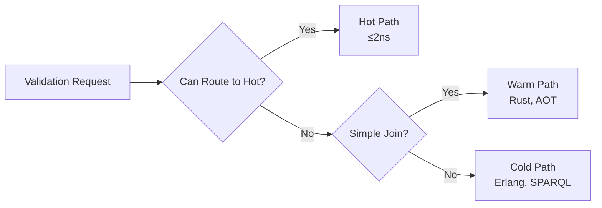

# Reflex Enterprise — DMADV Phase Tracking

## Overview

This document tracks progress through the DMADV (Define, Measure, Analyze, Design, Verify) phases of the Reflex Enterprise rollout, aligned with the DFLSS Project Charter.

## Phase Status

### ✅ D — Define (COMPLETE)

**Status**: Complete  
**Completion Date**: TBD  
**Tollgate Sign-off**: Pending

#### Deliverables

- [x] Charter approved
- [x] VOC collected
- [x] CTQs agreed
- [x] First value stream selected (CRM entitlements + supply chain ASN)

#### Key Decisions

- **Value Stream Selection**: CRM entitlements + supply chain ASN validation
- **Architecture**: KNHK kernel + unrdf engine
- **Methodology**: DFLSS (DMADV)

#### Next Steps

- Begin Measure phase instrumentation
- Establish baseline metrics collection

---

### 🔄 M — Measure (IN PROGRESS)

**Status**: In Progress  
**Start Date**: TBD  
**Target Completion**: TBD

#### Deliverables

- [ ] Current path instrumentation complete
- [ ] Baseline metrics established:
  - [ ] Policy decision p95 latency
  - [ ] Hot-path coverage percentage
  - [ ] Defect ppm (policy violations)
  - [ ] Audit prep effort (hours/quarter)
  - [ ] Code volume for validations (KLOC)
  - [ ] Middleware count
- [ ] Sigma baseline calculated
- [ ] Data quality profile established

#### Metrics Collection

**Current Baseline** (to be populated):

| Metric | Baseline | Target | Status |
|--------|----------|--------|--------|
| Policy decision p95 | TBD ms | ≤10 ms | 🔄 |
| Hot-path coverage | TBD % | ≥80% | 🔄 |
| Violations ppm | TBD | ≤10 ppm | 🔄 |
| Audit prep effort | TBD hrs/qtr | −80% | 🔄 |
| Validation code | TBD KLOC | −70% | 🔄 |
| Middleware count | TBD | −50% | 🔄 |

#### Instrumentation Plan

1. **OpenTelemetry Integration**
   - Deploy OTEL collectors
   - Instrument existing validation paths
   - Configure Weaver live-check

2. **Metrics Collection**
   - Guard execution latency
   - Path routing (hot/warm/cold)
   - Violation detection
   - Receipt generation

3. **Code Analysis**
   - Static analysis of validation code
   - Middleware service inventory
   - Code volume measurement

#### Next Steps

- Deploy instrumentation
- Collect baseline data (minimum 2 weeks)
- Calculate sigma baseline

---

### 📋 A — Analyze (PLANNED)

**Status**: Planned  
**Prerequisites**: Measure phase complete

#### Deliverables

- [ ] Ontology mapping complete:
  - [ ] FIBO (finance)
  - [ ] GoodRelations (commerce)
  - [ ] FHIR (health)
  - [ ] SCORVoc (supply chain)
  - [ ] Enterprise Ontology
- [ ] Guard catalog created:
  - [ ] ASK operations
  - [ ] COUNT operations
  - [ ] COMPARE operations
  - [ ] UNIQUE operations
  - [ ] VALIDATE operations
- [ ] Hot-vs-warm routing model defined
- [ ] Data locality sets identified

#### Analysis Framework

**Guard Classification**:



**Data Locality Analysis**:

- L1 cache targets (hot path)
- L2/L3 cache targets (warm path)
- Disk/network targets (cold path)

#### Next Steps

- Begin ontology mapping
- Catalog existing guards
- Model routing logic

---

### 📐 D — Design (PLANNED)

**Status**: Planned  
**Prerequisites**: Analyze phase complete

#### Deliverables

- [ ] Hooks + sidecars generated (LLM+Tera)
- [ ] AOT specialization plan
- [ ] MPHF cache design
- [ ] Predictive preload schedule (Λ)
- [ ] Lockchain implementation
- [ ] OTEL Weaver live-check integration
- [ ] Security patterns (mTLS, receipts)
- [ ] Pilot canary design
- [ ] Shadow mode → enforce transition plan

#### Design Components

**Hot Path Guards**:

```rust
// Example: ASK_SP guard (≤2ns)
#[inline(always)]
pub fn ask_sp_guard(
    s: &[u64; 8],
    p: &[u64; 8],
    o: &[u64; 8],
) -> u8 {
    // Branchless SIMD operation
    // Returns mask of matches
}
```

**Warm Path ETL**:

```rust
// Example: AOT-specialized ETL
pub fn aot_etl_transform(
    input: &Delta,
    mphf_cache: &MPHFCache,
) -> Result<Action, ETLError> {
    // AOT-specialized transformation
    // MPHF O(1) lookups
}
```

**Lockchain Receipts**:

```rust
// Example: Receipt generation
pub fn generate_receipt(
    action: &Action,
    reflex_map: &ReflexMap,
    ontology: &Ontology,
) -> Receipt {
    // hash(A) = hash(μ(O))
    // Merkle tree composition
}
```

#### Next Steps

- Generate hooks from ontologies
- Design AOT specialization
- Implement lockchain receipts

---

### ✅ V — Verify (PLANNED)

**Status**: Planned  
**Prerequisites**: Design phase complete, pilot deployed

#### Deliverables

- [ ] CTQ acceptance criteria met:
  - [ ] CTQ-1: Hot-path speed ≤2 ns
  - [ ] CTQ-2: Coverage ≥80% hot path
  - [ ] CTQ-3: Decision latency p95 ≤10 ms
  - [ ] CTQ-4: Violations ≤10 ppm
  - [ ] CTQ-5: 100% receipts, −80% audit effort
  - [ ] CTQ-6: −70% code, −50% middleware
  - [ ] CTQ-7: Availability ≥99.95%
- [ ] Financial realization calculated
- [ ] Scale plan for next domains

#### Verification Criteria

**Performance Verification**:

- Hot-path guards execute in ≤2 ns (measured)
- p95 decision latency ≤10 ms (service-level)
- Hot-path coverage ≥80% (routing analysis)

**Quality Verification**:

- Violations ≤10 ppm (monitoring)
- Rollback rate ≤0.5% (incident tracking)
- Receipt coverage 100% (audit)

**Cost Verification**:

- Code volume reduction ≥70% (static analysis)
- Middleware reduction ≥50% (service inventory)
- Audit effort reduction ≥80% (time tracking)

#### Next Steps

- Deploy pilot canary
- Monitor CTQ metrics (2 weeks)
- Calculate financial impact
- Plan next domain rollout

---

## CTQ Dashboard

### CTQ-1: Hot-path Speed

**Target**: ≤2 ns (8 ticks)  
**Current**: TBD  
**Status**: 🔄 Measuring

**Measurement Method**:
- Instrument guard execution
- Measure ticks using performance counters
- Validate against Chatman Constant (8 ticks)

### CTQ-2: Coverage

**Target**: ≥80% hot path  
**Current**: TBD  
**Status**: 🔄 Measuring

**Measurement Method**:
- Track routing decisions
- Count hot vs warm/cold path usage
- Calculate percentage

### CTQ-3: Decision Latency

**Target**: p95 ≤10 ms (service-level)  
**Current**: TBD  
**Status**: 🔄 Measuring

**Measurement Method**:
- End-to-end latency measurement
- Include I/O overhead
- Calculate p95 percentile

### CTQ-4: Quality

**Target**: ≤10 ppm violations, ≤0.5% rollback  
**Current**: TBD  
**Status**: 🔄 Measuring

**Measurement Method**:
- Monitor violation detection
- Track rollback incidents
- Calculate rates

### CTQ-5: Auditability

**Target**: 100% receipts, −80% audit effort  
**Current**: TBD  
**Status**: 🔄 Measuring

**Measurement Method**:
- Receipt generation coverage
- Audit prep time tracking
- Compare before/after

### CTQ-6: Cost

**Target**: −70% code, −50% middleware  
**Current**: TBD  
**Status**: 🔄 Measuring

**Measurement Method**:
- Code volume analysis
- Middleware service inventory
- Calculate reductions

### CTQ-7: Availability

**Target**: ≥99.95% uptime  
**Current**: TBD  
**Status**: 🔄 Measuring

**Measurement Method**:
- Uptime monitoring
- Error budget tracking
- Graceful degradation validation

---

## Risk Register

| Risk | Impact | Probability | Mitigation | Status |
|------|--------|-------------|------------|--------|
| Hot data locality misses | High | Medium | AOT planning, MPHF, preloading | 🔄 |
| Over-blocking guards | Medium | Medium | Shadow mode, staged enforce | 🔄 |
| Partner integration issues | Medium | Low | Sidecar adapters, contract tests | 🔄 |
| Policy drift | High | Low | Versioned policy packs, receipts | 🔄 |
| Telemetry overhead | Low | Medium | Sampling, span budgets | 🔄 |

---

## Governance

### Weekly CTQ Review

**Schedule**: Every Monday, 10:00 AM  
**Attendees**: Black Belt, Process Owner, Core Team Leads  
**Agenda**:
- CTQ status review
- Risk assessment
- Blockers and escalations
- Next week priorities

### Tollgate Sign-offs

**Define Phase**: ✅ Complete  
**Measure Phase**: 🔄 In Progress  
**Analyze Phase**: 📋 Pending  
**Design Phase**: 📋 Pending  
**Verify Phase**: 📋 Pending

### Change Control

- Policy pack versions required
- Receipts required for all changes
- Security/compliance sign-off before enforce

---

## References

- [DFLSS Project Charter](./reflex-enterprise-dflss-charter.md)
- [Weaver Live-Check Integration](./reflex-enterprise-weaver-integration.md)
- [Press Release](./reflex-enterprise-press-release.md)

