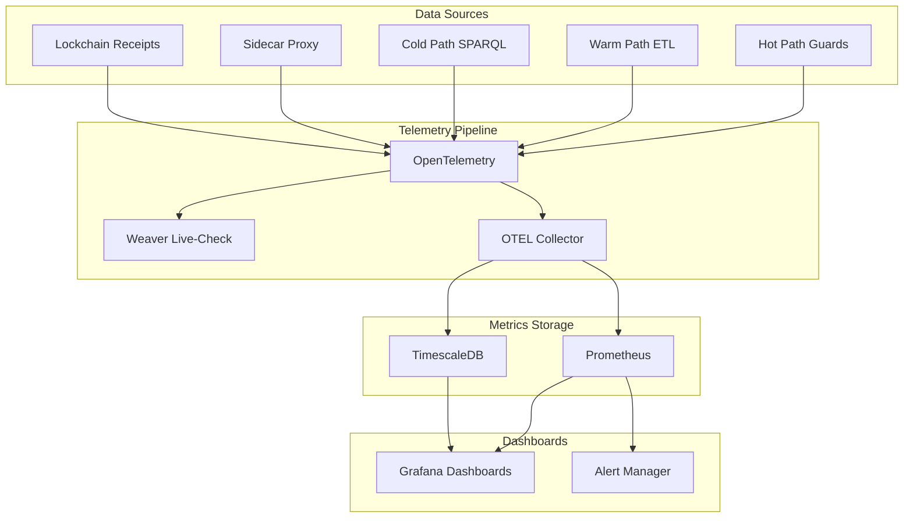

# Reflex Enterprise — Metrics Dashboard Specification

## Overview

This document specifies the metrics dashboard for Reflex Enterprise, aligned with the DFLSS Project Charter CTQs and DMADV phase tracking.

## Dashboard Architecture



## CTQ Metrics

### CTQ-1: Hot-path Speed

**Metric**: `knhk.hot.guard.latency.ticks`  
**Type**: Histogram  
**Unit**: Ticks  
**Target**: ≤8 ticks (≤2 ns)

**Dashboard Panel**:
- **Gauge**: Current p95 latency in ticks
- **Histogram**: Distribution of guard execution times
- **Alert**: Alert when p95 > 8 ticks

**Query Example**:
```promql
histogram_quantile(0.95, 
  rate(knhk_hot_guard_latency_ticks_bucket[5m])
)
```

### CTQ-2: Coverage

**Metric**: `knhk.path.routing.count`  
**Type**: Counter  
**Labels**: `path_type` (hot/warm/cold)  
**Target**: ≥80% hot path

**Dashboard Panel**:
- **Pie Chart**: Hot vs Warm vs Cold path distribution
- **Gauge**: Hot path percentage
- **Alert**: Alert when hot path < 80%

**Query Example**:
```promql
sum(rate(knhk_path_routing_count{path_type="hot"}[5m])) 
/ 
sum(rate(knhk_path_routing_count[5m])) * 100
```

### CTQ-3: Decision Latency

**Metric**: `knhk.decision.latency.ms`  
**Type**: Histogram  
**Unit**: Milliseconds  
**Target**: p95 ≤10 ms

**Dashboard Panel**:
- **Time Series**: p50, p95, p99 latency over time
- **Gauge**: Current p95 latency
- **Alert**: Alert when p95 > 10 ms

**Query Example**:
```promql
histogram_quantile(0.95, 
  rate(knhk_decision_latency_ms_bucket[5m])
)
```

### CTQ-4: Quality

**Metrics**:
- `knhk.violations.admitted.count` (Counter)
- `knhk.rollbacks.count` (Counter)
- `knhk.operations.total.count` (Counter)

**Targets**: ≤10 ppm violations, ≤0.5% rollback

**Dashboard Panel**:
- **Gauge**: Current violation ppm
- **Gauge**: Current rollback percentage
- **Time Series**: Violation rate over time
- **Alert**: Alert when violations > 10 ppm or rollback > 0.5%

**Query Example**:
```promql
# Violations ppm
sum(rate(knhk_violations_admitted_count[5m])) 
/ 
sum(rate(knhk_operations_total_count[5m])) 
* 1000000

# Rollback percentage
sum(rate(knhk_rollbacks_count[5m])) 
/ 
sum(rate(knhk_operations_total_count[5m])) 
* 100
```

### CTQ-5: Auditability

**Metrics**:
- `knhk.receipts.generated.count` (Counter)
- `knhk.receipts.verified.count` (Counter)
- `knhk.audit.prep.time.hours` (Gauge)

**Targets**: 100% receipts, −80% audit effort

**Dashboard Panel**:
- **Gauge**: Receipt coverage percentage
- **Gauge**: Receipt verification success rate
- **Time Series**: Audit prep time trend
- **Alert**: Alert when receipt coverage < 100%

**Query Example**:
```promql
# Receipt coverage
sum(rate(knhk_receipts_generated_count[5m])) 
/ 
sum(rate(knhk_operations_total_count[5m])) 
* 100

# Audit prep time reduction
(knhk_audit_prep_time_hours - knhk_audit_prep_time_hours_baseline) 
/ 
knhk_audit_prep_time_hours_baseline 
* 100
```

### CTQ-6: Cost

**Metrics**:
- `knhk.code.volume.kloc` (Gauge)
- `knhk.middleware.count` (Gauge)

**Targets**: −70% code, −50% middleware

**Dashboard Panel**:
- **Gauge**: Code volume reduction percentage
- **Gauge**: Middleware reduction percentage
- **Time Series**: Code volume trend
- **Time Series**: Middleware count trend

**Query Example**:
```promql
# Code volume reduction
(knhk_code_volume_kloc_baseline - knhk_code_volume_kloc) 
/ 
knhk_code_volume_kloc_baseline 
* 100

# Middleware reduction
(knhk_middleware_count_baseline - knhk_middleware_count) 
/ 
knhk_middleware_count_baseline 
* 100
```

### CTQ-7: Availability

**Metrics**:
- `knhk.availability.percentage` (Gauge)
- `knhk.errors.count` (Counter)
- `knhk.error.budget.remaining` (Gauge)

**Target**: ≥99.95% uptime

**Dashboard Panel**:
- **Gauge**: Current availability percentage
- **Gauge**: Remaining error budget
- **Time Series**: Availability over time
- **Alert**: Alert when availability < 99.95%

**Query Example**:
```promql
# Availability
(1 - sum(rate(knhk_errors_count[5m])) / sum(rate(knhk_operations_total_count[5m]))) * 100

# Error budget
knhk_error_budget_remaining
```

## Operational Metrics

### Hot Path Metrics

```yaml
metrics:
  - name: knhk.hot.guard.execute.count
    type: counter
    labels: [guard_name, result]
    description: "Number of hot path guard executions"
  
  - name: knhk.hot.guard.latency.ticks
    type: histogram
    buckets: [1, 2, 4, 6, 8, 10, 12, 16]
    description: "Hot path guard execution latency in ticks"
  
  - name: knhk.hot.cache.hit.rate
    type: gauge
    description: "Hot path cache hit rate"
```

### Warm Path Metrics

```yaml
metrics:
  - name: knhk.warm.etl.process.count
    type: counter
    labels: [operation_type]
    description: "Number of warm path ETL operations"
  
  - name: knhk.warm.mphf.cache.hit.rate
    type: gauge
    description: "MPHF cache hit rate"
  
  - name: knhk.warm.aot.specialization.count
    type: counter
    description: "Number of AOT specializations"
```

### Receipt Metrics

```yaml
metrics:
  - name: knhk.receipt.generated.count
    type: counter
    labels: [receipt_type]
    description: "Number of receipts generated"
  
  - name: knhk.receipt.verified.count
    type: counter
    labels: [verification_status]
    description: "Number of receipts verified"
  
  - name: knhk.receipt.merkle.depth
    type: histogram
    description: "Merkle tree depth distribution"
```

### Sidecar Metrics

```yaml
metrics:
  - name: knhk.sidecar.request.count
    type: counter
    labels: [method, status_code]
    description: "Number of sidecar requests"
  
  - name: knhk.sidecar.latency.ms
    type: histogram
    description: "Sidecar request latency"
  
  - name: knhk.sidecar.circuit.breaker.state
    type: gauge
    labels: [circuit_name]
    description: "Circuit breaker state (0=closed, 1=open, 2=half-open)"
```

## Grafana Dashboard JSON

### Main CTQ Dashboard

```json
{
  "dashboard": {
    "title": "Reflex Enterprise CTQ Dashboard",
    "panels": [
      {
        "title": "CTQ-1: Hot-path Speed (p95 ticks)",
        "targets": [
          {
            "expr": "histogram_quantile(0.95, rate(knhk_hot_guard_latency_ticks_bucket[5m]))",
            "legendFormat": "p95 latency"
          }
        ],
        "type": "graph",
        "yaxes": [
          {
            "format": "short",
            "label": "Ticks",
            "max": 10,
            "min": 0
          }
        ],
        "alert": {
          "conditions": [
            {
              "evaluator": {
                "params": [8],
                "type": "gt"
              },
              "operator": {
                "type": "and"
              },
              "query": {
                "params": ["A", "5m", "now"]
              },
              "reducer": {
                "params": [],
                "type": "last"
              },
              "type": "query"
            }
          ],
          "executionErrorState": "alerting",
          "for": "5m",
          "frequency": "10s",
          "handler": 1,
          "name": "Hot-path latency exceeded",
          "noDataState": "no_data",
          "notifications": []
        }
      },
      {
        "title": "CTQ-2: Hot Path Coverage (%)",
        "targets": [
          {
            "expr": "sum(rate(knhk_path_routing_count{path_type=\"hot\"}[5m])) / sum(rate(knhk_path_routing_count[5m])) * 100",
            "legendFormat": "Hot Path %"
          }
        ],
        "type": "gauge",
        "thresholds": "80,90",
        "yaxes": [
          {
            "format": "percent",
            "label": "Percentage",
            "max": 100,
            "min": 0
          }
        ]
      }
    ]
  }
}
```

## Alert Rules

### Prometheus Alert Rules

```yaml
groups:
  - name: reflex_enterprise_ctq
    interval: 30s
    rules:
      - alert: HotPathLatencyExceeded
        expr: histogram_quantile(0.95, rate(knhk_hot_guard_latency_ticks_bucket[5m])) > 8
        for: 5m
        labels:
          severity: critical
          ctq: "CTQ-1"
        annotations:
          summary: "Hot path latency exceeded 8 ticks"
          description: "p95 latency is {{ $value }} ticks (target: ≤8)"
      
      - alert: HotPathCoverageLow
        expr: sum(rate(knhk_path_routing_count{path_type="hot"}[5m])) / sum(rate(knhk_path_routing_count[5m])) * 100 < 80
        for: 10m
        labels:
          severity: warning
          ctq: "CTQ-2"
        annotations:
          summary: "Hot path coverage below 80%"
          description: "Current coverage: {{ $value }}%"
      
      - alert: DecisionLatencyHigh
        expr: histogram_quantile(0.95, rate(knhk_decision_latency_ms_bucket[5m])) > 10
        for: 5m
        labels:
          severity: critical
          ctq: "CTQ-3"
        annotations:
          summary: "Decision latency exceeded 10ms"
          description: "p95 latency is {{ $value }}ms"
      
      - alert: ViolationsHigh
        expr: sum(rate(knhk_violations_admitted_count[5m])) / sum(rate(knhk_operations_total_count[5m])) * 1000000 > 10
        for: 5m
        labels:
          severity: critical
          ctq: "CTQ-4"
        annotations:
          summary: "Violations exceeded 10 ppm"
          description: "Current rate: {{ $value }} ppm"
      
      - alert: ReceiptCoverageLow
        expr: sum(rate(knhk_receipts_generated_count[5m])) / sum(rate(knhk_operations_total_count[5m])) * 100 < 100
        for: 5m
        labels:
          severity: critical
          ctq: "CTQ-5"
        annotations:
          summary: "Receipt coverage below 100%"
          description: "Current coverage: {{ $value }}%"
      
      - alert: AvailabilityLow
        expr: (1 - sum(rate(knhk_errors_count[5m])) / sum(rate(knhk_operations_total_count[5m]))) * 100 < 99.95
        for: 5m
        labels:
          severity: critical
          ctq: "CTQ-7"
        annotations:
          summary: "Availability below 99.95%"
          description: "Current availability: {{ $value }}%"
```

## Weaver Live-Check Integration

Weaver live-check validates that telemetry conforms to semantic conventions:

```yaml
weaver_validation:
  enabled: true
  registry: ./schemas/reflex-enterprise-registry
  otlp_port: 4317
  admin_port: 8080
  format: json
  output: ./weaver-reports
  
  checks:
    - name: knhk.operation.name
      required: true
      pattern: "^knhk\\.(hot|warm|cold|sidecar|receipt)\\..+"
    
    - name: knhk.hot.latency.ticks
      required: true
      max: 8
    
    - name: knhk.reflex.map.applied
      required: true
      type: boolean
```

## References

- [DFLSS Project Charter](./reflex-enterprise-dflss-charter.md)
- [DMADV Phase Tracking](./reflex-enterprise-dmadv-tracking.md)
- [Weaver Live-Check Integration](./reflex-enterprise-weaver-integration.md)

