# Weaver Live-Check Implementation with Diagrams

## Overview

Complete implementation of Weaver live-check for telemetry validation with comprehensive diagrams showing the workflow, architecture, and integration points.

## Architecture Diagram


## Live-Check Workflow Diagram


## Component Interaction Diagram

```mermaid
graph LR
    subgraph "Command Layer"
        A[weaver_start]
        B[weaver_stop]
        C[weaver_validate]
    end
    
    subgraph "WeaverLiveCheck API"
        D[new]
        E[with_registry]
        F[with_otlp_port]
        G[with_admin_port]
        H[start]
        I[stop]
        J[otlp_endpoint]
    end
    
    subgraph "Telemetry Export"
        K[Tracer]
        L[export_to_weaver]
        M[OtlpExporter]
    end
    
    subgraph "Validation"
        N[parse_weaver_report]
        O[ValidationResult]
    end
    
    A --> D
    A --> E
    A --> F
    A --> G
    A --> H
    
    B --> I
    
    C --> A
    C --> L
    C --> N
    C --> B
    
    L --> K
    L --> M
    
    N --> O
```



## Data Flow Diagram


## State Machine Diagram


## Integration Points Diagram


## Validation Process Diagram


## Error Handling Flow


## CI/CD Integration Diagram


## File Structure

```
rust/knhk-cli/src/
├── commands/
│   └── metrics.rs          # weaver_start, weaver_stop, weaver_validate
└── metrics.rs              # CLI command wrappers

rust/knhk-otel/src/
└── lib.rs                  # WeaverLiveCheck, Tracer, export_to_weaver

docs/
└── weaver-live-check-diagrams.md  # This file
```

## Implementation Details

### 1. Weaver Start Process

```rust
pub fn weaver_start(
    registry: Option<String>,
    otlp_port: Option<u16>,
    admin_port: Option<u16>,
    format: Option<String>,
    output: Option<String>,
) -> Result<(String, u16, Option<u32>), String>
```

**Flow:**
1. Create `WeaverLiveCheck` instance
2. Configure with provided parameters
3. Spawn Weaver process via `start()`
4. Return endpoint, admin port, and process ID

### 2. Telemetry Export

```rust
pub fn export_to_weaver(&mut self, weaver_endpoint: &str) -> Result<(), String>
```

**Flow:**
1. Create `OtlpExporter` with Weaver endpoint
2. Export all spans via OTLP JSON
3. Export all metrics via OTLP JSON
4. Return success/failure

### 3. Validation Process

```rust
pub fn weaver_validate(
    registry: Option<String>,
    otlp_port: Option<u16>,
    admin_port: Option<u16>,
    timeout: Option<u64>,
) -> Result<(bool, u32, String), String>
```

**Flow:**
1. Start Weaver with output directory
2. Export current telemetry
3. Wait for validation timeout
4. Stop Weaver process
5. Parse validation report
6. Extract violations count
7. Return compliance status

### 4. Report Parsing

```rust
fn parse_weaver_report(output_dir: &std::path::Path) -> Result<ValidationResult, String>
```

**Flow:**
1. Read JSON report files from output directory
2. Find most recent report
3. Parse JSON structure
4. Extract violations array
5. Count violations
6. Generate compliance message

## Usage Examples

### Basic Validation

```bash
# Start Weaver
knhk metrics weaver-start --otlp-port 4317 --admin-port 8080

# Generate telemetry (other commands)
knhk boot init schema.ttl invariants.sparql

# Validate
knhk metrics weaver-validate --timeout 10

# Stop Weaver
knhk metrics weaver-stop --admin-port 8080
```

### With Custom Registry

```bash
knhk metrics weaver-start \
    --registry ./schemas/my-registry \
    --otlp-port 4317 \
    --admin-port 8080 \
    --format json \
    --output ./weaver-reports
```

### CI/CD Integration

```yaml
# .github/workflows/telemetry-validation.yml
- name: Install Weaver
  run: ./scripts/install-weaver.sh

- name: Start Weaver
  run: knhk metrics weaver-start --otlp-port 4317

- name: Run Tests (generate telemetry)
  run: cargo test

- name: Validate Telemetry
  run: |
    RESULT=$(knhk metrics weaver-validate --timeout 30)
    if echo "$RESULT" | grep -q '"compliant":false'; then
      echo "Telemetry validation failed"
      exit 1
    fi
```

## Testing

See `docs/chicago-tdd-weaver-tests.md` for comprehensive test coverage.

## References

- [OpenTelemetry Semantic Conventions](https://opentelemetry.io/docs/specs/semconv/)
- [Weaver Live-Check](https://github.com/open-telemetry/opentelemetry-rust/tree/main/vendors/weaver)
- [OTLP Protocol](https://opentelemetry.io/docs/specs/otlp/)

