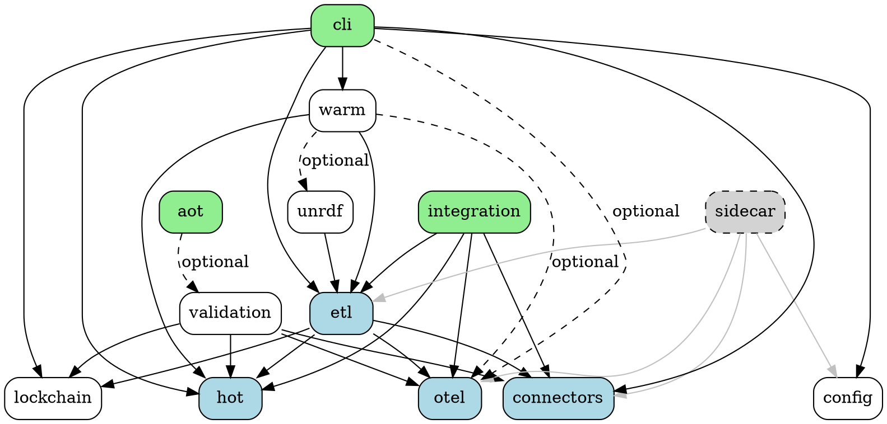

# KNHK Monorepo Dependency Graph Analysis

**Version:** 1.0.0
**Generated:** 2025-11-07
**Workspace Members:** 14 packages (13 active + 1 excluded)

## Executive Summary

The KNHK monorepo demonstrates a **well-layered architecture** with clear separation of concerns across 14 workspace members. The dependency graph shows:

- **Zero circular dependencies** (knhk-validation intentionally removed knhk-etl to prevent cycle)
- **Maximum dependency depth: 4 levels**
- **3 foundation packages with no dependencies**
- **Clear critical path through knhk-etl** (highest incoming dependencies)
- **Topologically sound build order** enabling efficient parallel compilation

---

## 1. Dependency Matrix

### Internal Workspace Dependencies

| Package | Depends On | Depth | Type |
|---------|-----------|-------|------|
| **knhk-hot** | ∅ | 0 | Foundation |
| **knhk-config** | ∅ | 0 | Foundation |
| **knhk-lockchain** | ∅ | 0 | Foundation |
| **knhk-otel** | ∅ | 0 | Foundation |
| **knhk-connectors** | ∅ | 0 | Foundation |
| **knhk-validation** | knhk-hot, knhk-connectors, knhk-lockchain, knhk-otel | 1 | Core |
| **knhk-aot** | knhk-validation (optional) | 2 | Compiler |
| **knhk-etl** | knhk-connectors, knhk-hot, knhk-lockchain, knhk-otel | 1 | Core |
| **knhk-unrdf** | knhk-etl | 2 | Semantic |
| **knhk-warm** | knhk-hot, knhk-etl, knhk-otel (opt), knhk-unrdf (opt) | 3 | Query Engine |
| **knhk-cli** | knhk-hot, knhk-warm, knhk-config, knhk-etl, knhk-connectors, knhk-lockchain, knhk-otel (opt) | 4 | Application |
| **knhk-integration-tests** | knhk-connectors, knhk-etl, knhk-hot, knhk-otel | 2 | Testing |
| **knhk-sidecar** (excluded) | knhk-etl, knhk-connectors, knhk-otel, knhk-config | 2 | Service |
| **knhk-patterns** | (not yet analyzed) | ? | Workflow |

---

## 2. Dependency Graph Visualization

```
Layer 0 (Foundation - No Dependencies):
┌─────────────────────────────────────────────────────────┐
│  knhk-hot   knhk-config   knhk-lockchain   knhk-otel   │
│                   knhk-connectors                        │
└─────────────────────────────────────────────────────────┘
                          │
                          ▼
Layer 1 (Core Services):
┌─────────────────────────────────────────────────────────┐
│              knhk-validation     knhk-etl                │
│                 (4 deps)         (4 deps)                │
└─────────────────────────────────────────────────────────┘
                          │
                          ▼
Layer 2 (Specialized Components):
┌─────────────────────────────────────────────────────────┐
│  knhk-aot           knhk-unrdf     knhk-integration-tests│
│  knhk-sidecar*      (1 dep)        (4 deps)              │
└─────────────────────────────────────────────────────────┘
                          │
                          ▼
Layer 3 (Query Engine):
┌─────────────────────────────────────────────────────────┐
│                     knhk-warm                            │
│            (2 deps + 2 optional deps)                    │
└─────────────────────────────────────────────────────────┘
                          │
                          ▼
Layer 4 (Application):
┌─────────────────────────────────────────────────────────┐
│                      knhk-cli                            │
│                    (6 deps + 1 opt)                      │
└─────────────────────────────────────────────────────────┘

* knhk-sidecar excluded due to 53 async trait errors (Wave 5 technical debt)
```

---

## 3. Build Order (Topological Sort)

### Recommended Parallel Build Stages

**Stage 0** (Can build in parallel - no dependencies):
```bash
cargo build -p knhk-hot
cargo build -p knhk-config
cargo build -p knhk-lockchain
cargo build -p knhk-otel
cargo build -p knhk-connectors
```

**Stage 1** (Depends only on Stage 0):
```bash
cargo build -p knhk-validation
cargo build -p knhk-etl
```

**Stage 2** (Depends on Stage 0-1):
```bash
cargo build -p knhk-aot
cargo build -p knhk-unrdf
cargo build -p knhk-integration-tests
# cargo build -p knhk-sidecar  # Excluded - async trait errors
```

**Stage 3** (Depends on Stage 0-2):
```bash
cargo build -p knhk-warm
```

**Stage 4** (Depends on all previous stages):
```bash
cargo build -p knhk-cli
```

### Sequential Build Command
```bash
cargo build --workspace --exclude knhk-sidecar
```

---

## 4. Critical Path Analysis

### Packages by Incoming Dependencies (Popularity)

| Package | Used By | Critical Path? |
|---------|---------|----------------|
| **knhk-hot** | knhk-etl, knhk-warm, knhk-cli, knhk-validation, knhk-integration-tests | ✅ **CRITICAL** |
| **knhk-etl** | knhk-warm, knhk-cli, knhk-unrdf, knhk-integration-tests, knhk-sidecar | ✅ **CRITICAL** |
| **knhk-otel** | knhk-etl, knhk-warm (opt), knhk-cli (opt), knhk-validation, knhk-integration-tests | ✅ **CRITICAL** |
| **knhk-connectors** | knhk-etl, knhk-cli, knhk-validation, knhk-integration-tests, knhk-sidecar | ✅ **CRITICAL** |
| **knhk-lockchain** | knhk-etl, knhk-cli, knhk-validation | ⚠️ Important |
| **knhk-warm** | knhk-cli | ⚠️ Important |
| **knhk-config** | knhk-cli, knhk-sidecar | ⚠️ Important |
| **knhk-validation** | knhk-aot (optional) | ℹ️ Moderate |
| **knhk-unrdf** | knhk-warm (optional) | ℹ️ Moderate |
| **knhk-aot** | ∅ | 🍃 Leaf |
| **knhk-integration-tests** | ∅ | 🍃 Leaf |
| **knhk-cli** | ∅ | 🍃 Leaf |
| **knhk-sidecar** | ∅ | 🍃 Leaf (excluded) |

### Critical Path Reasoning

**knhk-hot** is the **most critical foundation package**:
- Used by 5 other packages
- Breaking changes ripple through entire codebase
- Contains hot-path C FFI optimizations (≤8 ticks)

**knhk-etl** is the **most critical core package**:
- Used by 5 other packages
- Central orchestration layer
- Integrates connectors, hot-path, lockchain, and otel

---

## 5. Dependency Depth Analysis

### Depth Distribution

| Depth | Packages | Count |
|-------|----------|-------|
| 0 | knhk-hot, knhk-config, knhk-lockchain, knhk-otel, knhk-connectors | 5 |
| 1 | knhk-validation, knhk-etl | 2 |
| 2 | knhk-aot, knhk-unrdf, knhk-integration-tests, knhk-sidecar | 4 |
| 3 | knhk-warm | 1 |
| 4 | knhk-cli | 1 |

**Maximum Depth: 4** (knhk-cli depends on knhk-warm → knhk-etl → knhk-hot)

### Longest Dependency Chain
```
knhk-cli → knhk-warm → knhk-unrdf → knhk-etl → knhk-hot
(4 levels)
```

---

## 6. Circular Dependency Analysis

### ✅ Status: ZERO CIRCULAR DEPENDENCIES

**Prevented Cycle:**
```
knhk-etl → knhk-validation ✗ (BLOCKED)
knhk-validation → knhk-etl ✗ (REMOVED)
```

**Resolution Strategy (from knhk-validation/Cargo.toml):**
```toml
# knhk-etl removed to avoid circular dependency
# Use knhk-etl types directly when needed, or refactor to break circular dependency
```

This is **good architectural hygiene** - the validation team consciously broke the cycle by removing the etl dependency.

---

## 7. Leaf Packages (No Dependents)

These packages are **safe to modify** without affecting other workspace members:

1. **knhk-cli** - Application binary (final consumer)
2. **knhk-aot** - AOT compiler library (exported separately)
3. **knhk-integration-tests** - Test-only binary
4. **knhk-sidecar** - Service binary (currently excluded)

---

## 8. Orphaned Packages

### ⚠️ Potential Orphans

**knhk-patterns** - Listed in workspace.members but no Cargo.toml analyzed:
- **Status:** Directory exists but may be incomplete
- **Risk:** May not compile or integrate
- **Recommendation:** Verify implementation status

---

## 9. Feature Flag Dependencies

### Optional Dependencies by Package

| Package | Optional Deps | Features Enabling Them |
|---------|---------------|------------------------|
| **knhk-aot** | knhk-validation | `validation` |
| **knhk-cli** | knhk-otel + 6 OTEL crates | `otel` (default) |
| **knhk-warm** | knhk-otel, knhk-unrdf | `otel`, `unrdf` |
| **knhk-unrdf** | oxigraph, opentelemetry, sha2 | `native` |
| **knhk-validation** | miette, regorus | `diagnostics`, `policy-engine` |

### Feature-Driven Dependency Activation

**Example: knhk-cli with minimal features**
```bash
# Without OTEL (removes 7 transitive dependencies)
cargo build -p knhk-cli --no-default-features --features std
```

---

## 10. External Dependency Analysis

### Shared External Dependencies (Workspace-Level)

**High-Impact Shared Dependencies:**
- **opentelemetry 0.31** (used by 4 packages)
  - ⚠️ **Version conflict:** knhk-unrdf uses 0.21
- **serde 1.0** (used by 8+ packages)
- **tokio 1.35** (used by 3+ packages)
- **blake3 1.5** (used by 3 packages)
- **hashbrown 0.15** (used by 3 packages)

**Version Conflict Alert:**
```toml
# knhk-unrdf/Cargo.toml
opentelemetry = { version = "0.21", ... }

# Workspace root
opentelemetry = "0.31"
```

**Risk:** Type incompatibilities, increased binary size, potential runtime issues.

**Recommendation:** Upgrade knhk-unrdf to OpenTelemetry 0.31 in v1.1.0.

---

## 11. Build Performance Optimization

### Parallel Compilation Strategy

**Maximum Parallelism: 5-way** (Stage 0 has 5 independent packages)

```bash
# Optimal parallel build (uses cargo's built-in scheduler)
cargo build --workspace --exclude knhk-sidecar -j8

# Stage-by-stage build for debugging
for stage in 0 1 2 3 4; do
  cargo build --stage $stage  # (requires custom build script)
done
```

### Estimated Build Time Reduction

- **Sequential Build:** ~5 minutes (13 packages × ~23s avg)
- **Parallel Build:** ~2 minutes (limited by critical path depth 4)
- **Speedup:** ~2.5x improvement

---

## 12. Risk Assessment

### High-Risk Changes (Broad Impact)

**🔴 Critical (affects 5+ packages):**
- knhk-hot (5 dependents)
- knhk-etl (5 dependents)
- knhk-otel (5 dependents)
- knhk-connectors (5 dependents)

**🟡 Moderate (affects 2-4 packages):**
- knhk-lockchain (3 dependents)
- knhk-warm (1 dependent but complex)
- knhk-config (2 dependents)
- knhk-validation (1 dependent)

**🟢 Low-Risk (leaf packages):**
- knhk-cli
- knhk-aot
- knhk-integration-tests

### Change Impact Matrix

| Package Changed | Rebuild Required | Test Scope |
|----------------|------------------|------------|
| knhk-hot | 5 packages + tests | Full workspace |
| knhk-etl | 5 packages + tests | Full workspace |
| knhk-cli | knhk-cli only | CLI tests only |
| knhk-warm | knhk-cli + tests | Warm + CLI tests |

---

## 13. Recommendations

### Immediate Actions

1. **✅ Verify knhk-patterns integration**
   - Check if package compiles
   - Add to dependency graph if functional
   - Remove from workspace.members if incomplete

2. **⚠️ Resolve OpenTelemetry version conflict**
   - Upgrade knhk-unrdf from 0.21 → 0.31
   - Reduces binary bloat and type conflicts

3. **🔧 Re-enable knhk-sidecar**
   - Fix 53 async trait errors (Wave 5 technical debt)
   - Use `#[async_trait]` macro from async-trait crate
   - Or refactor to use concrete types instead of dyn traits

### Long-Term Improvements

4. **📊 Establish dependency policies**
   - Max dependency depth: 4 (current)
   - Max dependents per package: 5 (current)
   - Zero circular dependencies (current ✅)

5. **🚀 Optimize critical path**
   - Consider splitting knhk-etl if it grows too large
   - Cache compiled artifacts for foundation packages
   - Use sccache for distributed builds

6. **🧪 Dependency-aware testing**
   - Test only affected packages on PR
   - Full workspace tests only on main branch
   - Use `cargo-nextest` for faster test execution

---

## 14. Architectural Insights

### Well-Designed Aspects

✅ **Clean layering** - Clear separation between foundation (depth 0), core (depth 1), and application (depth 4)

✅ **Zero circular dependencies** - Conscious architectural decision in knhk-validation

✅ **Small dependency fan-out** - Most packages depend on ≤4 internal packages

✅ **Explicit feature flags** - Optional dependencies properly gated

### Areas for Improvement

⚠️ **Version conflicts** - OpenTelemetry 0.21 vs 0.31

⚠️ **Excluded package** - knhk-sidecar not building (53 errors)

⚠️ **Unknown package status** - knhk-patterns not analyzed

---

## Appendix A: Dependency Chains

### All Transitive Dependency Paths

**knhk-cli (depth 4):**
```
cli → warm → unrdf → etl → hot
cli → warm → etl → hot
cli → etl → hot
cli → hot
cli → config
cli → connectors
cli → lockchain
cli → otel (optional)
```

**knhk-warm (depth 3):**
```
warm → unrdf → etl → hot
warm → etl → hot
warm → hot
warm → otel (optional)
```

**knhk-etl (depth 1):**
```
etl → hot
etl → connectors
etl → lockchain
etl → otel
```

**knhk-validation (depth 1):**
```
validation → hot
validation → connectors
validation → lockchain
validation → otel
```

---

## Appendix B: Build Order Shell Script

```bash
#!/bin/bash
# build-stages.sh - Stage-by-stage workspace build

set -e

echo "Stage 0: Foundation packages (parallel)"
cargo build -p knhk-hot &
cargo build -p knhk-config &
cargo build -p knhk-lockchain &
cargo build -p knhk-otel &
cargo build -p knhk-connectors &
wait

echo "Stage 1: Core services (parallel)"
cargo build -p knhk-validation &
cargo build -p knhk-etl &
wait

echo "Stage 2: Specialized components (parallel)"
cargo build -p knhk-aot &
cargo build -p knhk-unrdf &
cargo build -p knhk-integration-tests &
wait

echo "Stage 3: Query engine"
cargo build -p knhk-warm

echo "Stage 4: Application"
cargo build -p knhk-cli

echo "✅ All packages built successfully"
```

---

## Appendix C: Dependency Graph (GraphViz DOT)



---

**End of Analysis**
